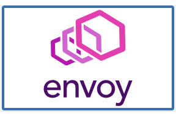
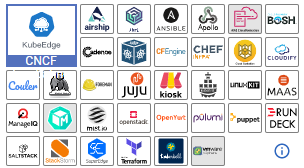
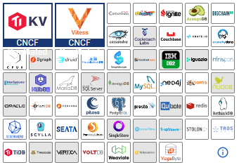
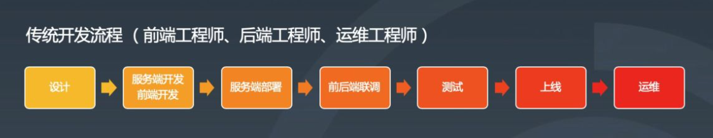
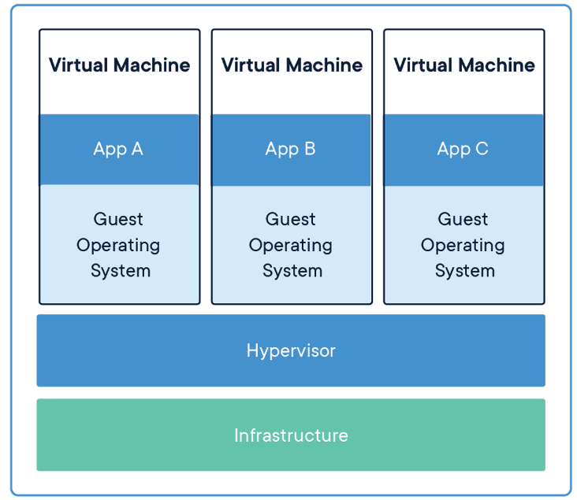
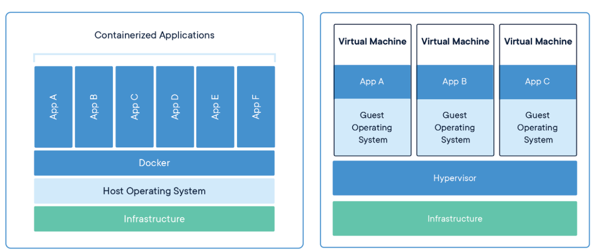

### 云计算（cloud computing）

#### 发展历史

1983年，[太阳电脑](https://zh.wikipedia.org/wiki/太陽電腦)提出“网络是电脑”（“The Network is the computer”）。

1996年，[Compaq](https://zh.wikipedia.org/wiki/Compaq)公司在其公司的内部文件中，首次提及“云计算”这个词汇。

2006年3月，[亚马逊](https://zh.wikipedia.org/wiki/亞馬遜公司)推出弹性计算云服务。

2008年，阿里云成立。

2010年3月5日，Novell与云安全联盟（CSA）共同宣布一项供应商中立项目，名为“可信任云计算项目”。

2010年7月，[美国国家航空航天局](https://zh.wikipedia.org/wiki/美國太空總署)和包括[Rackspace](https://zh.wikipedia.org/wiki/Rackspace)、[AMD](https://zh.wikipedia.org/wiki/AMD)、[Intel](https://zh.wikipedia.org/wiki/Intel)、[戴尔](https://zh.wikipedia.org/wiki/戴爾)等支持厂商共同宣布“[OpenStack](https://zh.wikipedia.org/wiki/OpenStack)”[开放源码](https://zh.wikipedia.org/wiki/開放源碼)项目，[微软](https://zh.wikipedia.org/wiki/微軟)在2010年10月表示支持OpenStack与[Windows Server 2008 R2](https://zh.wikipedia.org/wiki/Windows_Server_2008_R2)的集成；而[Ubuntu](https://zh.wikipedia.org/wiki/Ubuntu)已把[OpenStack](https://zh.wikipedia.org/wiki/OpenStack)加至11.04版本中。2011年2月，[思科系统](https://zh.wikipedia.org/wiki/思科系統)正式加入OpenStack，重点研制OpenStack的网络服务。

#### 云计算类型

**私有云**

[私有云](https://zh.wikipedia.org/wiki/私有雲)（Private Cloud）具备许多公用云环境的优点，例如弹性、适合提供服务，两者差别在于私有云服务中，资料与程序皆在组织内管理，且与公用云服务不同，不会受到网络带宽、安全疑虑、法规限制影响；此外，私有云服务让供应者及用户更能掌控云基础架构、改善安全与弹性，因为用户与网络都受到特殊限制

**公有云**

简而言之，[公有云](https://zh.wikipedia.org/wiki/公用雲)（Public Cloud）服务可透过网络及第三方服务供应者，开放给客户使用，“公有”一词并不一定代表“免费”，但也可能代表免费或相当廉价，公有云并不表示用户资料可供任何人查看，公有云供应者通常会对用户实施使用访问控制机制，公有云作为解决方案，既有弹性，又具备成本效益。

**混合云**

[混合云](https://zh.wikipedia.org/wiki/混合雲)（Hybrid Cloud）结合公有云及私有云，这个模式中，用户通常将非企业关键信息外包，并在公有云上处理，但同时掌控企业关键服务及资料。

#### 云计算服务模式

美国国家标准技术研究所的云计算定义明确了三种服务模式：

- 软件即服务（SaaS）：消费者使用应用程序，但并不掌控操作系统、硬件或运作的网络基础架构。是一种服务观念的基础，软件服务供应商，以租赁的概念提供客户服务，而非购买，比较常见的模式是提供一组账号密码。如果：Adobe Creative Cloud，Microsoft CRM与Salesforce.com。
- 平台即服务（PaaS）：消费者使用主机操作应用程序。消费者掌握运作应用程序的环境（也拥有主机部分掌控权），但并不掌握操作系统、硬件或运作的网络基础架构。平台通常是应用程序基础架构。如：Google App Engine。
- 基础设施及服务（IaaS）：消费者使用 “基础计算资源” ，如处理能力、存储空间、网络组件或中间件等。消费者能掌控操作系统、存储空间、已部署的应用程序及网络组件（如防火墙），但并不掌控云基础架构。如：Amazon AWS 、Rackspace。

### 云原生（CloudNative）

​	云原生计算基金会(Cloud Native Computing Foundation,CNCF)认为：云原生是一类技术的统称，通过云原生技术，我们可以构建出更易于弹性扩展的应用程序，其包含容器、服务网格、微服务、不可变基础设施和声明式API等相关技术，这些技术能够构建容错性好、易于管理和便于观察的松耦合系统，结合可靠的自动化手段，相关工程师能够轻松对系统作出频繁和可预测的重大变更。

> 云原生计算基金会(Cloud Native Computing Foundation,CNCF)成立于2015年12月11日，由谷歌与Linux基金会联合创办，成立这个非盈利组织的目的是为了推广、孵化和标准化云原生相关的技术。

#### 云原生发展

​	计算资源应用技术一直是在不断地往前发展的，从物理机演进为虚拟机，从虚拟机再演进到容器化，由容器化再演变到今天的云原生技术。

- 容器引擎之争：docker公司的docker  VS CoreOS公司的rocket

- 容器编排之争：Docker swarm  VS  kubernetes  VS  Apache Mesos

​	在竞争合作之间寻找平衡从而导致了标准规范的诞生，而标准规范的诞生是整个云原生生态最重要的基石。

​	2015年6月，Docker带头成立OCI，旨在 “制定并维护容器镜像格式和容器运行时的正式规范（OCI Specifications）”，其核心产出是OCI Runtime Spec（容器运行时规范）、OCI Images Spec（镜像格式规范）、OCI Distribution Spec（镜像分发规范）。所以**OCI组织解决的是容器的构建、分发和运行问题。**

​	一个月之后，Google带头成立了Cloud Native Computing Foundation（CNCF），旨在“构建云原生计算 :一种围绕着微服务、容器和应用动态调度的、以基础设施为中心的架构，并促进其广泛使用”。所以**CNCF组织解决的是应用管理及容器编排问题**。

### 云原生代表技术

#### 微服务

​	微服务的定义：原有单体应用拆分为多个独立自治的组件，每个组件都可以独立设计、开发、测试、部署和运维，这个组件可以单独提供对外服务，被称为微服务。

​	例如：早期的LNMT WEB部署架构，使用微服务后，每一个组件都可以独立自治、运行、扩容、缩容等。

**各组件之间可以通过轻量的Restful风格接口进行交互和协同**

#### 容器化

##### Docker容器

Docker容器，容器属于it基础设施层概念，是比虚拟机更轻量化的隔离工具，是微服务最佳载体。

##### Kubernetes资源调度与容器编排

使用kubernetes的资源调度与容器编排，可以实现Docker容器更优管理，进一步实现其PaaS层能力

#### 服务网格

​	服务网格存在的目的，就是去中心化的服务治理框架。

​	以往需要对微服务或对api接口去做治理和管控，一般会用类似于ESB服务总线或 API网关，将API接口注册和接入到API网关，由于API网关本身是一个中心化的架构，所以所有的请求流量都可以通过API网关，由API网关实现对流量拦截，同时对拦截以后的流量进行安全，日志，限流熔断，链路监控等各种管控治理，去中心化以后就没有这种集中化的流量管控点了，所以对流量的拦截就从ESB服务总线或API网关下沉到各个微服务中去了，这就是为什么我们需要在微服务端增加一个代理包的原因，通过这个代理包来做流量的拦截，同时实现对流量的管控，当前在微服务网格中也是用同样的思路来对服务进行治理的例如：Istio 作为服务治理工具，在微服务架构中通过与每个服务实例并行部署的边车（sidecar）——Envoy代理，来实现流量管理和安全策略实施。这是微服务服务网格治理的核心技术之一

去中心化的服务治理依然有一个控制中心，而控制中心依然是中心化的，但实际的控制流和接口数据访问的消息流是实现分离的，控制中心仅处理服务注册发现，实际的接口调用、服务访问是不通过控制中心的，即使控制中心出现问题，例如控制中心服务不可用等，也不会影响实际服务接口调用。

#### 不可变基础设施

​	传统开发过程中，做一个软件程序的部署，当它部署到一个生产环境，如果我们要做变更，不管是程序的变更还是配置的变更，都需要在原来的生产环境上面重新部署或对某一个配置直接进行修改，但是在云原生应用中，任何一个应用当你部署到生产环境中，形成一个容器实例以后，这个容器实例不应该再做任何变化，如果软件程序需要重新部署或修改配置时怎么办呢？可以利用基础容器镜像，重新生成一个新的容器实例，同时把旧的容器实例销毁掉，这个就是云原生技术中要求的不可变技术点。

#### 声明式API

- 使用yaml资源清单文件
- 在yaml文件中声明要做的操作、需要的配置信息有哪些、用户期望达到的状态。

***IT基础设施获取声明式文件的后续操作***

当IT基础设施获取到声明文件后，首先要解析声明式文件中声明的内容，再去后端做出相应的操作，操作完成后，把各个底层技术组件协调到应用需要的一个状态。

使用声明式API，任何对生产环境、配置都不是操作一条命令来完成的，都需要先写声明，或配置文件，这些操作都可以纳入配置管理中进行集中管理，这样有利于在生产环境出现问题时，能够快速了解前述操作，及对生产环境产生的影响，易于做版本回退、回滚等操作。

#### DevOps

- 实现开发、运维、测试协同全作
- 构建自动化发布管道，实现代码快速部署（测试环境、预发布环境、生产环境等）
- 频繁发布、快速交付、快速反馈、降低发布风险

### CNCF云原生全景图

https://landscape.cncf.io/

### 云原生应用编排及管理

#### 编排与调度

####  远程调用

#### 服务代理

####  API网关

####  服务网格

####  服务发现

#### 消息和流式处理

#### Serverless

####  CI/CD

####  自动化配置

####  数据库

#### 容器镜像仓库

#### 应用定义及镜像制作

####  密钥管理

### 云原生底层技术

#### 容器技术

####  存储技术

####  网络技术

### 云原生监测分析

#### 主机状态及服务状态监控

#### 日志收集分析

#### 全链路状态跟踪

### 云原生安全技术

> **基础设施安全**：存储安全（加密存储、容灾备份）、网络安全（网络策略管理、访问控制）、计算安全（系统加固、资源隔离）
>
> **应用安全**：应用数据安全、应用配置安全、应用环境安全
>
> **云原生研发安全**：代码托管、代码审计、软件管理、可信测试、可信构建
>
> **容器生命周期安全**：运行时安全、容器构建（镜像扫描、镜像签名）、部署安全（合规部署）、组件安全
>
> **安全管理**：身份认证、访问授权、账号管理、审计日志、密钥管理、监控告警
>
> 以上所有云原生相关技术都是围绕着Kubernetes展开。

### serverless无服务器架构

> 云原生2.0时代，由On Cloud变为In Cloud，生于云，长于云，且立而不破。

#### 云原生技术未来发展方向

由于业务的逐利性，我们需要对计算资源和服务进行不断的抽象，在抽象的过程中我们会发现越来越少的能够接触到IT基础设施层，仅能够接触到各种技术的服务能力，这种服务能力我们称之BaaS后端能力及服务，对于开发人员来说，不要去接触到最底层的资源，这也不是其应该去做的事，开发人员应该专注于代码业务逻辑的实现即可。

其实在从IT基础设施层(IaaS)到PaaS层，我们一直在强调这种变化，那么serverless能够给我们带来了什么呢？

在传统的云原生架构开发下面，我们基于DevOps，基于微服务和容器云，开发应用的时候，你依旧会选择一个开发框架，开发所使用的底层的基础平台，依旧会涉及到开发一个应用的时候的数据层，逻辑层，展现层，例如我们常说的三层架构和五层架构：

进入serverless时代后，对于开发人员来说不需要去了解底层的基础设施及多层架构，全部不需要了解，任何一个功能的实现，简单来说，就变成一个个代码片段，通过代码片段去实现功能，通过代码片段的组合组装，来实现复杂一点的流程，这就是serverless所要达到的目的，因此Serverless有两个部分组成，一个是前面我们提到的BaaS，另一个是FaaS（funtion as a Service）层，函数即服务，当我们的BaaS能力足够强以后，我们去实现代码的功能非常简单，只要写一个个函数，并让其执行即可,即可达到项目上线的目的。

### 计算机资源应用演进过程

#### 使用物理服务器痛点

- 从服务器自身管理角度
  - 物理服务器环境部署人力成本大
  - 当物理服务器出现宕机，服务器重启时间过长，短则1-2分钟，长则3-5分钟
  - 物理服务器在应用程序运行期间硬件出现故障，解决比较麻烦
  - 物理服务器计算资源不能有效调度使用，无法发挥其充足资源的优势
- 从物理服务器部署应用程序角度
  - 物理服务器环境部署浪费时间，时间是成倍增加。

#### 使用虚拟机优点与缺点

##### 使用虚拟机优点

- 从虚拟机本身管理角度
  - 虚拟机较物理服务器轻量，可以借助虚拟机模板实现快速生成应用
  - 虚拟机中部署应用与物理服务器一样可控性强，且当虚拟机出现故障时，可直接使用新的虚拟机代替
  - 在物理服务器中使用虚拟机可高效使用物理服务器的资源
  - 虚拟机与物理服务器一样可以达到良好的应用程序环境的隔离
- 从在虚拟机中部署应用程序角度
  - 在虚拟机中部署应用，容易扩容及缩容实现
  - 与物理服务器比较，当部署应用程序的虚拟机出现宕机时，可以快速启动，时间通常可达到秒级，10秒或20秒即可启动，应用程序可以继续提供服务
  - 应用程序迁移方便

##### 使用虚拟机缺点

- 虚拟机底层硬件消耗物理服务器资源较大，如：虚拟机操作系统硬盘，会直接占用大量物理服务器硬盘空间
- 相较于容器技术，虚拟机启动时间过长，容器启动可毫秒级计算
- 虚拟机对物理服务器硬件资源调度添加了调链条，存在浪费时间的现象，所以虚拟机性能弱于物理服务器
- 由于应用程序直接部署在虚拟机的硬盘上，应用程序迁移时，需要连同虚拟机硬盘中的操作系统一同迁移，会导致迁移文件过大，浪费更多的存储空间及时间消耗过长

#### 使用容器的优点

- 不需要为容器安装操作系统，可以节约大量时间
- 不需要通过手动的方式在容器中部署应用程序的运行环境，直接部署应用就可以了
- 不需要管理容器网络，以自动调用的方式访问容器中应用提供的服务
- 方便分享与构建应用容器，一次构建，到处运行
- 毫秒级启动
- 容器可直接使用物理服务器要硬件资源，物理服务器硬件资源利用率高，性能较好。

### 什么是容器

**虚拟机**

- 采用虚拟化技术手段实现物理服务器计算资源打包的方式，为应用程序提供类似物理服务器运行环境
- 能够实现应用程序与应用程序之间的隔离
- 使用自动化技术部署应用程序及应用程序迁移较方便
- 可横向扩展

**容器**

- 容器时轻量级物理服务器计算资源的打包方式，即轻量级虚拟机，为应用程序提供类似虚拟机运行环境
- 可在物理服务器中实现高密度部署

**容器与虚拟机对比**

| 对比属性               | 容器（Container） | 虚拟机（VM）       |
| ---------------------- | ----------------- | ------------------ |
| 隔离性                 | 基于进程隔离      | 提供资源的完全隔离 |
| 启动时间               | 毫秒级或秒级      | 秒级或分钟级       |
| 内核                   | 共用宿主机内核    | 使用独立内核       |
| 占用资源               | MB级              | GB级               |
| 系统支持容量（同级别） | 支持上千个容器    | 几十台虚拟机       |
