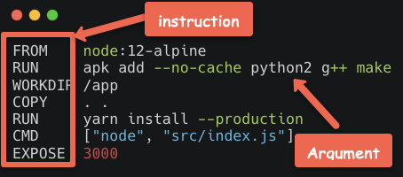
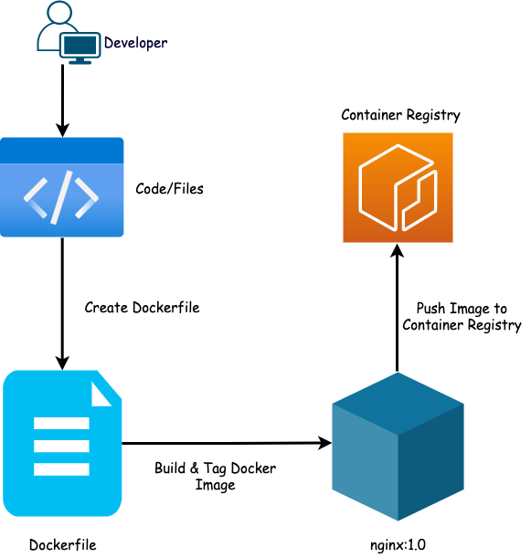
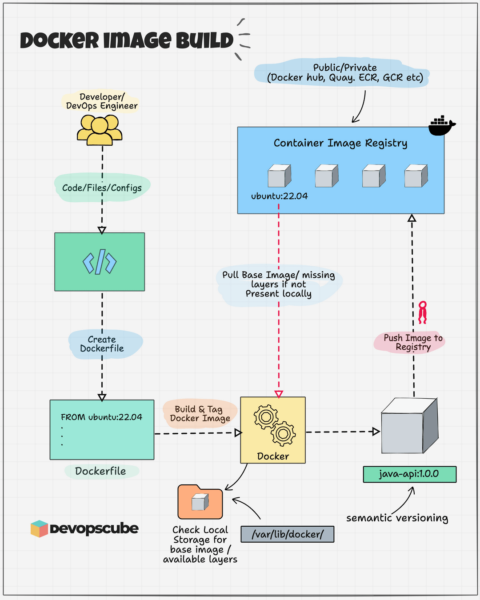

### 容器镜像的分类

- 操作系统类
  - Centos
  - Ubuntu
- 应用类
  - tomcat
  - nginx
  - mysql
  - redis

### 容器镜像获取的方法

- DockerHub
- 把操作系统打包为容器镜像
- 把正在运行的容器打包为镜像，即commit
- 通过Dockerfile实现容器镜像的自定义及生成

### 把操作系统中文件系统打包为容器镜像

```shell
#把操作系统中文件系统进行打包
tar --numeric-owner --exclude=/proc --exclude=/sys -cvf centos7u6.tar /
scp -P 10022 centos7-1810.tar root@192.168.194.10:/root/

#把打包的centos文件系统生成本地容器镜像 
[root@docker ~]# docker import centos7-1810.tar centos7-1810:v1
sha256:f5f6bc8e192d1085cda0aabc1aac78a7eec41098ad55e27f6bdc38f105e5c540
[root@docker ~]# docker images
REPOSITORY                     TAG          IMAGE ID       CREATED              SIZE
centos7-1810                   v1           f5f6bc8e192d   About a minute ago   1.09GB
#运行镜像
[root@docker ~]# docker run -it centos7-1810:v1 bash
[root@562bf0a52b79 /]# ip a s
1: lo: <LOOPBACK,UP,LOWER_UP> mtu 65536 qdisc noqueue state UNKNOWN group default qlen 1000
    link/loopback 00:00:00:00:00:00 brd 00:00:00:00:00:00
    inet 127.0.0.1/8 scope host lo
       valid_lft forever preferred_lft forever
    inet6 ::1/128 scope host 
       valid_lft forever preferred_lft forever
10: eth0@if11: <BROADCAST,MULTICAST,UP,LOWER_UP> mtu 1500 qdisc noqueue state UP group default 
    link/ether 02:42:ac:11:00:02 brd ff:ff:ff:ff:ff:ff link-netnsid 0
    inet 172.17.0.2/16 brd 172.17.255.255 scope global eth0
       valid_lft forever preferred_lft forever
```

### Dockerfile

Dockerfile是一种能够被Docker程序解释的剧本。Dockerfile由一条一条的指令组成，并且有自己的书写格式和支持的命令。当我们需要在容器镜像中指定自己额外的需求时，只需在Dockerfile上添加或修改指令，然后通过docker build生成我们自定义的容器镜像（image）。


- Docker镜像的最基本组成部分是Dockerfile

- Dockerfile是带有指令和参数的简单文本文件。Docker可以通过读取Dockerfile中给出的指令来自动构建镜像。

- 在Dockerfile中，左侧的所有内容都是指令，右侧是这些指令的参数。注意：Dockerfile文件没有任何扩展名



#### Dockerfile指令

- 构建类指令
  - 用于构建image
  - 指定的操作不会在运行image的容器上执行（FROM、MAINTAINER、RUN、ENV、ADD、COPY）
- 设置类指令
  - 用于设置image的属性
  - 指定的操作将在运行image的容器中执行（CMD、ENTRYPOINT、USER、EXPOSE、VOLUME、WORKDIR、ONBUILD）

| 指令        | 说明                                                     | 示例                                                     |
| ----------- | -------------------------------------------------------- | -------------------------------------------------------- |
| FROM        | 指定基础镜像，所有其他指令都将在该基础上运行。           | `FROM python:3.9-slim`                                   |
| MAINTAINER  | 指定镜像维护者的信息（已被 LABEL 取代）。                | `MAINTAINER you@example.com`                             |
| WORKDIR     | 设置工作目录，所有接下来的指令都将在此目录执行。         | `WORKDIR /app`                                           |
| RUN         | 执行命令，通常用于安装包或依赖。                         | `RUN pip install --no-cache-dir -r requirements.txt`     |
| COPY        | 将文件或目录从主机复制到镜像的文件系统中。               | `COPY . /app`                                            |
| ADD         | 类似于 COPY，但能解压 tar 文件和复制 URL。               | `ADD https://example.com/file.tar.gz /app/file.tar.gz`   |
| CMD         | 指定启动容器时的默认命令或参数。                         | `CMD ["python", "app.py"]`                               |
| ENTRYPOINT  | 配置容器启动时运行的命令，允许后续传递参数。             | `ENTRYPOINT ["python", "app.py"]`                        |
| ENV         | 设置环境变量。                                           | `ENV NAME World`                                         |
| EXPOSE      | 声明镜像内部的服务监听端口。                             | `EXPOSE 80`                                              |
| VOLUME      | 创建一个挂载点，宿主机和容器之间进行持久化数据共享。     | `VOLUME /data`                                           |
| USER        | 指定运行容器时的用户名或 UID。                           | `USER appuser`                                           |
| LABEL       | 为镜像添加元数据。                                       | `LABEL maintainer="you@example.com"`                     |
| STOPSIGNAL  | 设置容器停止时发送的系统调用信号。                       | `STOPSIGNAL SIGKILL`                                     |
| ARG         | 定义可在 build 时传递的变量。                            | `ARG build_version=1.0`                                  |
| ONBUILD     | 定义触发镜像构建时执行的命令，当继承 Dockerfile 时使用。 | `ONBUILD RUN apt-get update`                             |
| HEALTHCHECK | 指定如何测试某个容器以确保它仍然正常工作。               | `HEALTHCHECK CMD curl --fail http://localhost || exit 1` |
| SHELL       | 指定 RUN、CMD 及 ENTRYPOINT 命令的默认 shell。           | `SHELL ["powershell", "-command"]`                       |

#### Dockerfile指令解释

- man dockerfile   # 用于查看详细说明

##### FROM

- FROM指令用于指定其构建新镜像所使用的基础镜像
- FROM指令必须是在Dockerfile文件中的首条命令
- FROM指令指定的基础image可以是官方远程仓库中的，也可以位于本地仓库，优先本地仓库

```dockerfile
FROM <image>:<tag>
FROM centos:latest
```

##### RUN

RUN指令用于在构建镜像中执行命令

```dockerfile
#shell格式
RUN <命令>
RUN echo 'hello docker' > /var/www/html/index.html

#exec格式
RUN ["可执行文件", "参数1","参数2"]
RUN ["/bin/bash", "-c","echo hello > /var/www/html/index.html"]
```

> 注意：按照优化的角度来讲，当有多条要执行的命令，不要使用多条RUN，尽量使用&&符号于 \ 符号连接成一行。因为多条RUN命令会让镜像建立多层

```dockerfile
RUN yum install httpd -y
RUN echo test > /var/www/html/index.html
#改成
RUN yum install httpd -y && echo test > /var/www/html/index.html
```

##### CMD

CMD不同于RUN，CMD用于指定在容器启动时所要执行的命令，而RUN用于指定镜像构建要执行的命令。

```dockerfile
#格式有三种
CMD ["executable","param1","param2"]
CMD ["param1","param2"]
CMD command param1 param2
```

每个Dockerfile只能有一条CMD命令。如果指定了多条命令，只有最后一条被执行。如果用户启动容器时候指定了运行的命令，则会覆盖掉CMD指定的命令

```shell
docker run -d -p 80:80 镜像名 运行的命令
```

##### EXPOSE

EXPOSE指令用于指定容器在运行时监听的端口

```dockerfile
EXPOSE <port> [<port>....]
EXPOSE 80 3306 8080
```

还需要使用docker run运行容器时通过-p参数映射到宿主机的端口；-P随机映射到宿主机的端口

##### ENV

ENV指令用于指定一个环境变量

```dockerfile
#格式1
ENV <key> <value> 
#格式2
ENV <key>=<value>
ENV JAVA_HOME /usr/local/jdk1.8/
```

##### ADD

ADD指令用于把宿主机上的文件拷贝到镜像中

```dockerfile
# src可以是本地文件或压缩包文件，还可以是一个url
# desc路径的填写可以是容器的绝对路径，也可以是相对于工作目录的相对路径
ADD <src> <desc>
```

##### ENTRYPOINT

ENTRYPOINT与CMD非常类似

相同点：

- 一个Dockerfile只写一条，如果写了多条，那么只有最后一条生效
- 都是容器启动时才运行

不同点：

- 如果用户启动容器的时候指定了运行的命令，ENTRYPOINT不会被运行的命令覆盖，而CMD则会被覆盖

```dockerfile
ENTRYPOINT ["executable", "param1", "param2"]
ENTRYPOINT commadn param1 param2
```

##### VOLUME

VOLUME指令用于把宿主机里的目录与容器的目录映射

只指定挂载点，docker宿主机映射的目录为自动生成的

```dockerfile
VOLUME ["<mountpoint>"]
```

##### USER

USER指令设置启动容器的用户（像hadoop需要hadoop用户操作，oracle需要oracle用户操作），可以是用户名或UID

```dockerfile
USER daemon
USER 1001
```

> 注意：如果设置了容器以daemon用户运行，那么RUN、CMD和ENTRYPOINT都会以这个用户去运行镜像构建完成后，通过docker run运行容器时，可以通过 -u 参数来覆盖所指定的用户

##### WORKDIR

WORKDIR指令设置工作目录，类似于cd命令。不建议使用 RUN cd /root，建议使用WORKDIR

```dockerfile
WORKDIR /root
```

### Dockerfile基本构成

- 基础镜像信息
- 维护者信息
- 镜像操作指令
- 启动容器时执行指令

#### Dockerfile生成容器镜像方法


#### 使用Dockerfile构建Docker镜像

下面显示了镜像构建过程的高级工作流程。




#### Dockerfile生成Nginx容器镜像

```shell
#创建所需的文件和和文件夹
[root@docker ~]# mkdir nginx-image && cd nginx-image
[root@docker nginx-image]# touch .dockerignore
[root@docker nginx-image]# mkdir files
[root@docker nginx-image]# cd files/
[root@docker files]# vim index.html
#编写Dockerfile文件
[root@docker nginx-image]# vim Dockerfile
[root@docker nginx-image]# cat Dockerfile
#选择基础镜像
FROM centos:7
LABEL maintainer="canvs@qq.com"
RUN rm -rf /etc/yum.repos.d/*
# 配置阿里云源
RUN curl -o /etc/yum.repos.d/CentOS-Base.repo http://mirrors.aliyun.com/repo/Centos-7.repo
RUN yum -y install epel-release
# 安装 nginx
RUN yum -y install nginx

# 复制本地文件到镜像目录
COPY files/default /etc/nginx/sites-available/default
# 添加本地文件到镜像目录
ADD files/index.html /usr/share/nginx/html/
#暴露80端口
EXPOSE 80
CMD ["/usr/sbin/nginx", "-g", "daemon off;"]
#查看文件目录结构
[root@docker nginx-image]# ll -R /root/nginx-image
/root/nginx-image:
total 4
-rw-r--r-- 1 root root 431 Jan 14 18:25 Dockerfile
drwxr-xr-x 2 root root  39 Jan 13 21:20 files

/root/nginx-image/files:
total 8
-rw-r--r-- 1 root root 223 Jan 13 21:08 default
-rw-r--r-- 1 root root 246 Jan 13 21:07 index.html

[root@docker nginx-image]# docker build --no-cache -t centos-nginx:v1 .
[+] Building 127.1s (12/12) FINISHED                                        docker:default
 => [internal] load build definition from Dockerfile                                  0.0s
 => => transferring dockerfile: 470B                                                  0.0s
 => [internal] load metadata for docker.io/library/centos:7                           0.0s
 => [internal] load .dockerignore                                                     0.0s
 => => transferring context: 34B                                                      0.0s
 => CACHED [1/7] FROM docker.io/library/centos:7                                      0.0s
 => [internal] load build context                                                     0.0s
 => => transferring context: 96B                                                      0.0s
 => [2/7] RUN rm -rf /etc/yum.repos.d/*                                               0.3s
 => [3/7] RUN curl -o /etc/yum.repos.d/CentOS-Base.repo http://mirrors.aliyun.com/re  2.1s
 => [4/7] RUN yum -y install epel-release                                            70.0s 
 => [5/7] RUN yum -y install nginx                                                   52.8s 
 => [6/7] COPY files/default /etc/nginx/sites-available/default                       0.0s 
 => [7/7] ADD files/index.html /usr/share/nginx/html/                                 0.0s 
 => exporting to image                                                                1.8s 
 => => exporting layers                                                               1.7s 
 => => writing image sha256:bac07868650a5f29303b0e91149a47acf7213bb847efe502ce8ad4d7  0.0s 
 => => naming to docker.io/library/centos-nginx:v1   
 
[root@docker nginx-image]# docker images
REPOSITORY               TAG          IMAGE ID       CREATED         SIZE
centos-nginx             v1           bac07868650a   2 minutes ago   756MB
```

##### CMD ["/usr/sbin/nginx", "-g", "daemon off;"] 解释

CMD指令是Dockerfile中定义容器默认启动命令的方式。

- /usr/sbin/nginx ： 是 nginx的执行文件路径；表示启动nginx服务
- -g 'daemon off;'： 这是nginx启动时的一个配置选项，用来控制nginx是否以守护进程（daemon）模式来运行
  - -g ：这个选项允许传递全局指令，通过用于命令行启动时传递配置项
  - daemon off；：让nginx以前台进程运行，而不是后台运行
- 为什么使用 daemon off ：在Docker容器中，容器的生命周期通常是由其主进程决定，容器会一直运行，直到主进程退出。默认情况下，nginx会以后台进程运行，这会导致容器启动后立即退出，因为没有主进程在前台运行，通过指定 `daemon off;` ，nginx会在前台运行，容器就会一直保持运行状态，直到停止容器

```shell
# 测试Docker镜像
[root@docker nginx-image]# docker run -d -p 8080:80 --name webserver centos-nginx:v1
e7a317e117c7b650b2a9a5f1fad647489b9be4af6264f3de4485d8d08731ca36
[root@docker nginx-image]# docker ps
CONTAINER ID   IMAGE             COMMAND                  CREATED         STATUS         PORTS                                   NAMES
e7a317e117c7   centos-nginx:v1   "/usr/sbin/nginx -g …"   4 seconds ago   Up 3 seconds   0.0.0.0:8080->80/tcp, :::8080->80/tcp   webserver
[root@docker nginx-image]# curl 127.0.0.1:8080
<html>
  <head>
    <title>Dockerfile</title>
  </head>
  <body>
    <div class="container">
      <h1>My App</h1>
      <h2>This is my first app</h2>
      <p>Hello everyone, This is running via Docker container</p>
    </div>
  </body>
</html>
```

#### Dockerfile生成Tomcat

```shell
[root@docker ~]# mkdir tomcat-image
[root@docker ~]# cd tomcat-image
[root@docker tomcat-image]# ls
Dockerfile  index.html  jdk-8u202
[root@docker tomcat-image]# vim Dockerfile 
[root@docker tomcat-image]# cat Dockerfile 
FROM centos:7
MAINTAINER "canvs@qq.com"
ENV VERSION=8.5.75
ENV JAVA_HOME=/usr/local/jdk-8u202
ENV TOMCAT_HOME=/usr/local/tomcat
RUN curl -O https://archive.apache.org/dist/tomcat/tomcat-8/v${VERSION}/bin/apache-tomcat-${VERSION}.tar.gz
RUN tar -zxf apache-tomcat-${VERSION}.tar.gz -C /usr/local
RUN mv /usr/local/apache-tomcat-${VERSION} /usr/local/tomcat && rm -rf apache-tomcat-${VERSION}.tar.gz /usr/local/tomcat/webapps/*
RUN mkdir /usr/local/tomcat/webapps/ROOT
COPY ./index.html /usr/local/tomcat/webapps/ROOT/
ADD ./jdk-8u202 /usr/local/jdk-8u202
RUN echo "export TOMCAT_HOME=/usr/local/tomcat" >> /etc/profile
RUN echo "export JAVA_HOME=/usr/local/jdk-8u202" >> /etc/profile
RUN echo "export PATH=${TOMCAT_HOME}/bin:${JAVA_HOME}/bin:$PATH" >> /etc/profile
RUN echo "export CLASSPATH=.:${JAVA_HOME}/lib/dt.jar:${JAVA_HOME}/lib/tools.jar" >> /etc/profile
RUN source /etc/profile
EXPOSE 8080
CMD ["/usr/local/tomcat/bin/catalina.sh","run"]

[root@docker tomcat-image]# docker build -t centos-tomcat:v3 .
[+] Building 8.0s (17/17) FINISHED                                                                                                                                         docker:default
 => [internal] load build definition from Dockerfile                                                                                                                                 0.0s
 => => transferring dockerfile: 984B                                                                                                                                                 0.0s
 => [internal] load metadata for docker.io/library/centos:7                                                                                                                          0.0s
 => [internal] load .dockerignore                                                                                                                                                    0.0s
 => => transferring context: 2B                                                                                                                                                      0.0s
 => [ 1/12] FROM docker.io/library/centos:7                                                                                                                                          0.0s
 => [internal] load build context                                                                                                                                                    0.1s
 => => transferring context: 167.60kB                                                                                                                                                0.1s
 => CACHED [ 2/12] RUN curl -O https://archive.apache.org/dist/tomcat/tomcat-8/v8.5.75/bin/apache-tomcat-8.5.75.tar.gz                                                               0.0s
 => CACHED [ 3/12] RUN tar -zxf apache-tomcat-8.5.75.tar.gz -C /usr/local                                                                                                            0.0s
 => CACHED [ 4/12] RUN mv /usr/local/apache-tomcat-8.5.75 /usr/local/tomcat && rm -rf apache-tomcat-8.5.75.tar.gz /usr/local/tomcat/webapps/*                                        0.0s
 => CACHED [ 5/12] RUN mkdir /usr/local/tomcat/webapps/ROOT                                                                                                                          0.0s
 => CACHED [ 6/12] COPY ./index.html /usr/local/tomcat/webapps/ROOT/                                                                                                                 0.0s
 => [ 7/12] ADD ./jdk-8u202 /usr/local/jdk-8u202                                                                                                                                     3.3s
 => [ 8/12] RUN echo "export TOMCAT_HOME=/usr/local/tomcat" >> /etc/profile                                                                                                          0.5s
 => [ 9/12] RUN echo "export JAVA_HOME=/usr/local/jdk-8u202" >> /etc/profile                                                                                                         0.4s
 => [10/12] RUN echo "export PATH=/usr/local/tomcat/bin:/usr/local/jdk-8u202/bin:/usr/local/sbin:/usr/local/bin:/usr/sbin:/usr/bin:/sbin:/bin" >> /etc/profile                       0.3s
 => [11/12] RUN echo "export CLASSPATH=.:/usr/local/jdk-8u202/lib/dt.jar:/usr/local/jdk-8u202/lib/tools.jar" >> /etc/profile                                                         0.3s
 => [12/12] RUN source /etc/profile                                                                                                                                                  0.3s
 => exporting to image                                                                                                                                                               2.7s
 => => exporting layers                                                                                                                                                              2.6s
 => => writing image sha256:2680980f32fdfca899586ba80d9f19c7fde5d1dd6db205fbec75f25c8fc75b87                                                                                         0.0s
 => => naming to docker.io/library/centos-tomcat:v3                
[root@docker tomcat-image]# docker images
REPOSITORY               TAG          IMAGE ID       CREATED         SIZE
centos-tomcat            v3           2680980f32fd   2 minutes ago   642MB

[root@docker tomcat-image]# docker run -d -p 8081:8080  centos-tomcat:v3      
cd746e6e30cf5780fbb4cbcf9ad3164995a0da290eb1e1428c80d6e159f2ab2a
[root@docker tomcat-image]# docker ps
CONTAINER ID   IMAGE              COMMAND                  CREATED         STATUS         PORTS                                       NAMES
cd746e6e30cf   centos-tomcat:v3   "/usr/local/tomcat/b…"   6 seconds ago   Up 5 seconds   0.0.0.0:8081->8080/tcp, :::8081->8080/tcp   gallant_mccarthy
e7a317e117c7   centos-nginx:v1    "/usr/sbin/nginx -g …"   2 hours ago     Up 2 hours     0.0.0.0:8080->80/tcp, :::8080->80/tcp       webserver
[root@docker tomcat-image]# curl 127.0.0.1:8081
Hello tomcat
```



### Dockerfile生成容器镜像优化

优化 `Dockerfile` 生成容器镜像的过程，主要是为了缩短构建时间、减小镜像大小、提高镜像的可维护性和可移植性。

#### 较少镜像分层

每个RUN、COPY、ADD等指令都会创建一个新的镜像层。过多的镜像层会增加镜像的大小，并且增加Docker构建镜像的时间

```dockerfile
# 不优化
RUN yum install -y nginx
RUN yum install -y curl

# 优化后
RUN yum install -y nginx curl
```

#### 合并RUN指令

每次RUN指令都会创建一个新的层，应该将多个相关的命令合并在一个RUN指令中执行

```dockerfile
# 不优化
RUN yum remove wget
RUN yum install -y nginx

# 优化后
RUN yum remove wget && yum install -y nginx
```

#### 使用更小的基础镜像

选择更小的基础镜像可用显著减少镜像大小。如：`alpine` 镜像代替 `ubuntu` 或 `centos` 。alpine镜像通常不到5MB

```shell
# 不优化
FROM centos:7
# 优化后
FROM alpine:3.14
```

#### 减少不必要的文件

在构建镜像时，常常会把不必要的文件也包含 进镜像，比如源码、构建文件等。使用 `.dockerignore` 文件来排除这些不必要的文件；这样Docker就会忽略掉这些文件，避免它们被添加到镜像中。

```tex
node_modules/
*.log
*.git
```

#### 使用多阶段构建

多阶段构建允许你在构建镜像时使用不同的基础镜像，只有在最终阶段才将需要的文件复制到最终镜像中。这样可用大幅度减小镜像的大小，因为构建工具和中间产物指挥出现在构建阶段，而不会出现在最终镜像中。

```dockerfile
# 第一阶段：构建阶段
FROM golang:1.16 AS build

WORKDIR /src
COPY . .
RUN go build -o app

# 第二阶段：生产镜像
FROM alpine:3.14

WORKDIR /app
COPY --from=build /src/app .

CMD ["./app"]
```

#### 缓存优化

Docker在构建镜像时会缓存每个步骤。如果你频繁地修改Dockerfile中的某个步骤，可用考虑将频繁更改的部分放在Dockerfile的后面，这样可用减少构建过程中缓存失效的情况，节约时间。

```

```

#### 删除临时文件和缓存

在镜像构建过程中，很多临时文件和包缓存是不需要保留的。使用 `rm -rf` 删除它们，减小镜像体积

```dockerfile
RUN yum install -y nginx mysql && yum clean all && rm -rf /var/cache/yum/*
```

#### 只复制需要的文件

在Dockerfile中，尽量只复制需要的文件，而不是整个项目目录。可用通过指定特定文件或目录来避免无关文件被复制到镜像中

```dockerfile
COPY config/ /etc/mysql/config/
COPY index.html /var/loacl/tomcat/webapps/ROOT/
```

#### 最小化运行时安装

避免在镜像中安装不必要的软件包，特别是开发工具和调试工具。生产环境中，只需要包含运行所需的最少依赖

#### 指定适当的文件权限

确保你复制的文件有正确的权限，以避免运行时出现权限错误。如果文件权限过于宽松，可能引发安全问题

```dockerfile
COPY --chown=user:group src/ /app/src/
```

#### 镜像标记和版本管理

使用清晰的标记和版本管理可用帮助区分不同版本的镜像

```shell
docker build -t myapp:v1 .
docker build -t myapp:latest .
```

#### 优化后的Dockerfile

```dockerfile
# 使用更小的 Alpine 镜像
FROM openjdk:11-jre-slim AS base

# 设置工作目录
WORKDIR /opt

# 下载并解压 Tomcat，删除多余文件
RUN curl -O https://archive.apache.org/dist/tomcat/tomcat-8/v8.5.75/bin/apache-tomcat-8.5.75.tar.gz && \
    tar -zxf apache-tomcat-8.5.75.tar.gz && \
    rm -f apache-tomcat-8.5.75.tar.gz && \
    mv apache-tomcat-8.5.75 tomcat

# 设置环境变量
ENV CATALINA_HOME=/opt/tomcat
ENV PATH=$CATALINA_HOME/bin:$PATH

# 开放 Tomcat 默认端口
EXPOSE 8080

# 启动 Tomcat
CMD ["catalina.sh", "run"]

```

### 优化总结：

1. **减少镜像层数**：通过合并 `RUN` 指令减少镜像层数。
2. **清理无用文件**：删除临时文件和缓存，减小镜像大小。
3. **选择小的基础镜像**：使用 `openjdk:11-jre-slim` 或 `alpine` 镜像代替较大的基础镜像。
4. **合理的镜像标记和版本管理**：通过标签管理不同版本的镜像。
5. **文件权限管理**：通过 `COPY --chown` 指定合适的文件权限。


