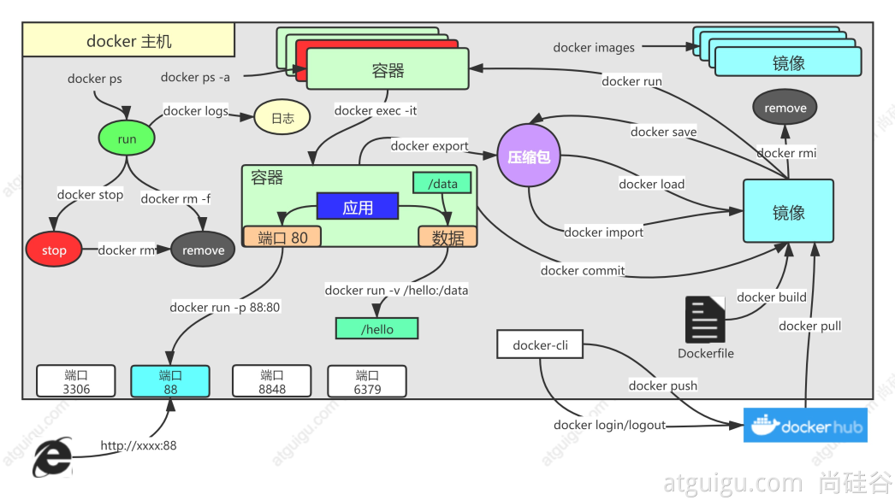
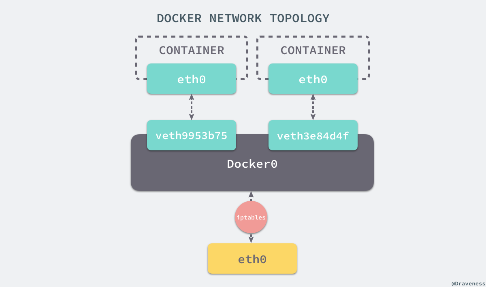
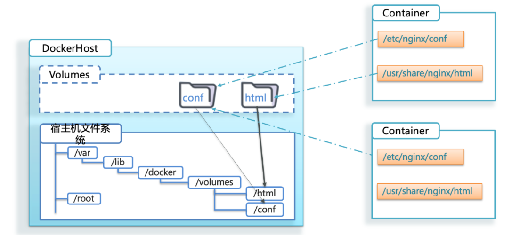

### Docker常用命令



| 命令      |                             作用                             |
| --------- | :----------------------------------------------------------: |
| attach    | 绑定到运行中容器的标准输入、输出，以及错误流（这样似乎也能进入容器内容，但是一定小心，它们操作的就是控制台，控制台的退出命令会生效，比如redis、nginx） |
| build     |                从一个 Dockerfile 文件构建镜像                |
| commit    |              把容器的改变 提交创建一个新的镜像               |
| cp        |             容器和本地文件系统间复制文件/文件夹              |
| create    | 创建新容器，但并不启动(注意与docker run 的区分)需要手动启动。start\stop |
| diff      | 检查容器里文件系统结构的更改【A:添加文件或目录 D:文件或者目录删除 C:文 件或者目录更改】 |
| events    |                     获取服务器的实时事件                     |
| exec      |                   在运行时的容器内运行命令                   |
| export    | 导出 **容器** 的文件系统为一个tar文件。commit是直接提交成镜像，export是导出成文 件方便传输 |
| history   |                        显示镜像的历史                        |
| images    |                         列出所有镜像                         |
| import    | 导入tar的内容创建一个镜像，再导入进来的镜像直接启动不了容器。 /docker-entrypoint.sh nginx -g 'daemon o;' docker ps --no-trunc 看下之前的完整启动命令再用他 |
| info      |                         显示系统信息                         |
| inspect   |                   获取docker对象的底层信息                   |
| kill      |                     杀死一个或者多个容器                     |
| load      |                     从 tar 文件加载镜像                      |
| login     |                     登录Docker registry                      |
| logout    |                     退出Docker registry                      |
| logs      | 获取容器日志;容器以前在前台控制台能输出的所有内容，都可以看到 |
| pause     |                     暂停一个或者多个容器                     |
| port      |                      列出容器的端口映射                      |
| ps        |                         列出所有容器                         |
| pull      |            从registry下载一个image 或者repository            |
| push      |            给registry推送一个image或者repository             |
| rename    |                        重命名一个容器                        |
| restart   |                     重启一个或者多个容器                     |
| rm        |                     移除一个或者多个容器                     |
| rmi       |                     移除一个或者多个镜像                     |
| run       |                        创建并启动容器                        |
| save      |            把一个或者多个 **镜像** 保存为tar文件             |
| search    |                     去docker hub寻找镜像                     |
| start     |                     启动一个或者多个容器                     |
| stats     |                  显示容器资源的实时使用状态                  |
| stop      |                     停止一个或者多个容器                     |
| tag       |            给源镜像创建一个新的标签，变成新的镜像            |
| top       |                    显示正在运行容器的进程                    |
| unpause   |                        pause的反操作                         |
| update    |                更新一个或者多个docker容器配置                |
| container |                           管理容器                           |
| network   |                           管理网络                           |
| volume    |                            管理卷                            |

### Docker镜像

#### 查找镜像

- docker search [OPTIONS] TERM

```shell
#查看docker search 帮助文档
[root@jackycheung ~]# docker search --help

Usage:  docker search [OPTIONS] TERM

Search Docker Hub for images

Options:
	#根据提供条件过滤输出
  -f, --filter filter   Filter output based on conditions provided
  		#用GO模板打印指定搜索结果
      --format string   Pretty-print search using a Go template
      #搜索结果的最大数量（默认值为25）
      --limit int       Max number of search results
      #不要截断输出
      --no-trunc        Don't truncate output
```

```shell
[root@jackycheung ~]# docker search oracle
NAME                          DESCRIPTION                                     STARS     OFFICIAL
paketobuildpacks/oracle                                                       1         
vulhub/oracle                                                                 0         
softwareplant/oracle          oracle db                                       3         
datagrip/oracle               Oracle 11.2 & 12.1.0.2-se2 & 11.2.0.2-xe        24        
lidofinance/oracle                                                            0         
bostongov/oracle                                                              0         
loblaw/oracle                                                                 2         
apecloud/oracle                                                               0         
openlegacy/oracle                                                             0         
cmssw/oracle                                                                  0         
isimplelab/oracle             СУБД Oracle XE 11g для разработки и тестиров…   0         
daggerok/oracle               Oracle Database 11g Express Edition Release …   2         
switchboardlabs/oracle        Switchboard On Demand Oracle - Oracle Docker…   0         
xebialabsunsupported/oracle   Oralce DBs required for XLR and XLD             1         
hussamnoah/oracle                                                             0         
tantalusadmin/oracle                                                          0         
izone/oracle                  Oracle 11g with Debian Wheezy - 692.6 MB        1         
dbsci/oracle                  Oracle service.                                 0         
exoplatform/oracle            An Oracle database image for testing purpose.   1         
hernancasla/oracle                                                            0         
conductorboot/oracle          Oracle Database Image - 12C : Enterprise Edi…   2         
stakewiselabs/oracle                                                          0         
tqldtqmapirails/oracle                                                        0         
garland/oracle                                                                0         
dockermph/oracle                                                              0         
[root@jackycheung ~]# 
```

#### 获取镜像

- docker pull [OPTIONS] NAME[:TAG|@DIGEST]

```shell
[root@jackycheung ~]# docker pull -h   
Flag shorthand -h has been deprecated, please use --help

Usage:  docker pull [OPTIONS] NAME[:TAG|@DIGEST]

Download an image from a registry

Aliases:
  docker image pull, docker pull

Options:
  -a, --all-tags                Download all tagged images in the repository
      --disable-content-trust   Skip image verification (default true)
      --platform string         Set platform if server is multi-platform capable
  -q, --quiet                   Suppress verbose output
#不指定版本号，代表laster版本
[root@jackycheung ~]# docker pull maven
Using default tag: latest
latest: Pulling from library/maven
de44b265507a: Already exists 
4c2afd91a87d: Already exists 
89e9bbcfa697: Already exists 
11be3e613582: Already exists 
1b9d1e181a2a: Already exists 
b8ebb86a487b: Pull complete 
9b375cb6232e: Pull complete 
866bd5f3675e: Pull complete 
4f4fb700ef54: Pull complete 
a2c3c2efdc18: Pull complete 
Digest: sha256:b89ede2635fb8ebd9ba7a3f7d56140f2bd31337b8b0e9fa586b657ee003307a7
Status: Downloaded newer image for maven:latest
docker.io/library/maven:latest
```

#### 列出镜像

- docker images
- docker image ls 

```shell
[root@jackycheung ~]# docker images 
REPOSITORY    TAG       IMAGE ID       CREATED         SIZE
redis         latest    691a00f92e2c   11 hours ago    117MB
tomcat        latest    f62f518e5c5c   4 weeks ago     467MB
nginx         latest    f876bfc1cc63   5 weeks ago     192MB
mysql         latest    56a8c14e1404   2 months ago    603MB
maven         latest    08eeb946c6cf   4 months ago    530MB
httpd         latest    4ce47c750a58   5 months ago    147MB
hello-world   latest    d2c94e258dcb   20 months ago   13.3kB
[root@jackycheung ~]# docker image ls
REPOSITORY    TAG       IMAGE ID       CREATED         SIZE
redis         latest    691a00f92e2c   11 hours ago    117MB
tomcat        latest    f62f518e5c5c   4 weeks ago     467MB
nginx         latest    f876bfc1cc63   5 weeks ago     192MB
mysql         latest    56a8c14e1404   2 months ago    603MB
maven         latest    08eeb946c6cf   4 months ago    530MB
httpd         latest    4ce47c750a58   5 months ago    147MB
hello-world   latest    d2c94e258dcb   20 months ago   13.3kB
```

#### 删除本地镜像

- docker image rm [OPTIONS] IMAGE [IMAGE...]
-  docker rm [OPTIONS] CONTAINER [CONTAINER...] ：用于删除多个镜像

```shell
#docker image rmi:指定版本号
[root@jackycheung ~]# docker image rmi maven
Untagged: maven:latest
Untagged: maven@sha256:b89ede2635fb8ebd9ba7a3f7d56140f2bd31337b8b0e9fa586b657ee003307a7
Deleted: sha256:08eeb946c6cfd01149e6111337f8e0cec734d3ab7723188d8f69b5d6b8de9887
Deleted: sha256:73249cda3f92c07a62cf91264ec7f56e886a45ccf7d723bc8f05cb9d413c4749
Deleted: sha256:8d063f7f456059a028ae9d906ba2cc06248e0aa7fe45fdb0a16372b8860bbb96
Deleted: sha256:2e97cef601719b4c783ddb4275c48191eeb9350ce4db5ebb5ef5addeb9610125
Deleted: sha256:86d5fca4348dc73cce790906700c0afdc34c2f4cc69bf3a3eea933747eb0afc8
Deleted: sha256:971c5e7f186b411223bffeabd5921effc0498c16994e22c58b0a856d2b0a7d13
[root@jackycheung ~]# docker images
REPOSITORY    TAG       IMAGE ID       CREATED         SIZE
redis         latest    691a00f92e2c   11 hours ago    117MB
tomcat        latest    f62f518e5c5c   4 weeks ago     467MB
nginx         latest    f876bfc1cc63   5 weeks ago     192MB
mysql         latest    56a8c14e1404   2 months ago    603MB
httpd         latest    4ce47c750a58   5 months ago    147MB
hello-world   latest    d2c94e258dcb   20 months ago   13.3kB
```

#### 查看本地镜像的IMAGE ID

```shell
[root@jackycheung ~]# docker images -q
691a00f92e2c
f62f518e5c5c
f876bfc1cc63
56a8c14e1404
4ce47c750a58
d2c94e258dcb
```

#### 查看镜像制作历史

- docker history 镜像名

```shell
[root@jackycheung ~]# docker history redis
IMAGE          CREATED        CREATED BY                                      SIZE      COMMENT
691a00f92e2c   11 hours ago   CMD ["redis-server"]                            0B        buildkit.dockerfile.v0
<missing>      11 hours ago   EXPOSE map[6379/tcp:{}]                         0B        buildkit.dockerfile.v0
<missing>      11 hours ago   ENTRYPOINT ["docker-entrypoint.sh"]             0B        buildkit.dockerfile.v0
<missing>      11 hours ago   COPY docker-entrypoint.sh /usr/local/bin/ # …   661B      buildkit.dockerfile.v0
<missing>      11 hours ago   WORKDIR /data                                   0B        buildkit.dockerfile.v0
<missing>      11 hours ago   VOLUME [/data]                                  0B        buildkit.dockerfile.v0
<missing>      11 hours ago   RUN /bin/sh -c mkdir /data && chown redis:re…   0B        buildkit.dockerfile.v0
<missing>      11 hours ago   RUN /bin/sh -c set -eux;   savedAptMark="$(a…   38.1MB    buildkit.dockerfile.v0
<missing>      11 hours ago   ENV REDIS_DOWNLOAD_SHA=4ddebbf09061cbb589011…   0B        buildkit.dockerfile.v0
<missing>      11 hours ago   ENV REDIS_DOWNLOAD_URL=http://download.redis…   0B        buildkit.dockerfile.v0
<missing>      11 hours ago   ENV REDIS_VERSION=7.4.2                         0B        buildkit.dockerfile.v0
<missing>      11 hours ago   RUN /bin/sh -c set -eux;  savedAptMark="$(ap…   4.12MB    buildkit.dockerfile.v0
<missing>      11 hours ago   ENV GOSU_VERSION=1.17                           0B        buildkit.dockerfile.v0
<missing>      11 hours ago   RUN /bin/sh -c set -eux;  apt-get update;  a…   5.08kB    buildkit.dockerfile.v0
<missing>      11 hours ago   RUN /bin/sh -c set -eux;  groupadd -r -g 999…   4.3kB     buildkit.dockerfile.v0
<missing>      2 weeks ago    # debian.sh --arch 'amd64' out/ 'bookworm' '…   74.8MB    debuerreotype 0.15
[root@jackycheung ~]# 
```

#### 导出镜像

- docker save [OPTIONS] IMAGE [IMAGE...]：save选项将本地仓库的镜像保存当前目录下

- docker load [OPTIONS]：load -i选项将打包的镜像文件导入到本地Docker仓库

- docker export [OPTIONS] CONTAINER ：把正在运行的容器导出

- docker import [OPTIONS] file|URL|- [REPOSITORY[:TAG]] ：导入使用docker export导出的容器作为本地容器镜像

```shell
[root@jackycheung ~]# docker images
REPOSITORY    TAG       IMAGE ID       CREATED         SIZE
redis         latest    691a00f92e2c   11 hours ago    117MB
tomcat        latest    f62f518e5c5c   4 weeks ago     467MB
nginx         latest    f876bfc1cc63   5 weeks ago     192MB
mysql         latest    56a8c14e1404   2 months ago    603MB
httpd         latest    4ce47c750a58   5 months ago    147MB
hello-world   latest    d2c94e258dcb   20 months ago   13.3kB
# 保存到当前目录下
[root@jackycheung ~]# docker save -o hello-world.tar hello-world
[root@jackycheung ~]# ll hello-world.tar 
-rw------- 1 root root 25600 Jan  7 11:08 hello-world.tar
[root@jackycheung ~]# docker image rmi hello-world
Untagged: hello-world:latest
Untagged: hello-world@sha256:5b3cc85e16e3058003c13b7821318369dad01dac3dbb877aac3c28182255c724
Deleted: sha256:d2c94e258dcb3c5ac2798d32e1249e42ef01cba4841c2234249495f87264ac5a
Deleted: sha256:ac28800ec8bb38d5c35b49d45a6ac4777544941199075dff8c4eb63e093aa81e
[root@jackycheung ~]# docker images |grep hello-world
[root@jackycheung ~]# docker load -i hello-world.tar 
ac28800ec8bb: Loading layer  14.85kB/14.85kB
Loaded image: hello-world:latest
[root@jackycheung ~]# docker images |grep hello-world
hello-world   latest    d2c94e258dcb   20 months ago   13.3kB
```

```shell
[root@docker ~]# docker run -d  -p 8080:8080 --name tomcat01 tomcat
aa914189fac9fe7b632079b4f45d6bd5aabd865defa9d14b566bda5f93c5fe0c
[root@docker ~]# docker ps | grep tomcat01
aa914189fac9   tomcat          "catalina.sh run"   11 seconds ago   Up 9 seconds    0.0.0.0:8080->8080/tcp, :::8080->8080/tcp   tomcat01
[root@docker ~]# echo "hello docker" > index.html
[root@docker ~]# docker exec tomcat01 mkdir -p /usr/local/tomcat/webapps/ROOT/
[root@docker ~]# docker cp index.html tomcat01:/usr/local/tomcat/webapps/ROOT/
                                             Successfully copied 2.05kB to tomcat01:/usr/local/tomcat/webapps/ROOT/
[root@docker ~]# docker inspect tomcat01 | grep IPAddress
            "SecondaryIPAddresses": null,
            "IPAddress": "172.17.0.3",
                    "IPAddress": "172.17.0.3",
[root@docker ~]# curl 172.17.0.3:8080
hello docker
[root@docker ~]# docker export aa914189fac9 > tomcat01.tar
[root@docker ~]# ll tomcat01.tar 
-rw-r--r-- 1 root root 470899712 Jan 10 05:49 tomcat01.tar
[root@docker ~]# docker images | grep tomcat
REPOSITORY                     TAG       IMAGE ID       CREATED          SIZE
tomcat                         latest    f62f518e5c5c   4 weeks ago      467MB

[root@docker ~]# docker import - tomcat:v2.1 < /root/tomcat01.tar 
sha256:4cb16a0a0efd4b4f7536d49314237dab8b2564ad17d8ecac11d49b36d2650e7b
[root@docker ~]# docker images | grep tomcat
tomcat                         v2.1      4cb16a0a0efd   51 seconds ago   466MB
tomcat                         latest    f62f518e5c5c   4 weeks ago      467MB
```

##### 两种方案的区别

- 文件大小不同：export导出的镜像文件体积小于save保存的镜像
- 是否可以对镜像重命令
  - docker import 可以为镜像指定新名称
  - docker load 不能对载入的镜像重命名
- 是否可以同时将多个镜像打包到一个文件中
  - docker export 不支持
  - docker save 支持
- 是否包含镜像历史
  - export导出import导入是根据容器拿到镜像，再导入时会丢失镜像所有的历史记录和元数据信息（即仅保存容器当时的快照状态），所以无法进行回滚操作。
  - 而save保存load加载的镜像，没有丢失镜像的历史，可以回滚到之前的层（layer）

#### 虚悬镜像（Dangling Image)

镜像列表中，有一种特殊的镜像，这个镜像既没有仓库名，也没有标签，称为虚悬镜像。

- docker image prune：删除虚悬镜像

> 这个镜像原本是有镜像名和标签的，原来为 tomcat:8.0，随着官方镜像维护，发布了新版本后，重新 docker pull tomcat:8.0 时，tomcat:8.0 这个镜像名被转移到了新下载的镜像身上，而旧的镜像上的这个名称则被取消， 从而成为了 。除了 docker pull 可能导致这种情况，docker build 也同样可以导致这种现象。由于新旧镜像同名，旧镜像名称被取消，从而出现仓库名、标签均为 的镜像。这类无标签镜像也被称为虚悬镜像(dangling image) 。 一般来说，虚悬镜像已经失去了存在的价值，是可以随意删除的.

### Docker容器

#### 启动容器

- docker run 参数 镜像名称:tag 执行命令

- docker create [OPTIONS] IMAGE [COMMAND] [ARG...]   #create创建好容器不会启动，需要手动启动

**常用参数：**

- -i  #保持和docker容器内的交互，启动容器时，运行的命令结束后，容器依然存活，没有退出（默认是会退出，即停止）
- -t  #为容器提供标准输入虚拟的一个tty
- -d  #后台运行容器
- --rm  #容器在启动后，执行完成命令或程序后就销毁
- --name  # 给容器起一个名称
- -p 宿主机端口:内部端口  #宿主机和容器内部端口映射
- -P #宿主机随机端口和容器默认端口映射

```shell
#redis
[root@jackycheung ~]# docker create redis
f0475670562884e4f78d395acea43d55f3ce293fe83c7f7c8cac7999cd22c33d
[root@jackycheung ~]# docker ps -a |grep redis
f04756705628   redis     "docker-entrypoint.s…"   9 seconds ago   Created             blissful_carver
[root@jackycheung ~]# docker run -d -p 6379:6379 --name redis2 redis
39bba36740fc468526f196dd5fa9af3046e6eb1cd0dd16ba0444f12842644e47
[root@jackycheung ~]# docker ps
CONTAINER ID   IMAGE     COMMAND                  CREATED          STATUS          PORTS                                       NAMES
39bba36740fc   redis     "docker-entrypoint.s…"   12 seconds ago   Up 11 seconds   0.0.0.0:6379->6379/tcp, :::6379->6379/tcp   redis2
```

#### 查看容器状态

- docker ps  #查看正在运行的容器
- docker ps -a   #查看所有容器（包含运行和停止）
- docker container ls
- docker container ls -a

```shell
[root@jackycheung ~]# docker ps
CONTAINER ID   IMAGE     COMMAND                  CREATED          STATUS          PORTS                                       NAMES
39bba36740fc   redis     "docker-entrypoint.s…"   54 minutes ago   Up 54 minutes   0.0.0.0:6379->6379/tcp, :::6379->6379/tcp   redis2
[root@jackycheung ~]# docker ps -a
CONTAINER ID   IMAGE     COMMAND                  CREATED          STATUS          PORTS                                       NAMES
39bba36740fc   redis     "docker-entrypoint.s…"   54 minutes ago   Up 54 minutes   0.0.0.0:6379->6379/tcp, :::6379->6379/tcp   redis2
f04756705628   redis     "docker-entrypoint.s…"   56 minutes ago   Created                                                     blissful_carver
[root@jackycheung ~]# docker container ls
CONTAINER ID   IMAGE     COMMAND                  CREATED          STATUS          PORTS                                       NAMES
39bba36740fc   redis     "docker-entrypoint.s…"   54 minutes ago   Up 54 minutes   0.0.0.0:6379->6379/tcp, :::6379->6379/tcp   redis2
[root@jackycheung ~]# docker container ls -a
CONTAINER ID   IMAGE     COMMAND                  CREATED          STATUS          PORTS                                       NAMES
39bba36740fc   redis     "docker-entrypoint.s…"   54 minutes ago   Up 54 minutes   0.0.0.0:6379->6379/tcp, :::6379->6379/tcp   redis2
f04756705628   redis     "docker-entrypoint.s…"   56 minutes ago   Created                                                     blissful_carver
```

#### 停止容器

- docker stop 容器名
- docker container stop 容器名
- docker stop $(docker ps  -q)

```shell
[root@jackycheung ~]# docker ps
CONTAINER ID   IMAGE     COMMAND                  CREATED          STATUS          PORTS                                       NAMES
3ac3ec680cf9   redis     "docker-entrypoint.s…"   18 seconds ago   Up 17 seconds   0.0.0.0:6380->6379/tcp, :::6380->6379/tcp   redis3
39bba36740fc   redis     "docker-entrypoint.s…"   57 minutes ago   Up 6 seconds    0.0.0.0:6379->6379/tcp, :::6379->6379/tcp   redis2
[root@jackycheung ~]# docker stop redis2
redis2
[root@jackycheung ~]# docker container stop redis2
redis2
[root@jackycheung ~]# docker ps -a
CONTAINER ID   IMAGE     COMMAND                  CREATED          STATUS                      PORTS                                       NAMES
3ac3ec680cf9   redis     "docker-entrypoint.s…"   42 seconds ago   Up 41 seconds               0.0.0.0:6380->6379/tcp, :::6380->6379/tcp   redis3
39bba36740fc   redis     "docker-entrypoint.s…"   58 minutes ago   Exited (0) 15 seconds ago                                               redis2
f04756705628   redis     "docker-entrypoint.s…"   59 minutes ago   Created                                                                 blissful_carver

```

#### 启动已停止容器

- docker start 容器id

```shell
[root@jackycheung ~]# docker ps -a
CONTAINER ID   IMAGE     COMMAND                  CREATED             STATUS                          PORTS     NAMES
3ac3ec680cf9   redis     "docker-entrypoint.s…"   3 minutes ago       Exited (0) About a minute ago             redis3
39bba36740fc   redis     "docker-entrypoint.s…"   About an hour ago   Exited (0) 2 minutes ago                  redis2
f04756705628   redis     "docker-entrypoint.s…"   About an hour ago   Created                                   blissful_carver
[root@jackycheung ~]# docker start 3ac3e 39bba
3ac3e
39bba
[root@jackycheung ~]# docker ps
CONTAINER ID   IMAGE     COMMAND                  CREATED             STATUS         PORTS                                       NAMES
3ac3ec680cf9   redis     "docker-entrypoint.s…"   3 minutes ago       Up 4 seconds   0.0.0.0:6380->6379/tcp, :::6380->6379/tcp   redis3
39bba36740fc   redis     "docker-entrypoint.s…"   About an hour ago   Up 3 seconds   0.0.0.0:6379->6379/tcp, :::6379->6379/tcp   redis2
```

#### 重启容器

- docker restart 容器id

```shell
[root@jackycheung ~]# docker restart 3ac3e
3ac3e
```

#### 删除容器

- docker rm 容器id	#删除容器需要停止容器

```shell
[root@jackycheung ~]# docker stop redis3
redis3
[root@jackycheung ~]# docker rm redis3
redis3
[root@jackycheung ~]# docker ps -a |grep redis3
[root@jackycheung ~]# 
```

#### 查看后台运行日志

- docker logs 容器id/容器名

```shell
[root@jackycheung ~]# docker logs redis2
```

#### 进入容器

- docker exec 容器id	#在容器外实现与容器交互执行某命令

- docker exec -it 容器id/容器名 bash	#进入容器
- docker attach 容器id      #类似于ssh命令，可以进入到容器中

> docker attach 退出容器时，如不需要容器再运行，可直接使用exit退出，要容器继续运行，可使用ctrl+p+q

```shell
[root@jackycheung ~]# docker run -d -it --name centos centos
3574492ef549431e7f216a64b4ab797501acfeefc5476320e863ad3ffcd5b4bf
[root@jackycheung ~]# docker ps
CONTAINER ID   IMAGE     COMMAND                  CREATED         STATUS         PORTS                                       NAMES
3574492ef549   centos    "/bin/bash"              4 seconds ago   Up 3 seconds                                               centos
39bba36740fc   redis     "docker-entrypoint.s…"   4 hours ago     Up 3 hours     0.0.0.0:6379->6379/tcp, :::6379->6379/tcp   redis2
#容器外实现与容器交互执行命令
[root@jackycheung ~]# docker exec centos ps aux
USER        PID %CPU %MEM    VSZ   RSS TTY      STAT START   TIME COMMAND
root          1  0.0  0.0  12036  2084 pts/0    Ss+  07:01   0:00 /bin/bash
root         33  0.0  0.0  44652  1760 ?        Rs   07:16   0:00 ps aux
#进入容器
[root@jackycheung ~]# docker exec -it centos bash 
#查看ip信息
[root@3574492ef549 /]# ip a s
1: lo: <LOOPBACK,UP,LOWER_UP> mtu 65536 qdisc noqueue state UNKNOWN group default qlen 1000
    link/loopback 00:00:00:00:00:00 brd 00:00:00:00:00:00
    inet 127.0.0.1/8 scope host lo
       valid_lft forever preferred_lft forever
    inet6 ::1/128 scope host 
       valid_lft forever preferred_lft forever
22: eth0@if23: <BROADCAST,MULTICAST,UP,LOWER_UP> mtu 1500 qdisc noqueue state UP group default 
    link/ether 02:42:ac:11:00:02 brd ff:ff:ff:ff:ff:ff link-netnsid 0
    inet 172.17.0.2/16 brd 172.17.255.255 scope global eth0
       valid_lft forever preferred_lft forever
#查看进程信息
[root@3574492ef549 /]# ps aux 
USER        PID %CPU %MEM    VSZ   RSS TTY      STAT START   TIME COMMAND
root          1  0.0  0.0  12036  2084 pts/0    Ss+  07:01   0:00 /bin/bash
root         15  0.0  0.0  12036  2176 pts/1    Ss   07:01   0:00 bash
root         31  0.0  0.0  44652  1784 pts/1    R+   07:02   0:00 ps aux
#查看用户配置文件
[root@3574492ef549 /]# cat /etc/passwd
root:x:0:0:root:/root:/bin/bash
bin:x:1:1:bin:/bin:/sbin/nologin
daemon:x:2:2:daemon:/sbin:/sbin/nologin
adm:x:3:4:adm:/var/adm:/sbin/nologin
lp:x:4:7:lp:/var/spool/lpd:/sbin/nologin
sync:x:5:0:sync:/sbin:/bin/sync
shutdown:x:6:0:shutdown:/sbin:/sbin/shutdown
halt:x:7:0:halt:/sbin:/sbin/halt
mail:x:8:12:mail:/var/spool/mail:/sbin/nologin
operator:x:11:0:operator:/root:/sbin/nologin
games:x:12:100:games:/usr/games:/sbin/nologin
ftp:x:14:50:FTP User:/var/ftp:/sbin/nologin
nobody:x:65534:65534:Kernel Overflow User:/:/sbin/nologin
dbus:x:81:81:System message bus:/:/sbin/nologin
systemd-coredump:x:999:997:systemd Core Dumper:/:/sbin/nologin
systemd-resolve:x:193:193:systemd Resolver:/:/sbin/nologin
[root@3574492ef549 /]# exit
exit
```

```shell
[root@jackycheung ~]# docker attach centos
[root@3574492ef549 /]# ps aux 
USER        PID %CPU %MEM    VSZ   RSS TTY      STAT START   TIME COMMAND
root          1  0.0  0.0  12036  2084 pts/0    Ss   07:01   0:00 /bin/bash
root         39  0.0  0.0  44652  1776 pts/0    R+   07:18   0:00 ps aux
#使用exit退出容器停止
[root@3574492ef549 /]# exit
exit
[root@jackycheung ~]# docker ps
CONTAINER ID   IMAGE     COMMAND                  CREATED       STATUS       PORTS                                       NAMES
39bba36740fc   redis     "docker-entrypoint.s…"   4 hours ago   Up 3 hours   0.0.0.0:6379->6379/tcp, :::6379->6379/tcp   redis2
[root@jackycheung ~]# docker ps -a | grep centos
3574492ef549   centos    "/bin/bash"              18 minutes ago   Exited (0) 20 seconds ago                                               centos
```

#### 容器网络



```shell
[root@jackycheung ~]# ip a s
	......
#docker0网桥，用于为容器提供连接，转发到主机外的网络
5: docker0: <BROADCAST,MULTICAST,UP,LOWER_UP> mtu 1500 qdisc noqueue state UP group default 
    link/ether 02:42:3f:eb:83:1b brd ff:ff:ff:ff:ff:ff
    inet 172.17.0.1/16 brd 172.17.255.255 scope global docker0
       valid_lft forever preferred_lft forever
    inet6 fe80::42:3fff:feeb:831b/64 scope link 
       valid_lft forever preferred_lft forever
       
#与容器中的虚拟网络设备在同一个命名空间中，用于把容器中的网络连接到主机
25: veth3fddeed@if24: <BROADCAST,MULTICAST,UP,LOWER_UP> mtu 1500 qdisc noqueue master docker0 state UP group default 
    link/ether 8a:fd:c3:18:11:78 brd ff:ff:ff:ff:ff:ff link-netnsid 0
    inet6 fe80::88fd:c3ff:fe18:1178/64 scope link 
       valid_lft forever preferred_lft forever
       
#容器中的虚拟网络      
[root@jackycheung ~]# docker exec centos ip a s
......
24: eth0@if25: <BROADCAST,MULTICAST,UP,LOWER_UP> mtu 1500 qdisc noqueue state UP group default 
    link/ether 02:42:ac:11:00:02 brd ff:ff:ff:ff:ff:ff link-netnsid 0
    inet 172.17.0.2/16 brd 172.17.255.255 scope global eth0
       valid_lft forever preferred_lft forever
```

#### 查看容器中运行的进程信息

- docker top #在Dokcer Host查看容器中运行的进程信息；与docker exec -it  redis ps -ef 不同

```shell
[root@jackycheung ~]# docker top centos
UID                 PID                 PPID                C                   STIME               TTY                 TIME                CMD
root                5174                5153                1                   15:25               pts/0               00:00:00            /bin/bash
```

| UID  | PID  | PPID | C    | STIME | TTY   | TIME     | CMD       |
| ---- | ---- | ---- | ---- | ----- | ----- | -------- | --------- |
| root | 5174 | 5153 | 1    | 15:25 | pts/0 | 00:00:00 | /bin/bash |

```powershell
输出说明：
UID 容器中运行的命令用户ID
PID 容器中运行的命令PID
PPID 容器中运行的命令父PID，由于PPID是一个容器，可指容器在Docker Host中进程ID
C 占用CPU百分比
STIME 启动时间
TTY 运行所在的终端
TIME 运行时间
CMD 执行的命令
```

#### 查看docker容器镜像本地存储位置

```shell
[root@jackycheung ~]# ls /var/lib/docker/
buildkit    engine-id  network   plugins   swarm  volumes
containers  image      overlay2  runtimes  tmp
```

> 考虑到docker容器镜像会占用本地存储空间，建议搭建其他存储系统挂载到本地以便解决占用大量本地存储的问题

#### docker inspect

查看Docker对象（容器、镜像、网络或卷）的详细信息。这些信息以JSON格式返回。

- docker inspect [OPTIONS] NAME|ID [NAME|ID...]

```shell
[root@jackycheung ~]# docker inspect centos
[
    {
        "Id": "3574492ef549431e7f216a64b4ab797501acfeefc5476320e863ad3ffcd5b4bf",
        "Created": "2025-01-07T07:01:02.965638954Z",
        "Path": "/bin/bash",
        "Args": [],
        "State": {
            "Status": "running",
            "Running": true,
            "Paused": false,
            "Restarting": false,
            "OOMKilled": false,
            "Dead": false,
            "Pid": 4876,
            "ExitCode": 0,
            "Error": "",
            "StartedAt": "2025-01-07T07:01:03.33649069Z",
            "FinishedAt": "0001-01-01T00:00:00Z"
        },
        "Image": "sha256:5d0da3dc976460b72c77d94c8a1ad043720b0416bfc16c52c45d4847e53fadb6",
        "ResolvConfPath": "/var/lib/docker/containers/3574492ef549431e7f216a64b4ab797501acfeefc5476320e863ad3ffcd5b4bf/resolv.conf",
        "HostnamePath": "/var/lib/docker/containers/3574492ef549431e7f216a64b4ab797501acfeefc5476320e863ad3ffcd5b4bf/hostname",
        "HostsPath": "/var/lib/docker/containers/3574492ef549431e7f216a64b4ab797501acfeefc5476320e863ad3ffcd5b4bf/hosts",
        "LogPath": "/var/lib/docker/containers/3574492ef549431e7f216a64b4ab797501acfeefc5476320e863ad3ffcd5b4bf/3574492ef549431e7f216a64b4ab797501acfeefc5476320e863ad3ffcd5b4bf-json.log",
        "Name": "/centos",
        "RestartCount": 0,
        "Driver": "overlay2",
        "Platform": "linux",
        "MountLabel": "",
        "ProcessLabel": "",
        "AppArmorProfile": "",
        "ExecIDs": null,
        "HostConfig": {
            "Binds": null,
            "ContainerIDFile": "",
            "LogConfig": {
                "Type": "json-file",
                "Config": {}
            },
            "NetworkMode": "bridge",
            "PortBindings": {},
            "RestartPolicy": {
                "Name": "no",
                "MaximumRetryCount": 0
            },
            "AutoRemove": false,
            "VolumeDriver": "",
            "VolumesFrom": null,
            "ConsoleSize": [
                32,
                93
            ],
            "CapAdd": null,
            "CapDrop": null,
            "CgroupnsMode": "host",
            "Dns": [],
            "DnsOptions": [],
            "DnsSearch": [],
            "ExtraHosts": null,
            "GroupAdd": null,
            "IpcMode": "private",
            "Cgroup": "",
            "Links": null,
            "OomScoreAdj": 0,
            "PidMode": "",
            "Privileged": false,
            "PublishAllPorts": false,
            "ReadonlyRootfs": false,
            "SecurityOpt": null,
            "UTSMode": "",
            "UsernsMode": "",
            "ShmSize": 67108864,
            "Runtime": "runc",
            "Isolation": "",
            "CpuShares": 0,
            "Memory": 0,
            "NanoCpus": 0,
            "CgroupParent": "",
            "BlkioWeight": 0,
            "BlkioWeightDevice": [],
            "BlkioDeviceReadBps": [],
            "BlkioDeviceWriteBps": [],
            "BlkioDeviceReadIOps": [],
            "BlkioDeviceWriteIOps": [],
            "CpuPeriod": 0,
            "CpuQuota": 0,
            "CpuRealtimePeriod": 0,
            "CpuRealtimeRuntime": 0,
            "CpusetCpus": "",
            "CpusetMems": "",
            "Devices": [],
            "DeviceCgroupRules": null,
            "DeviceRequests": null,
            "MemoryReservation": 0,
            "MemorySwap": 0,
            "MemorySwappiness": null,
            "OomKillDisable": false,
            "PidsLimit": null,
            "Ulimits": [],
            "CpuCount": 0,
            "CpuPercent": 0,
            "IOMaximumIOps": 0,
            "IOMaximumBandwidth": 0,
            "MaskedPaths": [
                "/proc/asound",
                "/proc/acpi",
                "/proc/kcore",
                "/proc/keys",
                "/proc/latency_stats",
                "/proc/timer_list",
                "/proc/timer_stats",
                "/proc/sched_debug",
                "/proc/scsi",
                "/sys/firmware",
                "/sys/devices/virtual/powercap"
            ],
            "ReadonlyPaths": [
                "/proc/bus",
                "/proc/fs",
                "/proc/irq",
                "/proc/sys",
                "/proc/sysrq-trigger"
            ]
        },
        "GraphDriver": {
            "Data": {
                "LowerDir": "/var/lib/docker/overlay2/28973bca973b07aeaa1ea35f3a70b8440999dc09f6dfe49f57245413af257162-init/diff:/var/lib/docker/overlay2/bf68f4b4a0ed021e6c9452bfc8019cdcc2380ede7da587e4fc31a0f63069083f/diff",
                "MergedDir": "/var/lib/docker/overlay2/28973bca973b07aeaa1ea35f3a70b8440999dc09f6dfe49f57245413af257162/merged",
                "UpperDir": "/var/lib/docker/overlay2/28973bca973b07aeaa1ea35f3a70b8440999dc09f6dfe49f57245413af257162/diff",
                "WorkDir": "/var/lib/docker/overlay2/28973bca973b07aeaa1ea35f3a70b8440999dc09f6dfe49f57245413af257162/work"
            },
            "Name": "overlay2"
        },
        "Mounts": [],
        "Config": {
            "Hostname": "3574492ef549",
            "Domainname": "",
            "User": "",
            "AttachStdin": false,
            "AttachStdout": false,
            "AttachStderr": false,
            "Tty": true,
            "OpenStdin": true,
            "StdinOnce": false,
            "Env": [
                "PATH=/usr/local/sbin:/usr/local/bin:/usr/sbin:/usr/bin:/sbin:/bin"
            ],
            "Cmd": [
                "/bin/bash"
            ],
            "Image": "centos",
            "Volumes": null,
            "WorkingDir": "",
            "Entrypoint": null,
            "OnBuild": null,
            "Labels": {
                "org.label-schema.build-date": "20210915",
                "org.label-schema.license": "GPLv2",
                "org.label-schema.name": "CentOS Base Image",
                "org.label-schema.schema-version": "1.0",
                "org.label-schema.vendor": "CentOS"
            }
        },
        "NetworkSettings": {
            "Bridge": "",
            "SandboxID": "1755c2e75541a4f84544ee79a934b8e10f9d62db91fa9aab4407c6819a207600",
            "SandboxKey": "/var/run/docker/netns/1755c2e75541",
            "Ports": {},
            "HairpinMode": false,
            "LinkLocalIPv6Address": "",
            "LinkLocalIPv6PrefixLen": 0,
            "SecondaryIPAddresses": null,
            "SecondaryIPv6Addresses": null,
            "EndpointID": "f971b24382cdfdc6d0207b58114fd82ada5609fcb7efab5cae6c5fa5ee612aa9",
            "Gateway": "172.17.0.1",
            "GlobalIPv6Address": "",
            "GlobalIPv6PrefixLen": 0,
            "IPAddress": "172.17.0.2",
            "IPPrefixLen": 16,
            "IPv6Gateway": "",
            "MacAddress": "02:42:ac:11:00:02",
            "Networks": {
                "bridge": {
                    "IPAMConfig": null,
                    "Links": null,
                    "Aliases": null,
                    "MacAddress": "02:42:ac:11:00:02",
                    "NetworkID": "5534b0365d67e7c59dac4b5d11db2ec8d021577938f6f36cd2df518fd826d42f",
                    "EndpointID": "f971b24382cdfdc6d0207b58114fd82ada5609fcb7efab5cae6c5fa5ee612aa9",
                    "Gateway": "172.17.0.1",
                    "IPAddress": "172.17.0.2",
                    "IPPrefixLen": 16,
                    "IPv6Gateway": "",
                    "GlobalIPv6Address": "",
                    "GlobalIPv6PrefixLen": 0,
                    "DriverOpts": null,
                    "DNSNames": null
                }
            }
        }
    }
]
```

#### 宿主机和容器之间交换文件

- docker cp [OPTIONS] CONTAINER:SRC_PATH DEST_PATH	#容器复制到宿主机
- docker cp [OPTIONS] SRC_PATH|- CONTAINER:DEST_PATH    #宿主机复制到容器

```shell
[root@jackycheung ~]# echo 'hello tomcat!' > index.html
[root@jackycheung ~]# docker run -d --name tomcat -p 8080:8080 tomcat
[root@jackycheung ~]# docker exec tomcat mkdir -p /usr/local/tomcat/webapps/ROOT/
#将宿主机index.html复制到容器中
[root@jackycheung ~]# docker cp index.html tomcat:/usr/local/tomcat/webapps/ROOT/
                                             Successfully copied 2.05kB to tomcat:/usr/local/tomcat/webapps/ROOT/
[root@jackycheung ~]# docker exec tomcat cat /usr/local/tomcat/webapps/ROOT/index.html
hello tomcat!
[root@jackycheung ~]# docker inspect tomcat | grep "IPAddress"
            "SecondaryIPAddresses": null,
            "IPAddress": "172.17.0.4",
                    "IPAddress": "172.17.0.4",
[root@jackycheung ~]# curl 172.17.0.4
curl: (7) Failed connect to 172.17.0.4:80; Connection refused
[root@jackycheung ~]# curl 172.17.0.4:8080
hello tomcat!
```

```shell
root@7b83bb71d582:/usr/local/tomcat/logs# ls
catalina.2025-01-07.log  localhost_access_log.2025-01-07.txt
root@7b83bb71d582:/usr/local/tomcat/logs# pwd
/usr/local/tomcat/logs
root@7b83bb71d582:/usr/local/tomcat/logs# exit
exit
#将容器tomcat日志复制到宿主机
[root@jackycheung ~]# docker cp tomcat:/usr/local/tomcat/logs/catalina.2025-01-07.log /root/
                                               Successfully copied 6.66kB to /root/
[root@jackycheung ~]# ll catalina.2025-01-07.log 
-rw-r----- 1 root root 4973 Jan  7 16:25 catalina.2025-01-07.log
```

#### 容器提交

docker commit [OPTIONS] CONTAINER [REPOSITORY[:TAG]]

OPTIONS说明：

- **-a :**提交的镜像作者。
- **-c :**使用 Dockerfile 指令来创建镜像。
- **-m :**提交时的说明文字。
- **-p :**提交镜像前暂停容器（默认为 true）

```shell
[root@docker ~]# docker run -d  -p 8080:8080 --name tomcat01 tomcat
aa914189fac9fe7b632079b4f45d6bd5aabd865defa9d14b566bda5f93c5fe0c
[root@docker ~]# docker ps | grep tomcat01
aa914189fac9   tomcat          "catalina.sh run"   11 seconds ago   Up 9 seconds    0.0.0.0:8080->8080/tcp, :::8080->8080/tcp   tomcat01
[root@docker ~]# echo "hello docker" > index.html
[root@docker ~]# docker exec tomcat01 mkdir -p /usr/local/tomcat/webapps/ROOT/
[root@docker ~]# docker cp index.html tomcat01:/usr/local/tomcat/webapps/ROOT/
                                             Successfully copied 2.05kB to tomcat01:/usr/local/tomcat/webapps/ROOT/
[root@docker ~]# docker inspect tomcat01 | grep IPAddress
            "SecondaryIPAddresses": null,
            "IPAddress": "172.17.0.3",
                    "IPAddress": "172.17.0.3",
[root@docker ~]# curl 172.17.0.3:8080
hello docker
[root@docker ~]# docker commit aa914189fac9 my_tomcat:v1.1
sha256:c073099b8930f61792c73df557eec7d0b99c253f057f57b2d82ca6ae31a77de4
[root@docker ~]# docker images | grep my_tomcat
my_tomcat                      v1.1      c073099b8930   15 seconds ago   467MB

[root@docker ~]# docker run -d -p 8081:8080 --name mytomcat my_tomcat:v1.1
eb59795419488f7f7c7b14a67f7eb0ca5b82f4890f1aeaeb022a8bb247b85859
[root@docker ~]# docker ps | grep mytomcat
eb5979541948   my_tomcat:v1.1   "catalina.sh run"   30 seconds ago      Up 28 seconds      0.0.0.0:8081->8080/tcp, :::8081->8080/tcp   mytomcat
[root@docker ~]# docker inspect eb5979541948 | grep IPAddress
            "SecondaryIPAddresses": null,
            "IPAddress": "172.17.0.4",
                    "IPAddress": "172.17.0.4",  
                    
[root@docker ~]# docker exec -it mytomcat bash 
 root@eb5979541948:/usr/local/tomcat# cd webapps/ROOT/
 root@eb5979541948:/usr/local/tomcat/webapps/ROOT# echo "hello mytomcat" >> index.html
root@eb5979541948:/usr/local/tomcat/webapps/ROOT# exit
exit
[root@docker ~]# curl 127.0.0.1:8080
hello docker
[root@docker ~]# curl 127.0.0.1:8081
hello docker
hello mytomcat
```

### Docker挂载

​	在Docker中，挂载（mount）是指将宿主机的文件系统或者目录映射到容器内的文件系统中。遮掩做的目的是在宿主机和容器之间共享数据。



#### Volume挂载（Docker Volumes）

- 这是Docker管理的一种数据存储方式。Docker会在宿主机上创建一个特殊的目录来存储容器的数据。非Docker进程不应该修改文件系统这一部分。
- 该文件系统在Linux上 "/var/lib/docker/volumes/"
- Volumes更适合持久化数据，因为它们独立于容器的生命周期
- 可以在多个容器之间共享数据
- 使用语法：
  - -v <volume_name>:<container_path>
  - --mount source=<volume_name>,target=<container_path>

```shell
#创建名为web_volume数据卷
[root@docker ~]# docker volume create web_volume
web_volume
#创建数据卷之后，默认会存放到目录: /var/lib/docker/volume/数据卷名称/_data目录下
[root@docker ~]# ll /var/lib/docker/volumes/web_volume/_data/
total 0
#查看数据卷的详细信息
[root@docker ~]# docker volume inspect web_volume
[
    {
        "CreatedAt": "2025-01-10T20:49:16+08:00",
        "Driver": "local",
        "Labels": null,
        "Mountpoint": "/var/lib/docker/volumes/web_volume/_data",
        "Name": "web_volume",
        "Options": null,
        "Scope": "local"
    }
]
#查看所有数据卷
[root@docker ~]# docker volume ls
DRIVER    VOLUME NAME
local     92cf31c19addd408dbe89b91ed897aba7e21f54103375db3559efd75438c8e2c
local     656527b17369df7e515c65e82cd6ac04ab168e719c21dc51b3f9fc6172e20514
local     d1de5f296bed3095b07f7748bb9411e7c5e60a045cb7d7cfa3c8cb93c6bcb864
local     web_volume

[root@docker ~]# docker run -d -it -p 8080:8080 --name webtomcat -v web_volume:/usr/local/tomcat/webapps/ROOT/ tomcat
de5aa8812cbd46bc1b24ac1302c467c8d1a43de6bd7f2fd42102cc56d9e34af3
[root@docker ~]# ll /var/lib/docker/volumes/web_volume/_data/
total 0
#在数据卷中添加文件
[root@docker ~]# echo "hello volumes" > /var/lib/docker/volumes/web_volume/_data/index.html
[root@docker ~]# ls /var/lib/docker/volumes/web_volume/_data/             index.html
#容器目录下会自动同步已挂载数据卷中的内容
[root@docker ~]# docker exec webtomcat ls /usr/local/tomcat/webapps/ROOT
index.html
#删除数据卷
[root@docker ~]# docker volume rm web_volume
Error response from daemon: remove web_volume: volume is in use - [de5aa8812cbd46bc1b24ac1302c467c8d1a43de6bd7f2fd42102cc56d9e34af3]
[root@docker ~]# docker stop webtomcat
webtomcat
[root@docker ~]# docker volume rm web_volume
Error response from daemon: remove web_volume: volume is in use - [de5aa8812cbd46bc1b24ac1302c467c8d1a43de6bd7f2fd42102cc56d9e34af3]
[root@docker ~]# docker rm webtomcat
webtomcat
#必须要容器被删除后，才能删除数据卷
[root@docker ~]# docker volume rm web_volume
web_volume
#删除无用的数据卷
[root@docker ~]# docker volume prune
WARNING! This will remove anonymous local volumes not used by at least one container.
Are you sure you want to continue? [y/N] y
Deleted Volumes:
92cf31c19addd408dbe89b91ed897aba7e21f54103375db3559efd75438c8e2c
d1de5f296bed3095b07f7748bb9411e7c5e60a045cb7d7cfa3c8cb93c6bcb864
656527b17369df7e515c65e82cd6ac04ab168e719c21dc51b3f9fc6172e20514

Total reclaimed space: 176B
[root@docker ~]# docker volume ls
DRIVER    VOLUME NAME
```

> 通过镜像创建一个容器。容器一旦销毁，则容器内的数据将一并被删除；容器中的数据不是持久化状态的；数据卷的目的就是数据的持久化，完全独立于容器的生命周期，因此docker不会再容器删除时删除其挂载的数据卷。

#### 绑定挂载（Bind Mounts）

- 可以在任何地方存储在主机系统上。甚至可能是重要的文件或目录。Docker主机或Docker容器上的非Docker进程可以随时对其修改

- 这是将宿主机上的一个具体目录或者文件挂载到容器内的一个目录中
- 宿主机上的目录或文件在容器启动之前必须存在
- 更灵活，可以直接访问宿主机上的文件系统
- 使用语法：
  - -v <host_path>:<contariner_path>
  - --mount type=bind,source=<host_path>,target=<container_path>

```shell
[root@docker /]# mkdir /opt/tomcat-server
[root@docker /]# docker run -d --name tomcat-server -p 8080:8080 -v /opt/tomcat-server:/usr/local/tomcat/webapps/ROOT:ro tomcat
f95155c83cfa2729b906aae37a89dfa11e143847161375e3a1efa4dde5dab5be
[root@docker /]# docker ps
CONTAINER ID   IMAGE     COMMAND             CREATED         STATUS         PORTS                                       NAMES
f95155c83cfa   tomcat    "catalina.sh run"   5 seconds ago   Up 4 seconds   0.0.0.0:8080->8080/tcp, :::8080->8080/tcp   tomcat-server
[root@docker /]# echo "hello tomcat-server" > /opt/tomcat-server/index.html
[root@docker /]# docker inspect tomcat-server | grep IPAddress
            "SecondaryIPAddresses": null,
            "IPAddress": "172.17.0.2",
                    "IPAddress": "172.17.0.2",
[root@docker /]# curl 172.17.0.2:8080
hello tomcat-server
[root@docker /]# curl 127.0.0.1:8080
hello tomcat-server
```

#### 临时挂载（tmpfs mounts）

​	tmpfs挂载是一种将容器的内存作为存储的挂载方式，这种挂载的内容在容器停止后会丢失。tmpfs挂载常用于需要高速存储且不需要持久化的数据。

**使用语法**

-  --tmpfs /tmp:rw,size=100m #将一个tmpfs文件系统挂载到容器内的 /tmp 目录中，挂载为读写模式，并设置大小为100MB。

**使用场景**

- 临时存储：例如存储临时文件、缓存数据等
- 高速访问：需要高性能读写操作的场景
- 数据不需要持久化：如日志、临时计算结果等

**注意事项**

- tmpfs挂载会占用容器的内存，所以需要合理分配内存资源
- topfs挂载的内容不会持久化，当容器停止或重启后，数据会丢失


