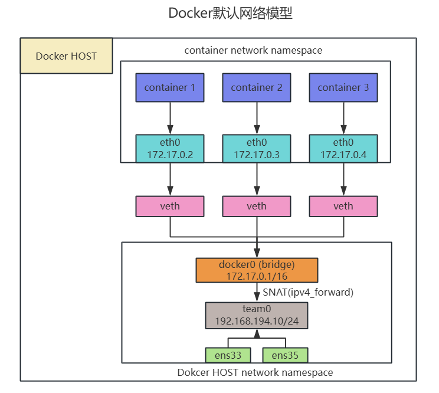
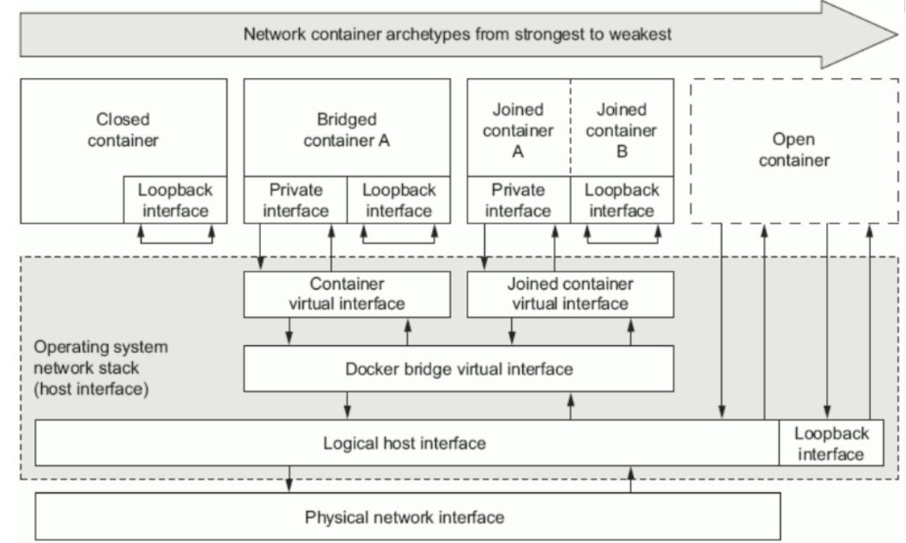

### Docker容器默认网络模型



- docker0
  - 是一个二层网络设备，即网桥
  - 通过网桥可以将Linux支持的不同的端口连接起来
  - 实现类交换机多对多的通信
- veth pair
  - 虚拟以太网（Ethernet）设备
  - 成对出现，用于解决网络命名空间之间的隔离
  - 一端连接Container network namespace，另一端连接host network namespace

```shell
[root@docker ~]# ifconfig docker0
docker0: flags=4163<UP,BROADCAST,RUNNING,MULTICAST>  mtu 1500
        inet 172.17.0.1  netmask 255.255.0.0  broadcast 172.17.255.255
        inet6 fe80::42:91ff:fe34:63b9  prefixlen 64  scopeid 0x20<link>
        ether 02:42:91:34:63:b9  txqueuelen 0  (Ethernet)
        RX packets 0  bytes 0 (0.0 B)
        RX errors 0  dropped 0  overruns 0  frame 0
        TX packets 5  bytes 446 (446.0 B)
        TX errors 0  dropped 0 overruns 0  carrier 0  collisions 0

[root@docker ~]# ip a s
1: lo: <LOOPBACK,UP,LOWER_UP> mtu 65536 qdisc noqueue state UNKNOWN group default qlen 1000
    link/loopback 00:00:00:00:00:00 brd 00:00:00:00:00:00
    inet 127.0.0.1/8 scope host lo
       valid_lft forever preferred_lft forever
    inet6 ::1/128 scope host 
       valid_lft forever preferred_lft forever
2: ens33: <BROADCAST,MULTICAST,UP,LOWER_UP> mtu 1500 qdisc pfifo_fast master team1 state UP group default qlen 1000
    link/ether 00:0c:29:50:69:c4 brd ff:ff:ff:ff:ff:ff
3: ens34: <BROADCAST,MULTICAST,UP,LOWER_UP> mtu 1500 qdisc pfifo_fast master team1 state UP group default qlen 1000
    link/ether 00:0c:29:50:69:ce brd ff:ff:ff:ff:ff:ff
4: team1: <BROADCAST,MULTICAST,UP,LOWER_UP> mtu 1500 qdisc noqueue state UP group default qlen 1000
    link/ether 00:0c:29:50:69:c4 brd ff:ff:ff:ff:ff:ff
    inet 192.168.194.10/24 brd 192.168.194.255 scope global noprefixroute team1
       valid_lft forever preferred_lft forever
    inet6 fe80::2d3:c7ef:d265:437/64 scope link noprefixroute 
       valid_lft forever preferred_lft forever
5: docker0: <BROADCAST,MULTICAST,UP,LOWER_UP> mtu 1500 qdisc noqueue state UP group default 
    link/ether 02:42:91:34:63:b9 brd ff:ff:ff:ff:ff:ff
    inet 172.17.0.1/16 brd 172.17.255.255 scope global docker0
       valid_lft forever preferred_lft forever
    inet6 fe80::42:91ff:fe34:63b9/64 scope link 
       valid_lft forever preferred_lft forever
7: veth156827d@if6: <BROADCAST,MULTICAST,UP,LOWER_UP> mtu 1500 qdisc noqueue master docker0 state UP group default 
    link/ether b2:51:b6:f6:fd:4e brd ff:ff:ff:ff:ff:ff link-netnsid 0
    inet6 fe80::b051:b6ff:fef6:fd4e/64 scope link 
       valid_lft forever preferred_lft forever
```

#### Docker网络的基本架构

##### 1.网络命名空间

每个Docker容器都会有一个独立的 **网络命名空间(Network Namespace)**

-  容器内部的网络栈（包括接口、路由表、iptables等）是完全隔离的
- 容器内部的 ”网卡“ 是通过虚拟设备对接入到宿主机的网桥上。

##### 2.虚拟网卡（veth pair）

Docker会为每个容器创建一堆虚拟以太网设备（veth pair）

- 一端连接到容器内部（这就是容器内看到的eth0）
- 另一段连接到宿主机的docker0网桥上

##### 3.宿主机上的网桥（docker0）

- docker0是一个虚拟网桥 ，它在宿主机上负责连接所有的容器的虚拟网卡（veth pair）
- 这就像一个二层交换机，所有挂载到docker0上的设备（容器的eth0）可以直接相互通信

#### 容器与外部网络通信的机制

​	虽然容器通过docker0网桥连接到宿主机。但要与外部网络通信，还需要额外的处理，因为容器的IP地址（如172.17.x.x）是私有的，无法直接访问外部网络。

##### 1.NAT（网络地址转换）

Docker使用宿主机的网络栈，配置iptables的NAT规则，对容器的流量进行SNAT（源地址转换）

当容器访问外部网络时刻：

- 数据包的源IP地址会被修改为宿主机的外部网卡IP地址
- 外部网络返回的数据包会通过NAT转回容器的IP地址。

##### 2.iptables配置

Docker在宿主机上设置了以下关键规则：

MASQUERADE规则：将容器的私有IP映射到宿主机的外部IP

```shell
iptables -t nat -A POSTROUTING -s 172.17.0.0/16 ! -o docker0 -j MASQUERADE
```

FORWARD规则：允许容器间流量已经容器与外部网络之间的流量转发

```shell
iptables -A FORWARD -o docker0 -j ACCEPT
```

##### 3.路由表

宿主机的路由表会自动添加一条规则：

Destination     Gateway         Genmask         Flags Metric Ref    Use Iface
172.17.0.0      0.0.0.0         255.255.0.0     U     0      0        0 docker0

这条规则确保宿主机直到如何将发往172.17.0.0/16网段的流量转发到docker0

```shell
[root@docker ~]# iptables -t nat -vnL POSTROUTING
Chain POSTROUTING (policy ACCEPT 0 packets, 0 bytes)
 pkts bytes target     prot opt in     out     source               destination         
    0     0 MASQUERADE  all  --  *      !docker0  172.17.0.0/16        0.0.0.0/0           
    0     0 MASQUERADE  tcp  --  *      *       172.17.0.2           172.17.0.2           tcp dpt:80
    
[root@docker ~]# iptables -t nat -vnL DOCKER
Chain DOCKER (2 references)
 pkts bytes target     prot opt in     out     source               destination         
    0     0 RETURN     all  --  docker0 *       0.0.0.0/0            0.0.0.0/0           
    0     0 DNAT       tcp  --  !docker0 *       0.0.0.0/0            0.0.0.0/0            tcp dpt:8080 to:172.17.0.2:80    
```

### Docker容器四种网络模型



|                             模式                             |                  使用方法                  | 说明                                                         |
| :----------------------------------------------------------: | :----------------------------------------: | :----------------------------------------------------------- |
|            bridge[桥接式网络（Bridge container A]            |              --network bridge              | 桥接容器，除了有一块本地回环接口（Loopback interface）外，还有一块私有接口（Private interface)通过容器虚拟接口（Container virtual interface）连接到桥接虚拟接口（Docker bridge virtual interface），之后通过逻辑主机接口（Logical host interface）连接到主机物理网络（Physical network interface）。<br/> 桥接网卡默认会分配到172.17.0.0/16的IP地址段。<br/>如果我们在创建容器时没有指定网络模型，默认就是（NAT）桥接网络，这也就是为什么我们在登录到一个容器后，发现IP地址段都在172.17.0.0/16网段的原因。 |
|             host [开放式容器（Open container）]              |               --network host               | 比联盟式网络更开放，我们知道联盟式网络是多个容器共享网络，而开放式容器（Open container）就直接共享了宿主机的命名空间。因此物理网卡有多少个，那么该容器就能看到多少个网卡信息。可以说Open container是联盟式容器的衍生。 |
|             none[封闭式网络（Closed container）]             |               --network none               | 封闭式容器，只有本地回环接口（Loopback interface，和服务器看到的lo接口类似），无法与外界进行通信。 |
| container[联盟式网络（Joined container A \| Joined container B] | --network container:c1（容器名称或容器ID） | 每个容器都有一部分名称空间（Mount、PID、User），另外一部分名称空间是共享的（UTS、Net、IPC）。<br/> 由于它们的网络是共享的，因此各个容器可以通过本地回环接口（Loopback interface）进行通信。<br/> 除了共享同一组本地回环接口（Loopback interface）外，还有一块私有接口（Private interface）通过联合容器虚拟接口（Joined container virtual interface）连接到桥接虚拟接口（Docker bridge virtual interface），之后通过逻辑主机接口（Logical host interface）连接到主机物理网络（Physical network interface）。 |

#### 查看已有网络模型

```shell
[root@docker ~]# docker network --h
unknown flag: --h
See 'docker network --help'.

Usage:  docker network COMMAND

Manage networks

Commands:
  connect     Connect a container to a network
  create      Create a network
  disconnect  Disconnect a container from a network
  inspect     Display detailed information on one or more networks
  ls          List networks
  prune       Remove all unused networks
  rm          Remove one or more networks

Run 'docker network COMMAND --help' for more information on a command.

#查看已有网络模型
[root@docker ~]# docker network ls
NETWORK ID     NAME      DRIVER    SCOPE
65ddc604823a   bridge    bridge    local
2e54950c1ed6   host      host      local
5fcbf2c4012a   none      null      local
#查看已有网络模型详细信息
[root@docker ~]# docker network inspect bridge
[
    {
        "Name": "bridge",
        "Id": "65ddc604823ab20457f113fd2fc7cbb1c7e3c4fef739669766ea5cfeab9c856f",
        "Created": "2025-01-17T17:54:36.94246324+08:00",
        "Scope": "local",
        "Driver": "bridge",
        "EnableIPv6": false,
        "IPAM": {
            "Driver": "default",
            "Options": null,
            "Config": [
                {
                    "Subnet": "172.17.0.0/16",
                    "Gateway": "172.17.0.1"
                }
            ]
        },
        "Internal": false,
        "Attachable": false,
        "Ingress": false,
        "ConfigFrom": {
            "Network": ""
        },
        "ConfigOnly": false,
        "Containers": {
            "e7a317e117c7b650b2a9a5f1fad647489b9be4af6264f3de4485d8d08731ca36": {
                "Name": "webserver",
                "EndpointID": "dee2f78a5e9e8160f041f6604a90bc68ec7272531256852eee8f4ad16c7238e4",
                "MacAddress": "02:42:ac:11:00:02",
                "IPv4Address": "172.17.0.2/16",
                "IPv6Address": ""
            }
        },
        "Options": {
            "com.docker.network.bridge.default_bridge": "true",
            "com.docker.network.bridge.enable_icc": "true",
            "com.docker.network.bridge.enable_ip_masquerade": "true",
            "com.docker.network.bridge.host_binding_ipv4": "0.0.0.0",
            "com.docker.network.bridge.name": "docker0",
            "com.docker.network.driver.mtu": "1500"
        },
        "Labels": {}
    }
]

#查看docker支持的网络模型
```

#### 创建指定类型网络模型


