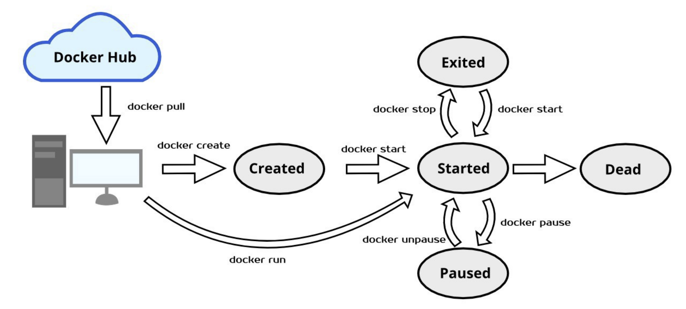

### Docker生命周期



### Docker Image

- Docker镜像是只读的容器模板，是Docker容器基础
- 为Docker容器提供了静态文件系统运行环境（rootfs）
- 是容器的静止状态
- 容器时镜像的运行状态

### 联合文件系统

- 联合文件系统（union filesystem）
- 联合文件系统时实现联合挂载技术的文件系统
- 联合挂载技术可以实现在一个挂载点同时挂载多个文件系统，将挂载点的原目录与被挂载内容进行整合，使得最终可见的文件系统包含整合之后的各层文件和目录


### Docker Overlay2

容器文件系统有多种存储驱动实现方式：aufs、devicemapper、overlay、overlay2等。

- registry / repository：registry是repository的集合，repository是镜像的集合。
- image：image是存储镜像相关的元数据，包括镜像的架构，镜像默认配置信息，镜像的容器配置信息等。它是逻辑上的概念，并无物理上的镜像文件与之对应。
- layer：layer（镜像层）组成了镜像，单个layer可以被多个镜像共享。


#### 查看Docker Host存储驱动方式

```shell
[root@jackycheung ~]# docker info | grep overlay
 Storage Driver: overlay2
  Network: bridge host ipvlan macvlan null overlay
```

#### images分层

```shell
[root@docker ~]# docker pull nginx:latest
latest: Pulling from library/nginx
fd674058ff8f: Pull complete 
566e42bcee1c: Pull complete 
2b99b9c5d9e5: Pull complete 
bd98674871f5: Pull complete 
1e109dd2a0d7: Pull complete 
da8cc133ff82: Pull complete 
c44f27309ea1: Pull complete 
Digest: sha256:42e917aaa1b5bb40dd0f6f7f4f857490ac7747d7ef73b391c774a41a8b994f15
Status: Downloaded newer image for nginx:latest
docker.io/library/nginx:latest
```

通过docker pull nginx:latest 可以看到下载的镜像分为7层；找到这7层存储在Docker Host具体位置

```shell
[root@harbor ~]# docker images |grep nginx
nginx                          latest    f876bfc1cc63   6 weeks ago     192MB
[root@harbor ~]# ls /var/lib/docker/image/overlay2/
distribution  imagedb  layerdb  repositories.json
```

这个目录是查找的入口，它存储了镜像管理的元数据

- repositories.json	#记录了repo与镜像ID的映射关系
- imagedb    #记录了镜像架构、操作系统、构建镜像的容器ID和配置以及rootfs等信息
- layerdb   #记录了每层镜像层的元数据

通过短ID查找repositories.json文件，找到镜像nginx的长ID，通过长ID在imagedb找到该镜像的元数据

```shell
[root@harbor ~]#  cat /var/lib/docker/image/overlay2/repositories.json |grep f876bfc1cc63
{"Repositories":"nginx":{"nginx:latest":"sha256:f876bfc1cc63d905bb9c8ebc5adc98375bb8e22920959719d1a96e8f594868fa","nginx@sha256:42e917aaa1b5bb40dd0f6f7f4f857490ac7747d7ef73b391c774a41a8b994f15":"sha256:f876bfc1cc63d905bb9c8ebc5adc98375bb8e22920959719d1a96e8f594868fa"}}}
```

元数据rootfs。在rootfs中看到layers有7层，这7层即对应镜像的7层镜像层。并且，自上而下分别映射到容器的底层到顶层。

```shell
[root@harbor ~]# cat /var/lib/docker/image/overlay2/imagedb/content/sha256/f876bfc1cc63d905bb9c8ebc5adc98375bb8e22920959719d1a96e8f594868fa
......
"os":"linux","rootfs":{"type":"layers","diff_ids":["sha256:8b296f48696071aafb5a6286ca60d441a7e559b192fc7f94bb63ee93dae98f17","sha256:c4c8312766f14d6032cdb9e42846762e96eb999c3eab60638c18898478c8e734","sha256:14a96b2ac5951fa6fb796b89d4323038cd64865b9cb80bca5a5413891c96f756","sha256:d567f5b4517ebfbe71f20832b779dffe810743f1b391df213fb8a0eb4c61ce0f","sha256:24aeff94f79e54ef0dbb0a0a46f71bfa059df6da1fe5d830cd3e9af0dde4dc7b","sha256:ad206e285c61fa7198fba29fc4b9aa903310f7de8a36d13fb029d2d50e53e915","sha256:af90855d83449413fa665066b5647b6217ffebf773356b4562b4100c8aa142ab"]}}
```

layerdb元数据会给我们想要的信息，通过底层diff-id：8b296f48696071aafb5a6286ca60d441a7e559b192fc7f94bb63ee93dae98f17查找到最底层的cache_id，通过cache_id即可查找到镜像层的文件内容

```shell
[root@harbor ~]# ls /var/lib/docker/image/overlay2/layerdb/sha256/8b296f48696071aafb5a6286ca60d441a7e559b192fc7f94bb63ee93dae98f17
cache-id  diff  size  tar-split.json.gz

[root@harbor ~]# cat /var/lib/docker/image/overlay2/layerdb/sha256/8b296f48696071aafb5a6286ca60d441a7e559b192fc7f94bb63ee93dae98f17/cache-id 
fd0f7121ee6cb4e7fb2de31e5e37783902a05398fd27baf729dad9523ad8f6b9

[root@harbor ~]# cat /var/lib/docker/image/overlay2/layerdb/sha256/8b296f48696071aafb5a6286ca60d441a7e559b192fc7f94bb63ee93dae98f17/diff 
sha256:8b296f48696071aafb5a6286ca60d441a7e559b192fc7f94bb63ee93dae98f17
```

使用cacheID查找文件内容

```shell
[root@harbor ~]# ls /var/lib/docker/overlay2/fd0f7121ee6cb4e7fb2de31e5e37783902a05398fd27baf729dad9523ad8f6b9
committed  diff  link
[root@harbor ~]# ls /var/lib/docker/overlay2/fd0f7121ee6cb4e7fb2de31e5e37783902a05398fd27baf729dad9523ad8f6b9/diff
bin   dev  home  lib64  mnt  proc  run   srv  tmp  var
boot  etc  lib   media  opt  root  sbin  sys  usr
```

镜像元数据和镜像层内容是分开存储的。因此通过cache-id需要到/var/lib/docker/overlay2目录下查看镜像层内容，它就存在diff目录下，其中link存储的是镜像层对应的短ID。


找到了镜像层最底层，我们查找镜像层的中间层，发现在layerdb目录下没有diff-id c4c8312766f14d6032cdb9e42846762e96eb999c3eab60638c18898478c8e734的镜像层

```shell
[root@harbor ~]# ls /var/lib/docker/image/overlay2/layerdb/sha256/c4c8312766f14d6032cdb9e42846762e96eb999c3eab60638c18898478c8e734 
ls: cannot access /var/lib/docker/image/overlay2/layerdb/sha256/c4c8312766f14d6032cdb9e42846762e96eb999c3eab60638c18898478c8e734: No such file or directory
```

这是因为docker引入了内容寻址机制，该机制会根据文件内容来索引镜像和镜像层。docker利用rootfs中的diff-id计算出内容寻址的chainID，通过chainID获取layer相关信息，最终引到镜像层文件内容。

对于最底层镜像层其diff-id即是chainID。因此我们可以查找到它的文件内容。除最底层外，chainID需要通过公式 chainID(n) = SHA256(chain(n-1) diffID(n)) 计算得到，计算中间层chainID：

```shell
[root@harbor ~]# echo -n "sha256:8b296f48696071aafb5a6286ca60d441a7e559b192fc7f94bb63ee93dae98f17 sha256:c4c8312766f14d6032cdb9e42846762e96eb999c3eab60638c18898478c8e734" | sha256sum -
59db063f63f68b942f3c60769828c15efe9abd12362d5c6d925a0484bbf031d0  -
```

根据中间层chainID查找到文件内容：

```shell
[root@harbor ~]# ll /var/lib/docker/image/overlay2/layerdb/sha256/59db063f63f68b942f3c60769828c15efe9abd12362d5c6d925a0484bbf031d0
total 108
-rw-r--r-- 1 root root    64 Jan 10 03:19 cache-id
-rw-r--r-- 1 root root    71 Jan 10 03:19 diff
-rw-r--r-- 1 root root    71 Jan 10 03:19 parent
-rw-r--r-- 1 root root     9 Jan 10 03:19 size
-rw-r--r-- 1 root root 92409 Jan 10 03:19 tar-split.json.gz

[root@harbor ~]# cat /var/lib/docker/image/overlay2/layerdb/sha256/59db063f63f68b942f3c60769828c15efe9abd12362d5c6d925a0484bbf031d0/cache-id 
37241d8b7061a28962a9833f00583269e7d90d2ddbc2f4a3bfe682bd54b705dd

[root@harbor ~]# cat /var/lib/docker/image/overlay2/layerdb/sha256/59db063f63f68b942f3c60769828c15efe9abd12362d5c6d925a0484bbf031d0/diff
sha256:c4c8312766f14d6032cdb9e42846762e96eb999c3eab60638c18898478c8e734

[root@harbor ~]# cat /var/lib/docker/image/overlay2/layerdb/sha256/59db063f63f68b942f3c60769828c15efe9abd12362d5c6d925a0484bbf031d0/parent 
sha256:8b296f48696071aafb5a6286ca60d441a7e559b192fc7f94bb63ee93dae98f17

#镜像层文件内容
[root@harbor ~]# ls /var/lib/docker/overlay2/37241d8b7061a28962a9833f00583269e7d90d2ddbc2f4a3bfe682bd54b705dd
committed  diff  link  lower  work
[root@harbor ~]# ls /var/lib/docker/overlay2/37241d8b7061a28962a9833f00583269e7d90d2ddbc2f4a3bfe682bd54b705dd/diff/
docker-entrypoint.d  etc  usr  var

#镜像层文件内容短ID
[root@harbor ~]# cat /var/lib/docker/overlay2/37241d8b7061a28962a9833f00583269e7d90d2ddbc2f4a3bfe682bd54b705dd/link   
VCY4IQWSSSRUFWQBZ4LZDB5NGH

#“父”镜像层文件内容短ID
[root@harbor ~]# cat /var/lib/docker/overlay2/37241d8b7061a28962a9833f00583269e7d90d2ddbc2f4a3bfe682bd54b705dd/lower 
l/36NEJXXLZQZRTMCONAJLCLT4RT
```

找到最底层文件内容和“中间层”文件内容，就可以找到最顶层文件内容。

### Docker容器与镜像

```shell
[root@harbor ~]# docker run -d nginx:latest
2cf76cbe3fe75659b35addd5513cec6a048c479664adaac70b107b463d6091de
[root@harbor ~]# docker ps |grep nginx
2cf76cbe3fe7   nginx:latest                 "/docker-entrypoint.…"   10 seconds ago   Up 8 seconds                 80/tcp                      brave_chatelet

[root@harbor ~]# mount | grep overlay
overlay on /var/lib/docker/overlay2/760fc7e199cd56b78621ae61eaefef812f7be17d5094348037d3e3316cf3f390/merged type overlay (rw,relatime,lowerdir=/var/lib/docker/overlay2/l/LWBQ2XGT5OPGZ5S4XCCKQKYPUC:/var/lib/docker/overlay2/l/IOORXQ735W52WVL3FGECNYGZ2Q:/var/lib/docker/overlay2/l/FE35ALP2I6Z6EH6ZU5K5CWYTLS:/var/lib/docker/overlay2/l/AVKTTAJM2HF2OTDXSUBE6CCU54:/var/lib/docker/overlay2/l/25MEORWCEXU2BBD27JG42GVRFE:/var/lib/docker/overlay2/l/JBJQYCLLXXGF6IGUE7P3OQ6STB:/var/lib/docker/overlay2/l/VCY4IQWSSSRUFWQBZ4LZDB5NGH:/var/lib/docker/overlay2/l/36NEJXXLZQZRTMCONAJLCLT4RT,upperdir=/var/lib/docker/overlay2/760fc7e199cd56b78621ae61eaefef812f7be17d5094348037d3e3316cf3f390/diff,workdir=/var/lib/docker/overlay2/760fc7e199cd56b78621ae61eaefef812f7be17d5094348037d3e3316cf3f390/work)
```

启动容器会mount一个overlay的联合文件系统到容器内。这个文件系统由三层组成：

- lowerdir：只读层，即镜像的镜像层
- upperdir：读写层，该层是容器的读写层，对容器的读写操作将反映再读写层
- workdir：overlayfs的内部层，用于实现从只读层到读写层的copy_up操作
- merge：容器内作为同一视图联合挂载点的目录

```shell
lowerdir=/var/lib/docker/overlay2/l/LWBQ2XGT5OPGZ5S4XCCKQKYPUC
/var/lib/docker/overlay2/l/IOORXQ735W52WVL3FGECNYGZ2Q
/var/lib/docker/overlay2/l/FE35ALP2I6Z6EH6ZU5K5CWYTLS
/var/lib/docker/overlay2/l/AVKTTAJM2HF2OTDXSUBE6CCU54
/var/lib/docker/overlay2/l/25MEORWCEXU2BBD27JG42GVRFE
/var/lib/docker/overlay2/l/JBJQYCLLXXGF6IGUE7P3OQ6STB
/var/lib/docker/overlay2/l/VCY4IQWSSSRUFWQBZ4LZDB5NGH
/var/lib/docker/overlay2/l/36NEJXXLZQZRTMCONAJLCLT4RT
```

镜像层只有7层，这边短ID却有7个；

```shell
[root@harbor /]# cd /var/lib/docker/overlay2/l/
[root@harbor l]# pwd
/var/lib/docker/overlay2/l
[root@harbor l]# ll LWBQ2XGT5OPGZ5S4XCCKQKYPUC/   
total 0
drwxr-xr-x 4 root root 43 Jan 10 04:31 dev
drwxr-xr-x 2 root root 66 Jan 10 04:31 etc
[root@harbor l]# ll IOORXQ735W52WVL3FGECNYGZ2Q/
total 0
drwxr-xr-x 2 root root 41 Dec 25 06:17 docker-entrypoint.d
[root@harbor l]# ll FE35ALP2I6Z6EH6ZU5K5CWYTLS/
total 0
drwxr-xr-x 2 root root 41 Dec 25 06:17 docker-entrypoint.d
[root@harbor l]# ll AVKTTAJM2HF2OTDXSUBE6CCU54/
total 0
drwxr-xr-x 2 root root 38 Dec 25 06:17 docker-entrypoint.d
[root@harbor l]# ll 25MEORWCEXU2BBD27JG42GVRFE/
total 0
drwxr-xr-x 2 root root 45 Dec 25 06:17 docker-entrypoint.d
[root@harbor l]# ll JBJQYCLLXXGF6IGUE7P3OQ6STB/
total 4
-rwxr-xr-x 1 root root 1620 Dec 25 06:17 docker-entrypoint.sh
[root@harbor l]# ll VCY4IQWSSSRUFWQBZ4LZDB5NGH/
total 4
drwxr-xr-x  2 root root    6 Dec 25 06:17 docker-entrypoint.d
drwxr-xr-x 19 root root 4096 Dec 25 06:17 etc
drwxr-xr-x  7 root root   66 Dec 23 08:00 usr
drwxr-xr-x  5 root root   41 Dec 23 08:00 var
[root@harbor l]# ll 36NEJXXLZQZRTMCONAJLCLT4RT/
total 4
lrwxrwxrwx  1 root root    7 Dec 23 08:00 bin -> usr/bin
drwxr-xr-x  2 root root    6 Oct 31 19:04 boot
drwxr-xr-x  2 root root    6 Dec 23 08:00 dev
drwxr-xr-x 29 root root 4096 Dec 23 08:00 etc
drwxr-xr-x  2 root root    6 Oct 31 19:04 home
lrwxrwxrwx  1 root root    7 Dec 23 08:00 lib -> usr/lib
lrwxrwxrwx  1 root root    9 Dec 23 08:00 lib64 -> usr/lib64
drwxr-xr-x  2 root root    6 Dec 23 08:00 media
drwxr-xr-x  2 root root    6 Dec 23 08:00 mnt
drwxr-xr-x  2 root root    6 Dec 23 08:00 opt
drwxr-xr-x  2 root root    6 Oct 31 19:04 proc
drwx------  2 root root   37 Dec 23 08:00 root
drwxr-xr-x  3 root root   18 Dec 23 08:00 run
lrwxrwxrwx  1 root root    8 Dec 23 08:00 sbin -> usr/sbin
drwxr-xr-x  2 root root    6 Dec 23 08:00 srv
drwxr-xr-x  2 root root    6 Oct 31 19:04 sys
drwxrwxrwt  2 root root    6 Dec 23 08:00 tmp
drwxr-xr-x 12 root root  133 Dec 23 08:00 usr
drwxr-xr-x 11 root root  139 Dec 23 08:00 var
```

镜像层

IOORXQ735W52WVL3FGECNYGZ2Q、FE35ALP2I6Z6EH6ZU5K5CWYTLS、AVKTTAJM2HF2OTDXSUBE6CCU54、25MEORWCEXU2BBD27JG42GVRFE、JBJQYCLLXXGF6IGUE7P3OQ6STB、VCY4IQWSSSRUFWQBZ4LZDB5NGH、36NEJXXLZQZRTMCONAJLCLT4RT 分别对应镜像的7层镜像层文件内容，它们分别映射到镜像层的diff目录。

而LWBQ2XGT5OPGZ5S4XCCKQKYPUC 映射的是容器的初始化层init，该层内容是和容器配置相关的文件内容，它是只读的。

启动了容器，docker将镜像内容mount到容器中。那么，如果再容器内写入文件会对镜像有什么影响呢？

### 容器内写文件

镜像层是只读的，在容器中写文件其实是将文件写入到overlay的可读写层。

- 读写层不存在该文件，只读层存在
- 读写层存在该文件，只读层不存在
- 读写层和只读层都不存在该文件

我们简单构建一种读写层和只读层都不存在的场景：

```shell
[root@docker ~]# docker run -it centos:latest bash
[root@ef125bd314cb /]# echo "hello docker!" > jackycheung.txt
[root@ef125bd314cb /]# ls
bin  etc   jackycheung.txt  lib64       media  opt   root  sbin  sys  usr
dev  home  lib              lost+found  mnt    proc  run   srv   tmp  var

[root@docker ~]# docker images | grep centos
centos                         latest    5d0da3dc9764   3 years ago     231MB

[root@docker ~]# cat /var/lib/docker/image/overlay2/repositories.json | grep 5d0da3dc9764
{"Repositories":"centos":{"centos:latest":"sha256:5d0da3dc976460b72c77d94c8a1ad043720b0416bfc16c52c45d4847e53fadb6","centos@sha256:a27fd8080b517143cbbbab9dfb7c8571c40d67d534bbdee55bd6c473f432b177":"sha256:5d0da3dc976460b72c77d94c8a1ad043720b0416bfc16c52c45d4847e53fadb6"}}}

[root@docker ~]# cat /var/lib/docker/image/overlay2/imagedb/content/sha256/5d0da3dc976460b72c77d94c8a1ad043720b0416bfc16c52c45d4847e53fadb6
"os":"linux","rootfs":{"type":"layers","diff_ids":["sha256:74ddd0ec08fa43d09f32636ba91a0a3053b02cb4627c35051aff89f853606b59"]}}

[root@docker ~]# ls /var/lib/docker/image/overlay2/layerdb/sha256/74ddd0ec08fa43d09f32636ba91a0a3053b02cb4627c35051aff89f853606b59/
cache-id           diff               size               tar-split.json.gz 

[root@docker ~]# cat /var/lib/docker/image/overlay2/layerdb/sha256/74ddd0ec08fa43d09f32636ba91a0a3053b02cb4627c35051aff89f853606b59/cache-id 
bf68f4b4a0ed021e6c9452bfc8019cdcc2380ede7da587e4fc31a0f63069083f

[root@docker ~]# cat /var/lib/docker/image/overlay2/layerdb/sha256/74ddd0ec08fa43d09f32636ba91a0a3053b02cb4627c35051aff89f853606b59/diff
sha256:74ddd0ec08fa43d09f32636ba91a0a3053b02cb4627c35051aff89f853606b59

[root@docker ~]# ls /var/lib/docker/overlay2/bf68f4b4a0ed021e6c9452bfc8019cdcc2380ede7da587e4fc31a0f63069083f/
committed  diff  link
[root@docker ~]# ls /var/lib/docker/overlay2/bf68f4b4a0ed021e6c9452bfc8019cdcc2380ede7da587e4fc31a0f63069083f/diff
bin  dev  etc  home  lib  lib64  lost+found  media  mnt  opt  proc  root  run  sbin  srv  sys  tmp  usr  var

#查看容器是否有变化
[root@docker ~]# mount | grep overlay
overlay on /var/lib/docker/overlay2/e85405dc3903b98cb4649ee569a14961b6456b4ead8e6280313ad4ef3592a1ab/merged type overlay (rw,relatime,lowerdir=/var/lib/docker/overlay2/l/S6ET7EHF76PYVJYNUGOZEEV6XT:/var/lib/docker/overlay2/l/Y67ZLZWKLI72YANGZBUYJIII36,upperdir=/var/lib/docker/overlay2/e85405dc3903b98cb4649ee569a14961b6456b4ead8e6280313ad4ef3592a1ab/diff,workdir=/var/lib/docker/overlay2/e85405dc3903b98cb4649ee569a14961b6456b4ead8e6280313ad4ef3592a1ab/work)

[root@docker ~]# ls /var/lib/docker/overlay2/e85405dc3903b98cb4649ee569a14961b6456b4ead8e6280313ad4ef3592a1ab/diff/
jackycheung.txt

[root@docker ~]# ls /var/lib/docker/overlay2/e85405dc3903b98cb4649ee569a14961b6456b4ead8e6280313ad4ef3592a1ab/merged/
bin  etc   jackycheung.txt  lib64       media  opt   root  sbin  sys  usr
dev  home  lib              lost+found  mnt    proc  run   srv   tmp  var
```

### Docker容器镜像操作命令

容器内写文件会反映在overlay的可读写层，可以将读写层的文件内容做成镜像；docker通过commit和build操作实现镜像的构建。commit将容器提交为一个镜像，build在一个镜像的基础上构建镜像。

使用commit将刚才的centos容器提交为一个镜像：

```shell
[root@docker ~]# docker ps 
CONTAINER ID   IMAGE           COMMAND   CREATED          STATUS          PORTS     NAMES
38bcaedabd1b   centos:latest   "bash"    23 minutes ago   Up 23 minutes             zen_cori
[root@docker ~]# docker commit 38bcaedabd1b
sha256:42c1f84ed175f85d71303796d5da23bd4763dd966280daea601cc1195ea599d9
[root@docker ~]# docker images 
REPOSITORY                     TAG       IMAGE ID       CREATED         SIZE
<none>                         <none>    42c1f84ed175   8 seconds ago   231MB
centos                         latest    5d0da3dc9764   3 years ago     231MB
```

image短ID 42c1f84ed175即容器提交的镜像，查看镜像的imagedb元数据

```shell
[root@docker ~]# cat /var/lib/docker/image/overlay2/imagedb/content/sha256/42c1f84ed175f85d71303796d5da23bd4763dd966280daea601cc1195ea599d9 
......
"os":"linux","rootfs":{"type":"layers","diff_ids":["sha256:74ddd0ec08fa43d09f32636ba91a0a3053b02cb4627c35051aff89f853606b59","sha256:853d6e3630e5a2ce8bfa3345fbf96f5cde4991efa5cf7d3e38657ed0fd94a118"]}}
```

可以看到镜像层自上而下的前一个镜像层diff-id和centos镜像层diff-id一样，说明没层镜像层可以被多个镜像共享。而多出来的一层镜像层内容即是刚才写入的文件 jackycheung.txtd的文件内容：

```shell
[root@docker ~]# echo -n "sha256:74ddd0ec08fa43d09f32636ba91a0a3053b02cb4627c35051aff89f853606b59 sha256:853d6e3630e5a2ce8bfa3345fbf96f5cde4991efa5cf7d3e38657ed0fd94a118" | sha256sum -
ed531812006ce0676bfb110e1a883c12d9e97f7cc8fe0f19e2af07ca5d2e647e  -

[root@docker ~]# ls /var/lib/docker/image/overlay2/layerdb/sha256/ed531812006ce0676bfb110e1a883c12d9e97f7cc8fe0f19e2af07ca5d2e647e/
cache-id  diff  parent  size  tar-split.json.gz

[root@docker ~]# cat /var/lib/docker/image/overlay2/layerdb/sha256/ed531812006ce0676bfb110e1a883c12d9e97f7cc8fe0f19e2af07ca5d2e647e/cache-id 
2c6017c175ff18e1d633c95aaae245fde04faf6504743180eb9816410cdfe8db

[root@docker ~]# ls /var/lib/docker/overlay2/2c6017c175ff18e1d633c95aaae245fde04faf6504743180eb9816410cdfe8db
diff  link  lower  work

[root@docker ~]# ls /var/lib/docker/overlay2/2c6017c175ff18e1d633c95aaae245fde04faf6504743180eb9816410cdfe8db/diff/
jackycheung.txt
```

