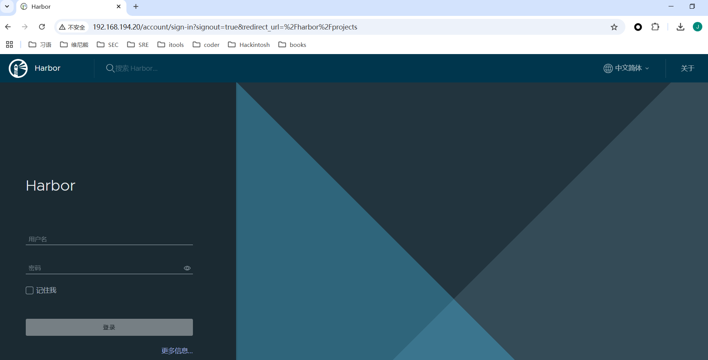
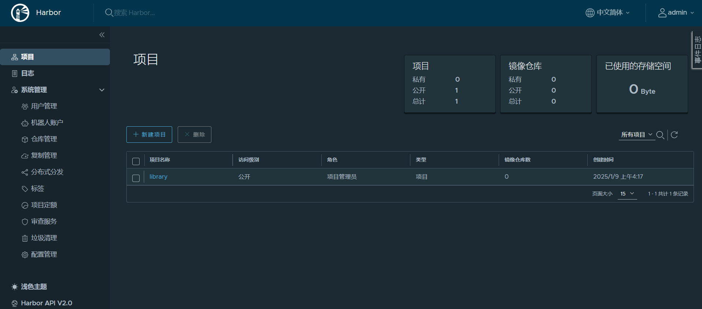
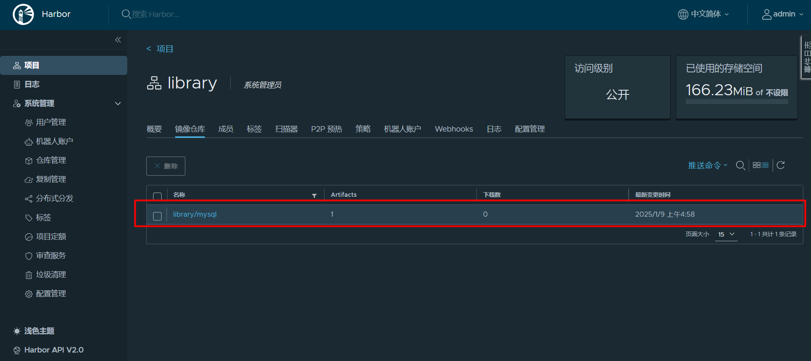
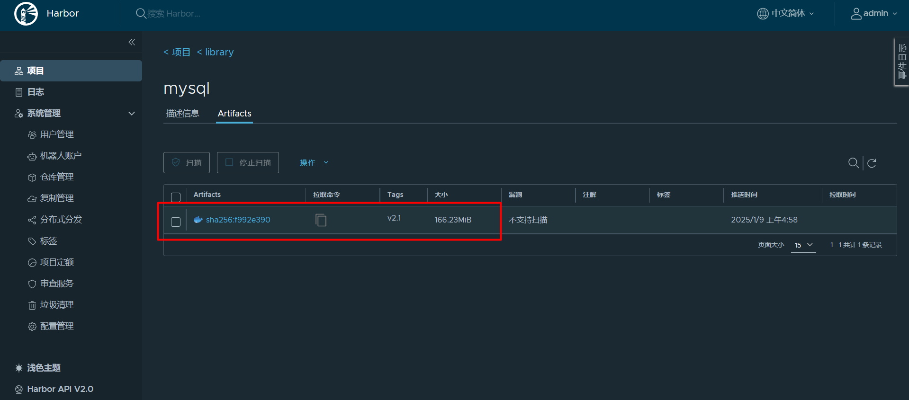

### docker hub

#### 本地登录docker hub

```shell
#登录docker hub
[root@jackycheung ~]# docker login
Login with your Docker ID to push and pull images from Docker Hub. If you don't have a Docker ID, head over to https://hub.docker.com to create one.
Username: canvs@qq.com
Password: 
WARNING! Your password will be stored unencrypted in /root/.docker/config.json.
Configure a credential helper to remove this warning. See
https://docs.docker.com/engine/reference/commandline/login/#credentials-store

Login Succeeded
#退出docker hub
[root@jackycheung ~]# docker logout
Removing login credentials for https://index.docker.io/v1/
```

#### 上传容器镜像

```shell
#原始redis容器镜像
[root@jackycheung ~]# docker images |grep redis
REPOSITORY    TAG       IMAGE ID       CREATED         SIZE
redis         latest    691a00f92e2c   27 hours ago    117MB
#重新为redis打标记
[root@jackycheung ~]# docker tag redis:latest canvs/redis:v1
#打标机后的容器镜像
[root@jackycheung ~]# docker images |grep canvs/redis
canvs/redis   v1        691a00f92e2c   27 hours ago    117MB
#推送到docker hub
[root@jackycheung ~]# docker push canvs/redis:v1
The push refers to repository [docker.io/canvs/redis]
e7cce060c5ae: Mounted from library/redis 
5f70bf18a086: Mounted from library/maven 
f24c8e302ac5: Mounted from library/redis 
d28f4a4f082a: Pushed 
906ab648c7c8: Mounted from library/redis 
0b264c1cc6b5: Mounted from library/redis 
3eba1aeafa05: Mounted from library/redis 
8b296f486960: Mounted from library/redis 
v1: digest: sha256:053b9ef33d9afb7d72f90bcf15ad11d6aea00fe1fb37f76f9fb17a7dd92d9ecc size: 1986
```


#### 下载容器镜像

```shell
[root@jackycheung ~]# docker images
REPOSITORY    TAG       IMAGE ID       CREATED         SIZE
canvs/redis   v1        691a00f92e2c   28 hours ago    117MB
redis         latest    691a00f92e2c   28 hours ago    117MB
tomcat        latest    f62f518e5c5c   4 weeks ago     467MB
nginx         latest    f876bfc1cc63   6 weeks ago     192MB
mysql         latest    56a8c14e1404   2 months ago    603MB
httpd         latest    4ce47c750a58   5 months ago    147MB
hello-world   latest    d2c94e258dcb   20 months ago   13.3kB
centos        latest    5d0da3dc9764   3 years ago     231MB
[root@jackycheung ~]# docker image rm canvs/redis:v1
Untagged: canvs/redis:v1
Untagged: canvs/redis@sha256:053b9ef33d9afb7d72f90bcf15ad11d6aea00fe1fb37f76f9fb17a7dd92d9ecc
[root@jackycheung ~]# docker images |grep canvs/redis
[root@jackycheung ~]# docker pull canvs/redis:v1
v1: Pulling from canvs/redis
Digest: sha256:053b9ef33d9afb7d72f90bcf15ad11d6aea00fe1fb37f76f9fb17a7dd92d9ecc
Status: Downloaded newer image for canvs/redis:v1
docker.io/canvs/redis:v1
[root@jackycheung ~]# docker images |grep canvs/redis
canvs/redis   v1        691a00f92e2c   28 hours ago    117MB
```

### 部署harbor

#### 安装docker-compose

```shell
#获取docker-compose二进制文件
[root@harbor ~]# wget https://github.com/docker/compose/releases/download/1.25.0/docker-compose-Linux-x86_64
[root@harbor ~]# mv docker-compose-Linux-x86_64  /usr/bin/docker-compose
[root@harbor ~]# chmod +x /usr/bin/docker-compose 
#查看docker-compose版本
[root@harbor ~]# docker-compose version
docker-compose version 1.25.0, build 0a186604
docker-py version: 4.1.0
CPython version: 3.7.4
OpenSSL version: OpenSSL 1.1.0l  10 Sep 2019
```

#### 获取harbor

```shell
#获取harbor
[root@harbor ~]# wget https://github.com/goharbor/harbor/releases/download/v2.4.1/harbor-offline-installer-v2.4.1.tgz
#解压harbor
[root@harbor ~]# tar xf harbor-offline-installer-v2.4.1.tgz
[root@harbor ~]# ll harbor/
total 601608
-rw-r--r-- 1 root root      3361 Dec 16  2021 common.sh
-rw-r--r-- 1 root root 616006217 Dec 16  2021 harbor.v2.4.1.tar.gz
-rw-r--r-- 1 root root      8999 Dec 16  2021 harbor.yml.tmpl
-rwxr-xr-x 1 root root      2500 Dec 16  2021 install.sh
-rw-r--r-- 1 root root     11347 Dec 16  2021 LICENSE
-rwxr-xr-x 1 root root      1881 Dec 16  2021 prepare
```

#### 修改harbor配置

```shell
[root@harbor harbor]# cp harbor.yml.tmpl harbor.yml	
[root@harbor harbor]# sed -n '5p;13p;;15p;17p;18p;34p' harbor.yml 
hostname: 192.168.194.20	# 可以使用域名或者本机IP
#https:	#由于没有证书禁用https
#  port: 443
#  certificate: /your/certificate/path
#  private_key: /your/private/key/path
harbor_admin_password: harbor	#harbor密码
```

#### 执行预备脚本

```
#执行预备脚本
[root@harbor harbor]# ./prepare 
prepare base dir is set to /root/harbor
WARNING:root:WARNING: HTTP protocol is insecure. Harbor will deprecate http protocol in the future. Please make sure to upgrade to https
Generated configuration file: /config/portal/nginx.conf
Generated configuration file: /config/log/logrotate.conf
Generated configuration file: /config/log/rsyslog_docker.conf
Generated configuration file: /config/nginx/nginx.conf
Generated configuration file: /config/core/env
Generated configuration file: /config/core/app.conf
Generated configuration file: /config/registry/config.yml
Generated configuration file: /config/registryctl/env
Generated configuration file: /config/registryctl/config.yml
Generated configuration file: /config/db/env
Generated configuration file: /config/jobservice/env
Generated configuration file: /config/jobservice/config.yml
Generated and saved secret to file: /data/secret/keys/secretkey
Successfully called func: create_root_cert
Generated configuration file: /compose_location/docker-compose.yml
Clean up the input dir
```

#### 执行安装脚本

```shell
[root@harbor harbor]# ./install.sh 

[Step 0]: checking if docker is installed ...

Note: docker version: 26.1.4

[Step 1]: checking docker-compose is installed ...

Note: docker-compose version: 1.25.0

[Step 2]: loading Harbor images ...
3fd9ccd5eeaa: Loading layer [==================================================>]  5.275MB/5.275MB
c600bceee2f7: Loading layer [==================================================>]  4.096kB/4.096kB
724cd8711815: Loading layer [==================================================>]  3.072kB/3.072kB
d7c82a981c89: Loading layer [==================================================>]  17.32MB/17.32MB
a814341c2c44: Loading layer [==================================================>]  18.12MB/18.12MB
Loaded image: goharbor/registry-photon:v2.4.1
b00595b6932d: Loading layer [==================================================>]   5.27MB/5.27MB
e34892d856ce: Loading layer [==================================================>]  5.928MB/5.928MB
ac5a22c6047d: Loading layer [==================================================>]  14.47MB/14.47MB
3d1ac12eb215: Loading layer [==================================================>]  29.29MB/29.29MB
394b4b2ea0fa: Loading layer [==================================================>]  22.02kB/22.02kB
bb0deb7416e0: Loading layer [==================================================>]  14.47MB/14.47MB
Loaded image: goharbor/notary-signer-photon:v2.4.1
c3b02aec560c: Loading layer [==================================================>]  8.422MB/8.422MB
4d5b3acd128e: Loading layer [==================================================>]  3.584kB/3.584kB
7afbf44c3706: Loading layer [==================================================>]   2.56kB/2.56kB
31f95ac6eb9a: Loading layer [==================================================>]  75.59MB/75.59MB
8981a12f5c17: Loading layer [==================================================>]  5.632kB/5.632kB
16eb0821dcc3: Loading layer [==================================================>]  96.26kB/96.26kB
b19eba29a0de: Loading layer [==================================================>]  11.78kB/11.78kB
f0785d2e9965: Loading layer [==================================================>]  76.49MB/76.49MB
26ce29b9d7ab: Loading layer [==================================================>]   2.56kB/2.56kB
Loaded image: goharbor/harbor-core:v2.4.1
59e3814aa5f1: Loading layer [==================================================>]  119.8MB/119.8MB
1e99e9cd580e: Loading layer [==================================================>]  3.072kB/3.072kB
2bab205001c7: Loading layer [==================================================>]   59.9kB/59.9kB
c51450af480c: Loading layer [==================================================>]  61.95kB/61.95kB
Loaded image: goharbor/redis-photon:v2.4.1
3636ff090145: Loading layer [==================================================>]  8.421MB/8.421MB
fa3d57c372c8: Loading layer [==================================================>]  3.584kB/3.584kB
a2c97825dcbf: Loading layer [==================================================>]   2.56kB/2.56kB
366b1363b528: Loading layer [==================================================>]  86.95MB/86.95MB
3d2fd6d13a0f: Loading layer [==================================================>]  87.74MB/87.74MB
Loaded image: goharbor/harbor-jobservice:v2.4.1
8f71cf8bc1c6: Loading layer [==================================================>]  5.275MB/5.275MB
5cb3457d8e25: Loading layer [==================================================>]  4.096kB/4.096kB
02c18fad9dc6: Loading layer [==================================================>]  17.32MB/17.32MB
7bbcea1ec44e: Loading layer [==================================================>]  3.072kB/3.072kB
f2842e1ada70: Loading layer [==================================================>]  28.69MB/28.69MB
4665575c3f9e: Loading layer [==================================================>]  46.81MB/46.81MB
Loaded image: goharbor/harbor-registryctl:v2.4.1
439595cfbbc0: Loading layer [==================================================>]  7.192MB/7.192MB
Loaded image: goharbor/nginx-photon:v2.4.1
a19de03ace6b: Loading layer [==================================================>]   5.27MB/5.27MB
35bbd4cf35b6: Loading layer [==================================================>]  5.928MB/5.928MB
88f852ebd746: Loading layer [==================================================>]  15.88MB/15.88MB
e3c0db81a28c: Loading layer [==================================================>]  29.29MB/29.29MB
f74e521b7a55: Loading layer [==================================================>]  22.02kB/22.02kB
7d97a705f439: Loading layer [==================================================>]  15.88MB/15.88MB
Loaded image: goharbor/notary-server-photon:v2.4.1
1e6473070b18: Loading layer [==================================================>]    124MB/124MB
f05c1a477d2d: Loading layer [==================================================>]  3.584kB/3.584kB
bcab3e00aa98: Loading layer [==================================================>]  3.072kB/3.072kB
970d569f474a: Loading layer [==================================================>]   2.56kB/2.56kB
c659c9812277: Loading layer [==================================================>]  3.072kB/3.072kB
9d401ff8bf07: Loading layer [==================================================>]  3.584kB/3.584kB
968dfed00d2e: Loading layer [==================================================>]  19.97kB/19.97kB
Loaded image: goharbor/harbor-log:v2.4.1
b64000a1cd2c: Loading layer [==================================================>]  1.097MB/1.097MB
e3fb7ac15701: Loading layer [==================================================>]  5.889MB/5.889MB
d6e7f8008582: Loading layer [==================================================>]  165.9MB/165.9MB
eff0812a8c6f: Loading layer [==================================================>]  15.07MB/15.07MB
91a6abd7a540: Loading layer [==================================================>]  4.096kB/4.096kB
47e875926154: Loading layer [==================================================>]  6.144kB/6.144kB
04876e025d4a: Loading layer [==================================================>]  3.072kB/3.072kB
b817a88114e6: Loading layer [==================================================>]  2.048kB/2.048kB
e5fb37021dff: Loading layer [==================================================>]   2.56kB/2.56kB
767486d5c318: Loading layer [==================================================>]   2.56kB/2.56kB
b92f2b842b46: Loading layer [==================================================>]   2.56kB/2.56kB
e90e3a7ea4e9: Loading layer [==================================================>]  8.704kB/8.704kB
Loaded image: goharbor/harbor-db:v2.4.1
daf3d38cddc8: Loading layer [==================================================>]  8.422MB/8.422MB
8013b2cbc0b9: Loading layer [==================================================>]  18.13MB/18.13MB
4445f5ea7083: Loading layer [==================================================>]  4.608kB/4.608kB
32e035f0af8e: Loading layer [==================================================>]  18.93MB/18.93MB
Loaded image: goharbor/harbor-exporter:v2.4.1
0ad72e88d766: Loading layer [==================================================>]   8.54MB/8.54MB
fe195f48d47b: Loading layer [==================================================>]  4.096kB/4.096kB
71f2671db231: Loading layer [==================================================>]  3.072kB/3.072kB
ddda0b4a8eae: Loading layer [==================================================>]  39.27MB/39.27MB
c3fe76027866: Loading layer [==================================================>]  12.37MB/12.37MB
d82a7403c39a: Loading layer [==================================================>]  52.43MB/52.43MB
Loaded image: goharbor/trivy-adapter-photon:v2.4.1
03e449493f09: Loading layer [==================================================>]  5.275MB/5.275MB
4f4a25c7cc0d: Loading layer [==================================================>]   64.5MB/64.5MB
77a37df05436: Loading layer [==================================================>]  3.072kB/3.072kB
47c58e48962d: Loading layer [==================================================>]  4.096kB/4.096kB
5dd56c28f3fc: Loading layer [==================================================>]  65.29MB/65.29MB
Loaded image: goharbor/chartmuseum-photon:v2.4.1
Loaded image: goharbor/prepare:v2.4.1
eb57d0945b2e: Loading layer [==================================================>]  7.192MB/7.192MB
dd9069fd53a8: Loading layer [==================================================>]  7.355MB/7.355MB
e779dab1d180: Loading layer [==================================================>]  1.754MB/1.754MB
Loaded image: goharbor/harbor-portal:v2.4.1


[Step 3]: preparing environment ...

[Step 4]: preparing harbor configs ...
prepare base dir is set to /root/harbor
WARNING:root:WARNING: HTTP protocol is insecure. Harbor will deprecate http protocol in the future. Please make sure to upgrade to https
Clearing the configuration file: /config/portal/nginx.conf
Clearing the configuration file: /config/log/logrotate.conf
Clearing the configuration file: /config/log/rsyslog_docker.conf
Clearing the configuration file: /config/nginx/nginx.conf
Clearing the configuration file: /config/core/env
Clearing the configuration file: /config/core/app.conf
Clearing the configuration file: /config/registry/passwd
Clearing the configuration file: /config/registry/config.yml
Clearing the configuration file: /config/registryctl/env
Clearing the configuration file: /config/registryctl/config.yml
Clearing the configuration file: /config/db/env
Clearing the configuration file: /config/jobservice/env
Clearing the configuration file: /config/jobservice/config.yml
Generated configuration file: /config/portal/nginx.conf
Generated configuration file: /config/log/logrotate.conf
Generated configuration file: /config/log/rsyslog_docker.conf
Generated configuration file: /config/nginx/nginx.conf
Generated configuration file: /config/core/env
Generated configuration file: /config/core/app.conf
Generated configuration file: /config/registry/config.yml
Generated configuration file: /config/registryctl/env
Generated configuration file: /config/registryctl/config.yml
Generated configuration file: /config/db/env
Generated configuration file: /config/jobservice/env
Generated configuration file: /config/jobservice/config.yml
loaded secret from file: /data/secret/keys/secretkey
Generated configuration file: /compose_location/docker-compose.yml
Clean up the input dir


[Step 5]: starting Harbor ...
Creating network "harbor_harbor" with the default driver
Creating harbor-log ... done
Creating registryctl   ... done
Creating harbor-db     ... done
Creating harbor-portal ... done
Creating redis         ... done
Creating registry      ... done
Creating harbor-core   ... done
Creating harbor-jobservice ... done
Creating nginx             ... done
✔ ----Harbor has been installed and started successfully.----
```

#### 验证运行情况

```shell
[root@harbor harbor]# docker ps
CONTAINER ID   IMAGE                                COMMAND                  CREATED         STATUS                   PORTS                                   NAMES
ffa37e8cdbba   goharbor/nginx-photon:v2.4.1         "nginx -g 'daemon of…"   3 minutes ago   Up 3 minutes (healthy)   0.0.0.0:80->8080/tcp, :::80->8080/tcp   nginx
036645b4cb01   goharbor/harbor-jobservice:v2.4.1    "/harbor/entrypoint.…"   3 minutes ago   Up 3 minutes (healthy)                                           harbor-jobservice
730782b5dba6   goharbor/harbor-core:v2.4.1          "/harbor/entrypoint.…"   3 minutes ago   Up 3 minutes (healthy)                                           harbor-core
a2549dad12e0   goharbor/harbor-portal:v2.4.1        "nginx -g 'daemon of…"   3 minutes ago   Up 3 minutes (healthy)                                           harbor-portal
b49407cbc259   goharbor/harbor-db:v2.4.1            "/docker-entrypoint.…"   3 minutes ago   Up 3 minutes (healthy)                                           harbor-db
19e877c7b602   goharbor/registry-photon:v2.4.1      "/home/harbor/entryp…"   3 minutes ago   Up 3 minutes (healthy)                                           registry
e46195998934   goharbor/redis-photon:v2.4.1         "redis-server /etc/r…"   3 minutes ago   Up 3 minutes (healthy)                                           redis
e2e9751bc769   goharbor/harbor-registryctl:v2.4.1   "/home/harbor/start.…"   3 minutes ago   Up 3 minutes (healthy)                                           registryctl
cc591fa81f33   goharbor/harbor-log:v2.4.1           "/bin/sh -c /usr/loc…"   3 minutes ago   Up 3 minutes (healthy)   127.0.0.1:1514->10514/tcp               harbor-log
```

#### 访问harbor web UI界面

通过物理机IP访问；用户名：admin 密码：harbor





### docker配置Harbor仓库

#### docker daemon使用harbor

```shell
[root@jackycheung ~]# vim /etc/docker/daemon.json
#添加内容
[root@jackycheung ~]# cat /etc/docker/daemon.json
{
    "insecure-registries": ["192.168.194.20"]
}
[root@jackycheung ~]# systemctl daemon-reload
[root@jackycheung ~]# systemctl restart docker
```

#### Login harbor

```shell
[root@jackycheung ~]# docker login 192.168.194.20
Username: admin
Password: 
WARNING! Your password will be stored unencrypted in /root/.docker/config.json.
Configure a credential helper to remove this warning. See
https://docs.docker.com/engine/reference/commandline/login/#credentials-store

Login Succeeded
```

#### docker push 

```shell
[root@jackycheung ~]# docker images | grep mysql
mysql         latest    56a8c14e1404   2 months ago    603MB
[root@jackycheung ~]# docker tag mysql:latest 192.168.194.20/library/mysql:v2.1
[root@jackycheung ~]# docker images | grep 192.168.194.20
192.168.194.20/library/mysql   v2.1      56a8c14e1404   2 months ago    603MB
[root@jackycheung ~]# docker push 192.168.194.20/library/mysql:v2.1
The push refers to repository [192.168.194.20/library/mysql]
819639725d6c: Pushed 
47d7ce436879: Pushed 
318ca2af319d: Pushed 
2a56f0c6bf3d: Pushed 
a95029854581: Pushed 
e0397abce739: Pushed 
cef599db096a: Pushed 
0a231028f7bb: Pushed 
d32eece2a9fa: Pushed 
7600fdef234b: Pushed 
v2.1: digest: sha256:f992e3907333f21e1370ad876d7a6f7376447ed722f604f33c0fc8e47ee86bd3 size: 2411
```





#### docker pull 

```shell
[root@jackycheung ~]# docker images | grep 192.168.194.20          
192.168.194.20/library/mysql   v2.1      56a8c14e1404   2 months ago    603MB
[root@jackycheung ~]# docker image rmi 192.168.194.20/library/mysql:v2.1
Untagged: 192.168.194.20/library/mysql:v2.1
Untagged: 192.168.194.20/library/mysql@sha256:f992e3907333f21e1370ad876d7a6f7376447ed722f604f33c0fc8e47ee86bd3
[root@jackycheung ~]# docker images | grep 192.168.194.20               
[root@jackycheung ~]# docker pull 192.168.194.20/library/mysql:v2.1
v2.1: Pulling from library/mysql
Digest: sha256:f992e3907333f21e1370ad876d7a6f7376447ed722f604f33c0fc8e47ee86bd3
Status: Downloaded newer image for 192.168.194.20/library/mysql:v2.1
192.168.194.20/library/mysql:v2.1
[root@jackycheung ~]# docker images | grep 192.168.194.20          
192.168.194.20/library/mysql   v2.1      56a8c14e1404   2 months ago    603MB
```

