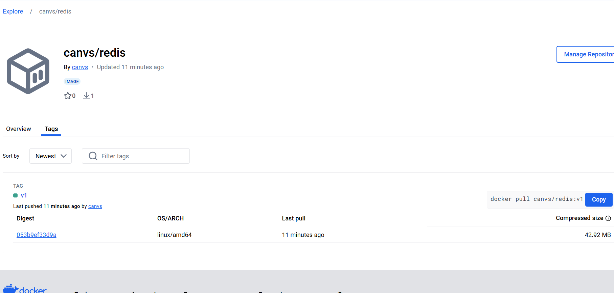

### docker hub

#### 本地登录docker hub

```shell
#登录docker hub
[root@jackycheung ~]# docker login
Login with your Docker ID to push and pull images from Docker Hub. If you don't have a Docker ID, head over to https://hub.docker.com to create one.
Username: canvs@qq.com
Password: 
WARNING! Your password will be stored unencrypted in /root/.docker/config.json.
Configure a credential helper to remove this warning. See
https://docs.docker.com/engine/reference/commandline/login/#credentials-store

Login Succeeded
#退出docker hub
[root@jackycheung ~]# docker logout
Removing login credentials for https://index.docker.io/v1/
```

#### 上传容器镜像

```shell
#原始redis容器镜像
[root@jackycheung ~]# docker images |grep redis
REPOSITORY    TAG       IMAGE ID       CREATED         SIZE
redis         latest    691a00f92e2c   27 hours ago    117MB
#重新为redis打标记
[root@jackycheung ~]# docker tag redis:latest canvs/redis:v1
#打标机后的容器镜像
[root@jackycheung ~]# docker images |grep canvs/redis
canvs/redis   v1        691a00f92e2c   27 hours ago    117MB
#推送到docker hub
[root@jackycheung ~]# docker push canvs/redis:v1
The push refers to repository [docker.io/canvs/redis]
e7cce060c5ae: Mounted from library/redis 
5f70bf18a086: Mounted from library/maven 
f24c8e302ac5: Mounted from library/redis 
d28f4a4f082a: Pushed 
906ab648c7c8: Mounted from library/redis 
0b264c1cc6b5: Mounted from library/redis 
3eba1aeafa05: Mounted from library/redis 
8b296f486960: Mounted from library/redis 
v1: digest: sha256:053b9ef33d9afb7d72f90bcf15ad11d6aea00fe1fb37f76f9fb17a7dd92d9ecc size: 1986
```



#### 下载容器镜像

```shell
[root@jackycheung ~]# docker images
REPOSITORY    TAG       IMAGE ID       CREATED         SIZE
canvs/redis   v1        691a00f92e2c   28 hours ago    117MB
redis         latest    691a00f92e2c   28 hours ago    117MB
tomcat        latest    f62f518e5c5c   4 weeks ago     467MB
nginx         latest    f876bfc1cc63   6 weeks ago     192MB
mysql         latest    56a8c14e1404   2 months ago    603MB
httpd         latest    4ce47c750a58   5 months ago    147MB
hello-world   latest    d2c94e258dcb   20 months ago   13.3kB
centos        latest    5d0da3dc9764   3 years ago     231MB
[root@jackycheung ~]# docker image rm canvs/redis:v1
Untagged: canvs/redis:v1
Untagged: canvs/redis@sha256:053b9ef33d9afb7d72f90bcf15ad11d6aea00fe1fb37f76f9fb17a7dd92d9ecc
[root@jackycheung ~]# docker images |grep canvs/redis
[root@jackycheung ~]# docker pull canvs/redis:v1
v1: Pulling from canvs/redis
Digest: sha256:053b9ef33d9afb7d72f90bcf15ad11d6aea00fe1fb37f76f9fb17a7dd92d9ecc
Status: Downloaded newer image for canvs/redis:v1
docker.io/canvs/redis:v1
[root@jackycheung ~]# docker images |grep canvs/redis
canvs/redis   v1        691a00f92e2c   28 hours ago    117MB
```

### 部署harbor

#### 安装docker-compose

```shell
#获取docker-compose二进制文件
[root@harbor ~]# wget https://github.com/docker/compose/releases/download/1.25.0/docker-compose-Linux-x86_64
[root@harbor ~]# mv docker-compose-Linux-x86_64  /usr/bin/docker-compose
[root@harbor ~]# chmod +x /usr/bin/docker-compose 
#查看docker-compose版本
[root@harbor ~]# docker-compose version
docker-compose version 1.25.0, build 0a186604
docker-py version: 4.1.0
CPython version: 3.7.4
OpenSSL version: OpenSSL 1.1.0l  10 Sep 2019
```

#### 获取harbor

```shell
[root@harbor ~]# wget https://github.com/goharbor/harbor/releases/download/v2.4.1/harbor-offline-installer-v2.4.1.tgz
```

