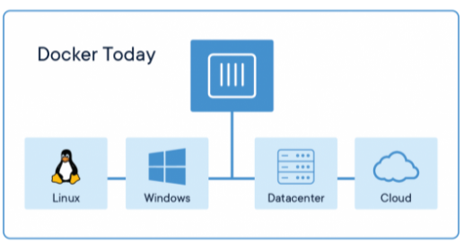
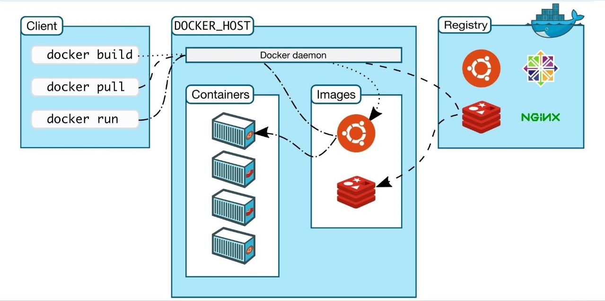

### Docker生态架构

- Docker使用C/S架构模式，可以远程API来管理和创建Docker容器。
- Docker容器通过Docker镜像来创建
- 容器与镜像的关系类似于面向对象的对象和类

#### 容器与镜像的关系

| Docker | 面向对象 |
| :----: | :------: |
|  容器  |   对象   |
|  镜像  |    类    |

#### Docker Containers Are Everywhere



#### Docker系统架构



- Docker Daemon：用于管理Docker Host中运行的容器、容器镜像、容器网络等，管理由Containerd.io提供的容器。即Dockerd，Docker守护进程，监听Docker API请求并管理Docker对象。 
- Image：把应用运行环境及计算资源打包方式生成可再用于启动容器的不可变的基础设施的模板文件，主要用于基于其启动一个容器。
- Container：Container容器是镜像运行的实体，一个镜像可以创建N个容器，每个处于运行的容器都包含着一个或多个相关的应用，且它们的运行不会干扰到其他容器；它们之间是互相隔离的。

- Repository：Repository仓库用来保存相关一组镜像，这组镜像具有相同的镜像名称，都与镜像仓库名称相同。
- Tag：通过\<repository>:\<tag>即可唯一定位一个镜像。
- Registry镜像中心：用于存储已生成容器运行模板的仓库；存放着很多由官方、其他机构或个人创建的 Docker 仓库，Docker 用户可以直接从这些仓库中 pull 需要的镜像，也可以将自己制作的镜像 push 到 Docker 镜像中心相应的仓库中。

#### Docker引擎架构

- Docker Client：提供CLI工具，用于用户向Docker提交命令请求
- Dockerd：即Docker Daemon，功能有镜像构建、镜像管理、REST API、核心网络等，通过gRPC与Containerd通信
- Containerd：Container Daemon，是管理容器的生命周期，自身不会创建容器，调用Runc来完成容器的创建
- Runc：Run Container是OCI（开放容器倡议基金会）容器运行时规范的实现；Runc用于创建容器，本质是一个独立的容器运行时CKI工具。在fork出一个容器子进程后会启动该容器进程。在容器进程启动后，Runc会自动退出
- Shim：当Runc自动退出之前，会讲新容器进程的父进程指定为相应的Shim进程

#### Docker仓库

- 公有 Docker Registry：公有服务是开放给用户使用、允许用户管理镜像的Registry服务。
  - [Docker Hub](https://hub.docker.com/)
  - [CoreOS](https://coreos.com/)
  - [Quay.io](https://quay.io/repository/)
- 私有 Docker Registry：用户可以本地搭建私有Docker Registry；Docker官方提供了Docker Registry镜像了，可以直接作为私有Registry服务
  - [Docker Trusted Registry](https://docs.docker.com/)
  - [VMWare Harbor](https://github.com/vmware/harbor)
  - [Sonatype Nexus](https://www.sonatype.com/docker) 

### Docker部署

#### Docker版本

- Docker-ce Docker社区版，主要用于个人开发者测试使用，免费版本
- Docker-ee Docker企业版，主要用于企业开发及应用部署使用，收费版本，免费试用一个月。

#### 使用YUM源部署

YUM源可以使用官方YUM源、阿里云开源镜像站YUM源。

> [官方安装手册](https://docs.docker.com/engine/install/centos/#install-using-the-repository)

[使用阿里云镜像站安装 docker](https://developer.aliyun.com/mirror/docker-ce?spm=a2c6h.13651102.0.0.1b1e1b11LWoniB)

##### 1.安装必要的工具包

```shell
[root@jackycheung ~]# sudo yum install -y yum-utils
[root@jackycheung ~]# yum install -y ntp
[root@jackycheung ~]# systemctl start ntpd
[root@jackycheung ~]# ntpdate ntp1.aliyun.com
```

##### 2.添加软件源信息

```shell
[root@jackycheung ~]# yum-config-manager --add-repo https://mirrors.aliyun.com/docker-ce/linux/centos/docker-ce.repo
```

##### 3.安装docker ce

```shell
#也可以yum install docker-ce；会全部安装
[root@jackycheung ~]# yum install docker-ce docker-ce-cli containerd.io docker-buildx-plugin docker-compose-plugin
#启动docker
[root@jackycheung ~]# systemctl start docker
#开机自启动docker
[root@jackycheung ~]# systemctl enable docker
#查看docker版本
[root@jackycheung ~]# docker version
Client: Docker Engine - Community	#客户端
 Version:           26.1.4
 API version:       1.45
 Go version:        go1.21.11
 Git commit:        5650f9b
 Built:             Wed Jun  5 11:32:04 2024
 OS/Arch:           linux/amd64
 Context:           default

Server: Docker Engine - Community	#docker管理引擎
 Engine:
  Version:          26.1.4
  API version:      1.45 (minimum version 1.24)
  Go version:       go1.21.11
  Git commit:       de5c9cf
  Built:            Wed Jun  5 11:31:02 2024
  OS/Arch:          linux/amd64
  Experimental:     false
 containerd:
  Version:          1.6.33
  GitCommit:        d2d58213f83a351ca8f528a95fbd145f5654e957
 runc:
  Version:          1.1.12
  GitCommit:        v1.1.12-0-g51d5e94
 docker-init:
  Version:          0.19.0
  GitCommit:        de40ad0
```

##### 4.配置Docker Daemon启动文件

由于Docker使用过程中会对Centos操作系统中的Iptables防火墙中的FORWARD链默认规划产生影响及需要让Docker Daemon接受用户自定义的daemon.json文件，需要要按使用者要求的方式修改。

```shell
[root@jackycheung ~]# vim /usr/lib/systemd/system/docker.service 
#重新加载daemon文件
[root@jackycheung ~]# systemctl daemon-reload
```


##### 5.禁用防火墙和SELinux

```shell
#禁用SELinux
[root@jackycheung ~]# sudo setenforce 0
setenforce: SELinux is disabled
#永久禁用SELinux
[root@jackycheung ~]# sudo sed -i 's/^SELINUX=.*$/SELINUX=disabled/' /etc/selinux/config
#关闭防火墙
[root@jackycheung ~]# systemctl stop firewalld
#永久关闭防火墙
[root@jackycheung ~]# systemctl disable firewalld
```

#### 配置阿里云容器镜像加速

```shell
# 阿里云镜像加速器 https://cr.console.aliyun.com/cn-hangzhou/instances/mirrors  
[root@jackycheung ~]# vim /etc/docker/daemon.json
[root@jackycheung ~]# cat /etc/docker/daemon.json
{
  "registry-mirrors": ["https://anurpwmt.mirror.aliyuncs.com"]
}
[root@jackycheung ~]# systemctl daemon-reload
[root@jackycheung ~]# systemctl restart docker
[root@jackycheung ~]# docker info |grep aliyuncs.com
  https://anurpwmt.mirror.aliyuncs.com/
```

#### 配置国内容器镜像加速

```shell
[root@jackycheung ~]# cat /etc/docker/daemon.json 
{
  "registry-mirrors": [
        "https://hub.icert.top/",
        "https://ghcr.geekery.cn"
]
}
[root@jackycheung ~]# systemctl daemon-reload
[root@jackycheung ~]# systemctl restart docker
```

