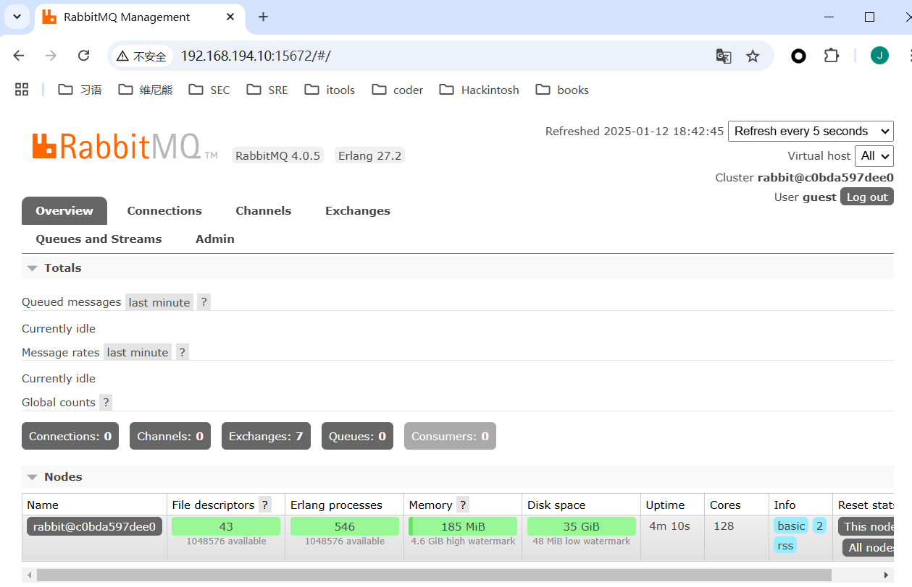
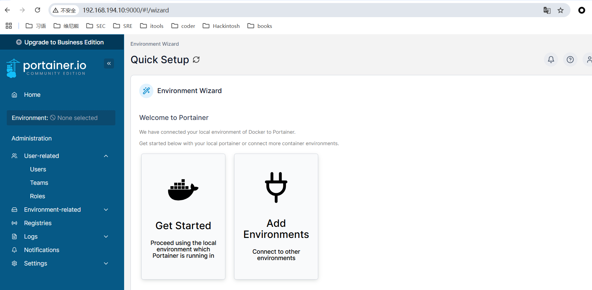

### Docker容器部署Tomcat

```shell
[root@docker /]# mkdir /opt/tomcat-8080
[root@docker /]# mkdir /opt/tomcat-8081
[root@docker /]# mkdir /opt/tomcat-8082
[root@docker /]# echo 'hello tomcat8080' > /opt/tomcat-8080/index.html
[root@docker /]# echo 'hello tomcat8081' > /opt/tomcat-8081/index.html 
[root@docker /]# echo 'hello tomcat8082' > /opt/tomcat-8082/index.html 
[root@docker /]# docker run -d -p 8080:8080 \
> -v /opt/tomcat-8080:/usr/local/tomcat/webapps/ROOT:ro \
> --name tomcat-8080 tomcat
7ee11e28d3d958f5c1b304c6e1a5e3d16913a27e73c419b83ac721993c84ac24
c[root@docker /]# curl 127.0.0.1:8080
hello tomcat8080
[root@docker /]# docker run -d -p 8081:8080 \
> -v /opt/tomcat-8081:/usr/local/tomcat/webapps/ROOT:ro \
> --name tomcat-8081 tomcat
d14b48c06bcc9970fe67f5e5f6064e27dfc20a8c8b2e656fd690bc4c5760b96c
c[root@docker /]# curl 127.0.0.1:8081
hello tomcat8081
[root@docker /]# docker run -d -p 8082:8080 -v /opt/tomcat-8082:/usr/local/tomcat/webapps/ROOT:ro --name tomcat-8082 tomcat 
ad6b2bfe98e38940d4db8baba9b7222de3b0e6de06421b659ab69e51ba011601
[root@docker ~]# docker ps | grep nginx-server
788d3e55a5fe   nginx:latest   "/docker-entrypoint.…"   9 minutes ago       Up 9 minutes       0.0.0.0:80->80/tcp, :::80->80/tcp           nginx-server
[root@docker /]# curl 127.0.0.1:8082
hello tomcat8082
[root@docker ~]# docker ps | grep tomcat
ad6b2bfe98e3   tomcat         "catalina.sh run"        About an hour ago   Up About an hour   0.0.0.0:8082->8080/tcp, :::8082->8080/tcp   tomcat-8082
d14b48c06bcc   tomcat         "catalina.sh run"        About an hour ago   Up About an hour   0.0.0.0:8081->8080/tcp, :::8081->8080/tcp   tomcat-8081
7ee11e28d3d9   tomcat         "catalina.sh run"        About an hour ago   Up About an hour   0.0.0.0:8080->8080/tcp, :::8080->8080/tcp   tomcat-8080
```

### Docker容器部署Nginx

#### 运行nginx容器将配置文件复制到宿主机

```shell
[root@docker /]# mkdir -p /opt/nginx-server/html 
[root@docker /]# mkdir -p /opt/nginx-server/conf
[root@docker /]# mkdir /opt/nginx-server/logs
[root@docker /]# docker run -d -p 80:80 --name nginx nginx
[root@docker /]# docker cp nginx:/etc/nginx/nginx.conf /opt/nginx-server/conf/
                                               Successfully copied 2.56kB to /opt/nginx-server/conf/

[root@docker /]# docker cp nginx:/etc/nginx/conf.d /opt/nginx-server/conf/
                                               Successfully copied 3.58kB to /opt/nginx-server/conf/
 
[root@docker /]# docker rm -f nginx
nginx
```

#### 运行nginx并挂载宿主机目录

```shell
#运行nginx容器并挂载目录和文件；logs日志目录不能是ro只读模式
[root@docker /]# docker run --name nginx-server -d -p 80:80 -v /opt/nginx-server/conf/nginx.conf:/etc/nginx/nginx.conf:ro -v /opt/nginx-server/conf/conf.d:/etc/nginx/conf.d:ro -v /opt/nginx-server/html:/usr/share/nginx/html:ro -v /opt/nginx-server/logs:/var/log/nginx nginx:latest
373355d9622c486d9731ea99d705227f70042df159ff42d2d8db4df2c250c1c0
[root@docker /]# docker ps
CONTAINER ID   IMAGE          COMMAND                  CREATED          STATUS          PORTS                                       NAMES
373355d9622c   nginx:latest   "/docker-entrypoint.…"   6 seconds ago    Up 5 seconds    0.0.0.0:80->80/tcp, :::80->80/tcp           nginx-server
ad6b2bfe98e3   tomcat         "catalina.sh run"        13 minutes ago   Up 13 minutes   0.0.0.0:8082->8080/tcp, :::8082->8080/tcp   tomcat-8082
d14b48c06bcc   tomcat         "catalina.sh run"        15 minutes ago   Up 15 minutes   0.0.0.0:8081->8080/tcp, :::8081->8080/tcp   tomcat-8081
7ee11e28d3d9   tomcat         "catalina.sh run"        16 minutes ago   Up 16 minutes   0.0.0.0:8080->8080/tcp, :::8080->8080/tcp   tomcat-8080
[root@docker /]# curl 127.0.0.1
<html>
<head><title>403 Forbidden</title></head>
<body>
<center><h1>403 Forbidden</h1></center>
<hr><center>nginx/1.27.3</center>
</body>
</html>
```

#### nginx反向代理

```shell
#修改conf.d/default.conf代理到tomcat-8080
[root@docker /]# vim /opt/nginx-server/conf/conf.d/default.conf
[root@docker /]# sed -n '8,12p' /opt/nginx-server/conf/conf.d/default.conf 
    location / {
    #    root   /usr/share/nginx/html;
    #   index  index.html index.htm;
       proxy_pass http://192.168.194.10:8080;
    }
#重新加载配置文件；或者重启nginx：docker restart nginx-server    
[root@docker /]# docker exec nginx-server nginx -s reload
[root@docker /]# curl 127.0.0.1
hello tomcat8080
```

#### nginx负载均衡

```shell
[root@docker /]# vim /opt/nginx-server/conf/nginx.conf 
[root@docker /]# sed -n '14,21p' /opt/nginx-server/conf/nginx.conf  
http {
    #配置负载均衡
    upstream nginxCluster{
        server 192.168.194.10:8080;
        server 192.168.194.10:8081;
        server 192.168.194.10:8082;
    }
    ......
}    
[root@docker /]# vim /opt/nginx-server/conf/conf.d/default.conf 
[root@docker /]# sed -n '8,13p' /opt/nginx-server/conf/conf.d/default.conf  
    location / {
       #root   /usr/share/nginx/html;
       #index  index.html index.htm;
       #proxy_pass http://192.168.194.10:8080;
        proxy_pass http://nginxCluster;
    }
[root@docker ~]# curl 127.0.0.1
hello tomcat8080
[root@docker ~]# curl 127.0.0.1
hello tomcat8080
[root@docker ~]# curl 127.0.0.1
hello tomcat8080
[root@docker ~]# curl 127.0.0.1
hello tomcat8080
[root@docker ~]# 
[root@docker ~]# curl 127.0.0.1
hello tomcat8081
[root@docker ~]# curl 127.0.0.1
hello tomcat8082
[root@docker ~]# curl 127.0.0.1
hello tomcat8080
[root@docker ~]# docker exec nginx-server nginx -s reload
```

### Docker容器部署Redis

#### 单节点Redis

```shell
[root@docker ~]# mkdir -p /opt/redis/conf
[root@docker ~]# touch /opt/redis/conf/redis.conf
# redis-server /etc/redis/redis.conf 告诉容器启动redis服务器，并且使用/etc/redis/redis.conf作为配置文件
[root@docker ~]# docker run -p 6379:6379 --name redis -v /opt/redis/data:/data -v /opt/redis/conf:/etc/redis -d redis redis-server /etc/redis/redis.conf
4729c791cb94358020a369ef0094168bc337e83a2fa35eca5bf157409cd836f8
[root@docker ~]# docker ps
CONTAINER ID   IMAGE     COMMAND                  CREATED         STATUS        PORTS                                       NAMES
4729c791cb94   redis     "docker-entrypoint.s…"   2 seconds ago   Up 1 second   0.0.0.0:6379->6379/tcp, :::6379->6379/tcp   redis
[root@docker yum.repos.d]# curl -o epel-7.repo http://mirrors.aliyun.com/repo/epel-7.repo 
  % Total    % Received % Xferd  Average Speed   Time    Time     Time  Current
                                 Dload  Upload   Total   Spent    Left  Speed
100   664  100   664    0     0   3454      0 --:--:-- --:--:-- --:--:--  3458
[root@docker yum.repos.d]# yum install -y redis
......
Complete!

[root@docker ~]# docker exec -it redis redis-cli -h 127.0.0.1 -p 6379
127.0.0.1:6379> set name jayce
OK
127.0.0.1:6379> get name
"jayce"
127.0.0.1:6379> exit
[root@docker ~]# redis-cli -h 127.0.0.1 -p 6379
127.0.0.1:6379> get name
"jayce"
```

#### Redis集群

安装redis-cluster；3主3从方式，从为了同步备份，主进行slot数据分片

```shell
#编写运行多个redis容器脚本
[root@docker ~]# vim redis-cluster.sh
[root@docker ~]# cat redis-cluster.sh 
# cat redis-cluster.sh
for port in $(seq 8001 8006); \
do \
mkdir -p /mydata/redis/node-${port}/conf
touch /mydata/redis/node-${port}/conf/redis.conf
cat << EOF >/mydata/redis/node-${port}/conf/redis.conf
port ${port}
cluster-enabled yes
cluster-config-file nodes.conf
cluster-node-timeout 5000
cluster-announce-ip 192.168.255.157
cluster-announce-port ${port}
cluster-announce-bus-port 1${port}
appendonly yes
EOF
docker run -p ${port}:${port} -p 1${port}:1${port} --name redis-${port} \
-v /mydata/redis/node-${port}/data:/data \
-v /mydata/redis/node-${port}/conf/redis.conf:/etc/redis/redis.conf \
-d redis:5.0.7 redis-server /etc/redis/redis.conf; \
done
[root@docker ~]# sh redis-cluster.sh 
Unable to find image 'redis:5.0.7' locally
5.0.7: Pulling from library/redis
68ced04f60ab: Pull complete 
7ecc253967df: Pull complete 
765957bf98d4: Pull complete 
52f16772e1ca: Pull complete 
2e43ba99c3f3: Pull complete 
d95576c71392: Pull complete 
Digest: sha256:938ee5bfba605cc85f9f52ff95024e9a24cf5511ba6f1cbc68ec9d91a0432125
Status: Downloaded newer image for redis:5.0.7
715155f4251991a5e7d4936b18a654b9fe55a0eb11592dcc61fd32eee60322fe
7c72c7dd8b65f18eddae43886822f83aefd6d7dca7b31675720a9132840b2717
ecaa18b6fd321999ca77c7b2c02684ce71c7bafff8de553ce8df7ebaea429d58
73598e5cb5b06990b22d0a95be5e59c2c0f4234c72ca7b50fc5b3cebd05e5ddb
fff381da91245164255c52d0ca723144f4185d513bffc7a51660c905a32e12e6
e780d38aa9ef6c9d4e85b8a82067e086ca26edddc7cdd780afe566280798f375
[root@docker ~]# docker ps
CONTAINER ID   IMAGE         COMMAND                  CREATED         STATUS         PORTS                                                                                                NAMES
e780d38aa9ef   redis:5.0.7   "docker-entrypoint.s…"   3 seconds ago   Up 2 seconds   0.0.0.0:8006->8006/tcp, :::8006->8006/tcp, 6379/tcp, 0.0.0.0:18006->18006/tcp, :::18006->18006/tcp   redis-8006
fff381da9124   redis:5.0.7   "docker-entrypoint.s…"   3 seconds ago   Up 3 seconds   0.0.0.0:8005->8005/tcp, :::8005->8005/tcp, 6379/tcp, 0.0.0.0:18005->18005/tcp, :::18005->18005/tcp   redis-8005
73598e5cb5b0   redis:5.0.7   "docker-entrypoint.s…"   4 seconds ago   Up 3 seconds   0.0.0.0:8004->8004/tcp, :::8004->8004/tcp, 6379/tcp, 0.0.0.0:18004->18004/tcp, :::18004->18004/tcp   redis-8004
ecaa18b6fd32   redis:5.0.7   "docker-entrypoint.s…"   4 seconds ago   Up 3 seconds   0.0.0.0:8003->8003/tcp, :::8003->8003/tcp, 6379/tcp, 0.0.0.0:18003->18003/tcp, :::18003->18003/tcp   redis-8003
7c72c7dd8b65   redis:5.0.7   "docker-entrypoint.s…"   4 seconds ago   Up 4 seconds   0.0.0.0:8002->8002/tcp, :::8002->8002/tcp, 6379/tcp, 0.0.0.0:18002->18002/tcp, :::18002->18002/tcp   redis-8002
715155f42519   redis:5.0.7   "docker-entrypoint.s…"   5 seconds ago   Up 4 seconds   0.0.0.0:8001->8001/tcp, :::8001->8001/tcp, 6379/tcp, 0.0.0.0:18001->18001/tcp, :::18001->18001/tcp   redis-8001

[root@docker ~]# docker exec -it redis-8001 bash
#创建集群
root@715155f42519:/data# redis-cli --cluster create 192.168.194.10:8001 192.168.194.10:8002  192.168.194.10:8003 192.168.194.10:8004 192.168.194.10:8005 192.168.194.10:8006 --cluster-replicas 1
>>> Performing hash slots allocation on 6 nodes...
Master[0] -> Slots 0 - 5460
Master[1] -> Slots 5461 - 10922
Master[2] -> Slots 10923 - 16383
Adding replica 192.168.194.10:8005 to 192.168.194.10:8001
Adding replica 192.168.194.10:8006 to 192.168.194.10:8002
Adding replica 192.168.194.10:8004 to 192.168.194.10:8003
>>> Trying to optimize slaves allocation for anti-affinity
[WARNING] Some slaves are in the same host as their master
M: e7eb25a188401d09bb1080e0fefd6c77afac8630 192.168.194.10:8001
   slots:[0-5460] (5461 slots) master
M: 4b0806c7a4f0aaf15c2aaa7cf88c0bf89b0606a4 192.168.194.10:8002
   slots:[5461-10922] (5462 slots) master
M: 36826905b1da905b906680b99a5cbd5cd6b94076 192.168.194.10:8003
   slots:[10923-16383] (5461 slots) master
S: b9566cb852f25694b848839292d4985e6c7d0632 192.168.194.10:8004
   replicates 36826905b1da905b906680b99a5cbd5cd6b94076
S: 5aef46d01d6416d9728299a7b342ded8fee2ea04 192.168.194.10:8005
   replicates e7eb25a188401d09bb1080e0fefd6c77afac8630
S: b63798f6d57791cecc85c94002f128e744b5eb6e 192.168.194.10:8006
   replicates 4b0806c7a4f0aaf15c2aaa7cf88c0bf89b0606a4
Can I set the above configuration? (type 'yes' to accept): yes
```

### Docker部署RabbitMQ

部署带管理控制台的RabbitMQ

端口说明：

- 4369，25672（Erlang发现&集群端口）
- 5672，5671（AMQP端口）
- 15672（web管理后台端口）
- 61613，61614（STOMP协议端口）
- 1883，8883（MQTT协议端口）

```shell
[root@docker ~]# docker run -d --name rabbitmq -p 5671:5671 -p 5672:5672 -p 4369:4369 -p 25672:25672 -p 15671:15671 -p 15672:15672 -v /opt/rabbitmq:/var/lib/rabbitmq rabbitmq:management
Unable to find image 'rabbitmq:management' locally
management: Pulling from library/rabbitmq
de44b265507a: Already exists 
1f73d79d4de9: Already exists 
bf0246a10015: Already exists 
04c2200eb82c: Already exists 
f071906ce3b4: Already exists 
c34563e7910a: Already exists 
5461254c53b9: Already exists 
042417f0b6e9: Already exists 
410649ab8bd0: Already exists 
3cbea2ae21d8: Pull complete 
Digest: sha256:4a2b95d53111fe589fb44b5152ff87253c63eb227eee21f39494f64d9d96c0b2
Status: Downloaded newer image for rabbitmq:management
c0bda597dee062bde89fd5a794994b4fd71eb282b3e535ac90aee8093d999f7b
[root@docker ~]# docker ps | grep rabbitmq
c0bda597dee0   rabbitmq:management   "docker-entrypoint.s…"   About a minute ago   Up About a minute   0.0.0.0:4369->4369/tcp, :::4369->4369/tcp, 0.0.0.0:5671-5672->5671-5672/tcp, :::5671-5672->5671-5672/tcp, 0.0.0.0:15671-15672->15671-15672/tcp, :::15671-15672->15671-15672/tcp, 0.0.0.0:25672->25672/tcp, :::25672->25672/tcp, 15691-15692/tcp   rabbitmq
```

用户名guest 密码guest



### Docker容器部署MySQL

#### 单节点MySQL部署

```shell
[root@docker ~]# docker run -p 3306:3306 --name mysql \
   -v /opt/mysql/log:/var/log/mysql \
   -v /opt/mysql/data:/var/lib/mysql \
   -v /opt/mysql/mysql.conf.d:/etc/mysql/mysql.conf.d \
   -e MYSQL_ROOT_PASSWORD=root -d mysql:5.7
3957d64c22f833299bbf48c3bf5dff255c537dcc0f5beac2b143cfa779cf3189
[root@docker ~]# docker ps
CONTAINER ID   IMAGE       COMMAND                  CREATED         STATUS         PORTS                                                  NAMES
3957d64c22f8   mysql:5.7   "docker-entrypoint.s…"   4 seconds ago   Up 3 seconds   0.0.0.0:3306->3306/tcp, :::3306->3306/tcp, 33060/tcp   mysql

[root@docker ~]# docker exec -it mysql mysql -uroot -proot
mysql: [Warning] Using a password on the command line interface can be insecure.
Welcome to the MySQL monitor.  Commands end with ; or \g.
Your MySQL connection id is 2
Server version: 5.7.44 MySQL Community Server (GPL)

Copyright (c) 2000, 2023, Oracle and/or its affiliates.

Oracle is a registered trademark of Oracle Corporation and/or its
affiliates. Other names may be trademarks of their respective
owners.

Type 'help;' or '\h' for help. Type '\c' to clear the current input statement.
mysql> show databases;
+--------------------+
| Database           |
+--------------------+
| information_schema |
| mysql              |
| performance_schema |
| sys                |
+--------------------+
4 rows in set (0.00 sec)
```

#### MySQL主从复制集群

##### MySQL主节点部署

```shell
[root@docker ~]# docker run -p 3306:3306 --name mysql-master \
 -v /opt/mysql-master/log:/var/log/mysql \
 -v /opt/mysql-master/data:/var/lib/mysql \
 -v /opt/mysql-master/conf:/etc/mysql \
 -v /opt/mysql-master/mysql.conf.d:/etc/mysql/mysql.conf.d \
 -v /opt/mysql-master/conf.d:/etc/mysql/conf.d \
 -e MYSQL_ROOT_PASSWORD=root -d mysql:5.7
6aa1755bd40166f32dbb300f9512be2a5721dde37292415e3cf4f37dedf5459e
[root@docker ~]# docker ps
CONTAINER ID   IMAGE       COMMAND                  CREATED         STATUS         PORTS                                                  NAMES
6aa1755bd401   mysql:5.7   "docker-entrypoint.s…"   4 seconds ago   Up 2 seconds   0.0.0.0:3306->3306/tcp, :::3306->3306/tcp, 33060/tcp   mysql-master
```

##### MySQL主节点配置

```shell
[root@docker ~]# vim /opt/mysql-master/conf/my.cnf
[root@docker ~]# cat /opt/mysql-master/conf/my.cnf

[client]
default-character-set=utf8

[mysql]
default-character-set=utf8

[mysqld]
init_connect='SET collation_connection = utf8_unicode_ci'
init_connect='SET NAMES utf8'
character-set-server=utf8
collation-server=utf8_unicode_ci
skip-character-set-client-handshake
skip-name-resolve

server_id=1
log-bin=mysql-bin
read-only=0
binlog-do-db=jayce

replicate-ignore-db=mysql
replicate-ignore-db=sys
replicate-ignore-db=information_schema
replicate-ignore-db=performance_schema
```

##### MySQL从节点部署

```shell
[root@docker ~]# docker run -p 3307:3306 --name mysql-slave \
 -v /opt/mysql-slave/log:/var/log/mysql \
 -v /opt/mysql-slave/data:/var/lib/mysql \
 -v /opt/mysql-slave/conf:/etc/mysql \
 -v /opt/mysql-slave/mysql.conf.d:/etc/mysql/mysql.conf.d \
 -v /opt/mysql-slave/conf.d:/etc/mysql/conf.d \
 -e MYSQL_ROOT_PASSWORD=root -d --link mysql-master:mysql-master mysql:5.7
27c67a7336b59af6576150dccecb5ff91c22d19071f7b3fdb4cf423afe2741f8
[root@docker ~]# docker ps
CONTAINER ID   IMAGE       COMMAND                  CREATED          STATUS          PORTS                                                  NAMES
27c67a7336b5   mysql:5.7   "docker-entrypoint.s…"   4 seconds ago    Up 1 second     33060/tcp, 0.0.0.0:3307->3306/tcp, :::3307->3306/tcp   mysql-slave
6aa1755bd401   mysql:5.7   "docker-entrypoint.s…"   15 minutes ago   Up 15 minutes   0.0.0.0:3306->3306/tcp, :::3306->3306/tcp, 33060/tcp   mysql-master
[root@docker ~]# 
```

##### MySQL从节点配置

```shell
[root@docker ~]# vim /opt/mysql-slave/conf/my.cnf
[root@docker ~]# cat /opt/mysql-slave/conf/my.cnf
[client]
default-character-set=utf8

[mysql]
default-character-set=utf8

[mysqld]
init_connect='SET collation_connection = utf8_unicode_ci'
init_connect='SET NAMES utf8'
character-set-server=utf8
collation-server=utf8_unicode_ci
skip-character-set-client-handshake
skip-name-resolve

server_id=2
log-bin=mysql-bin
read-only=1
binlog-do-db=jayce

replicate-ignore-db=mysql
replicate-ignore-db=sys
replicate-ignore-db=information_schema
replicate-ignore-db=performance_schema
```

##### master节点配置

```shell
[root@docker ~]# docker exec -it mysql-master mysql -uroot -proot
mysql: [Warning] Using a password on the command line interface can be insecure.
Welcome to the MySQL monitor.  Commands end with ; or \g.
Your MySQL connection id is 2
Server version: 5.7.44 MySQL Community Server (GPL)

Copyright (c) 2000, 2023, Oracle and/or its affiliates.

Oracle is a registered trademark of Oracle Corporation and/or its
affiliates. Other names may be trademarks of their respective
owners.

Type 'help;' or '\h' for help. Type '\c' to clear the current input statement.
# 授权
mysql> grant replication slave on *.* to 'backup'@'%' identified by '123456';
Query OK, 0 rows affected, 1 warning (0.00 sec)

mysql> exit
Bye
# 重启容器
[root@docker ~]# docker restart mysql-master
mysql-master
[root@docker ~]# docker exec -it mysql-master mysql -uroot -proot
mysql: [Warning] Using a password on the command line interface can be insecure.
Welcome to the MySQL monitor.  Commands end with ; or \g.
Your MySQL connection id is 2
Server version: 5.7.44-log MySQL Community Server (GPL)

Copyright (c) 2000, 2023, Oracle and/or its affiliates.

Oracle is a registered trademark of Oracle Corporation and/or its
affiliates. Other names may be trademarks of their respective
owners.

Type 'help;' or '\h' for help. Type '\c' to clear the current input statement.
# 查看状态
mysql> show master status\G
*************************** 1. row ***************************
             File: mysql-bin.000001
         Position: 154
     Binlog_Do_DB: jayce
 Binlog_Ignore_DB: 
Executed_Gtid_Set: 
1 row in set (0.00 sec)
```

##### slave节点配置

```shll
[root@docker ~]# docker exec -it mysql-slave mysql -uroot -proot
mysql: [Warning] Using a password on the command line interface can be insecure.
Welcome to the MySQL monitor.  Commands end with ; or \g.
Your MySQL connection id is 2
Server version: 5.7.44-log MySQL Community Server (GPL)

Copyright (c) 2000, 2023, Oracle and/or its affiliates.

Oracle is a registered trademark of Oracle Corporation and/or its
affiliates. Other names may be trademarks of their respective
owners.

Type 'help;' or '\h' for help. Type '\c' to clear the current input statement.

mysql> CHANGE MASTER TO 
       MASTER_HOST='mysql-master', 
       MASTER_USER='backup', 
       MASTER_PASSWORD='123456', 
       MASTER_LOG_FILE='mysql-bin.000001', 
       MASTER_LOG_POS=154, 
       MASTER_PORT=3306;
Query OK, 0 rows affected, 2 warnings (0.06 sec)

mysql> start slave
    -> ;
Query OK, 0 rows affected (0.01 sec)

mysql> show slave status\G
*************************** 1. row ***************************
               Slave_IO_State: Waiting for master to send event
                  Master_Host: mysql-master
                  Master_User: backup
                  Master_Port: 3306
                Connect_Retry: 60
              Master_Log_File: mysql-bin.000001
          Read_Master_Log_Pos: 154
               Relay_Log_File: 27c67a7336b5-relay-bin.000002
                Relay_Log_Pos: 320
        Relay_Master_Log_File: mysql-bin.000001
             Slave_IO_Running: Yes
            Slave_SQL_Running: Yes
              Replicate_Do_DB: 
          Replicate_Ignore_DB: mysql,sys,information_schema,performance_schema
           Replicate_Do_Table: 
       Replicate_Ignore_Table: 
      Replicate_Wild_Do_Table: 
  Replicate_Wild_Ignore_Table: 
                   Last_Errno: 0
                   Last_Error: 
                 Skip_Counter: 0
          Exec_Master_Log_Pos: 154
              Relay_Log_Space: 534
              Until_Condition: None
               Until_Log_File: 
                Until_Log_Pos: 0
           Master_SSL_Allowed: No
           Master_SSL_CA_File: 
           Master_SSL_CA_Path: 
              Master_SSL_Cert: 
            Master_SSL_Cipher: 
               Master_SSL_Key: 
        Seconds_Behind_Master: 0
Master_SSL_Verify_Server_Cert: No
                Last_IO_Errno: 0
                Last_IO_Error: 
               Last_SQL_Errno: 0
               Last_SQL_Error: 
  Replicate_Ignore_Server_Ids: 
             Master_Server_Id: 1
                  Master_UUID: 521a93e9-d1ec-11ef-80c6-0242ac110002
             Master_Info_File: /var/lib/mysql/master.info
                    SQL_Delay: 0
          SQL_Remaining_Delay: NULL
      Slave_SQL_Running_State: Slave has read all relay log; waiting for more updates
           Master_Retry_Count: 86400
                  Master_Bind: 
      Last_IO_Error_Timestamp: 
     Last_SQL_Error_Timestamp: 
               Master_SSL_Crl: 
           Master_SSL_Crlpath: 
           Retrieved_Gtid_Set: 
            Executed_Gtid_Set: 
                Auto_Position: 0
         Replicate_Rewrite_DB: 
                 Channel_Name: 
           Master_TLS_Version: 
1 row in set (0.00 sec)
```

##### 验证MySQL集群可用性

```shell
# MySQL Master节点创建jayce数据库
[root@docker ~]# docker exec -it mysql-master mysql -uroot -proot     
mysql: [Warning] Using a password on the command line interface can be insecure.
Welcome to the MySQL monitor.  Commands end with ; or \g.
Your MySQL connection id is 4
Server version: 5.7.44-log MySQL Community Server (GPL)

Copyright (c) 2000, 2023, Oracle and/or its affiliates.

Oracle is a registered trademark of Oracle Corporation and/or its
affiliates. Other names may be trademarks of their respective
owners.

Type 'help;' or '\h' for help. Type '\c' to clear the current input statement.

mysql> create database jayce;
Query OK, 1 row affected (0.01 sec)

mysql> show databases;
+--------------------+
| Database           |
+--------------------+
| information_schema |
| jayce              |
| mysql              |
| performance_schema |
| sys                |
+--------------------+
5 rows in set (0.00 sec)

mysql> exit
Bye
# 查看MySQL Slave节点同步情况
[root@docker ~]# docker exec -it mysql-slave mysql -uroot -proot 
mysql: [Warning] Using a password on the command line interface can be insecure.
Welcome to the MySQL monitor.  Commands end with ; or \g.
Your MySQL connection id is 5
Server version: 5.7.44-log MySQL Community Server (GPL)

Copyright (c) 2000, 2023, Oracle and/or its affiliates.

Oracle is a registered trademark of Oracle Corporation and/or its
affiliates. Other names may be trademarks of their respective
owners.

Type 'help;' or '\h' for help. Type '\c' to clear the current input statement.

mysql> show databases;
+--------------------+
| Database           |
+--------------------+
| information_schema |
| jayce              |
| mysql              |
| performance_schema |
| sys                |
+--------------------+
5 rows in set (0.00 sec)

```

### 可视化界面[Portainer](https://documentation.portainer.io/)

Portainer社区版2.0拥有超过50万的普通用户，是功能强大的开源工具集，可让您轻松地在Docker， Swarm，Kubernetes和Azure ACI中构建和管理容器。 Portainer的工作原理是在易于使用的GUI后面隐藏 使管理容器变得困难的复杂性。通过消除用户使用CLI，编写YAML或理解清单的需求，Portainer使部署 应用程序和解决问题变得如此简单，任何人都可以做到。 Portainer开发团队在这里为您的Docker之旅提 供帮助;

```shell
# 服务端部署
docker run -d -p 8000:8000 -p 9000:9000 --name=portainer --restart=always -v /var/run/docker.sock:/var/run/docker.sock -v portainer_data:/data portainer/portainer-ce
# 访问 9000 端口即可
#agent端部署
docker run -d -p 9001:9001 --name portainer_agent --restart=always -v /var/run/docker.sock:/var/run/docker.sock -v /var/lib/docker/volumes:/var/lib/docker/volumes portainer/agent
```

