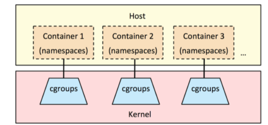

### 容器技术发展

#### 1979年 - chroot

容器技术的概念可以追溯到1979年的UNIX chroot。

它时一套 “UNIX操作系统”的系统，旨在将其root目录及子目录变更至文件系统的新位置，且只接受特定进程的访问。

这项功能的设计目的在于为每个进程提高一套隔离化磁盘空间。

1982年其被添加至BSD当中。

#### 2000年 - FreeBSD Jails

FreeBSD Jails是由Derrick T. Woolworth于2000年在FreeBSD研发协会中构建而成的早期容器技术之一。

这是一套“操作系统”的系统，与chroot的定位类似，不过其中包含有其它进程沙箱机制以对文件系统、用户及网络等资源进行隔离。

通过这种方式，它能够为每个Jail、定制化软件安装包乃至配置方案等提供一个对应的IP地址。

#### 2001年 - Linux VServer

Linux VServer属于另一种jail机制，其能够被用于保护计算机系统之上各分区资源的安全(包括文件系统、CPU时间、网络地址以及内存等)。

每个分区被称为一套安全背景(security context)，而其中的虚拟化系统则被称为一套虚拟私有服务器。

#### 2004年 - Solaris容器

Solaris容器诞生之时面向x86与SPARC系统架构，其最初亮相于2004年2月的Solaris 10 Build 51 beta当中，随后于2005年正式登陆Solaris 10的完整版本。

Solaris容器相当于将系统资源控制与由分区提供的边界加以结合。各分区立足于单一操作系统实例之内以完全隔离的虚拟服务器形式运行。

#### 2005年 - OpenVZ

OpenVZ与Solaris容器非常相似，且使用安装有补丁的Linux内核以实现虚拟化、隔离能力、资源管理以及检查点交付。

每套OpenVZ容器拥有一套隔离化文件系统、用户与用户群组、一套进程树、网络、设备以及IPC对象。

#### 2006年 - Process容器

Process容器于2006年由谷歌公司推出，旨在对一整套进程集合中的资源使用量(包括CPU、内存、磁盘I/O以及网络等等)加以限制、分配与隔离。

此后其被更名为Control Groups(即控制组)，从而避免其中的“容器”字眼与Linux内核2.6.24中的另一术语出现冲突。这表明了谷歌公司率先重视容器技术的敏锐眼光以及为其做出的突出贡献。

#### 2007年 - Control Groups

Control Groups也就是谷歌实现的cgroups，其于2007年被添加至Linux内核当中。

#### 2008年 - LXC

- LXC指代的是Linux Containers

- 是第一套完整的Linux容器管理实现方案

- 其功能通过cgroups以及Linux namespaces实现

- LXC通过liblxc库进行交付，并提供可与Python3、Lua、Go、Ruby等语言相对接的API。

#### 2011年 - Warden

- Warden由CloudFoundry公司于2011年所建立，其利用LXC作为初始阶段，随后又将其替换为自家实现方案。
- 与LXC不同，Warden并不会与Linux紧密耦合。相反，其能够运行在任意能够提供多种隔离环境方式的操作系统之上。Warden以后台进程方式运行并提供API以实现容器管理。

#### 2013年 - LMCTFY

- Lmctfy代表的是“Let Me Contain That For You(帮你实现容器化)”。它其实属于谷歌容器技术堆栈的开源版本，负责提供Linux应用程序容器。谷歌公司在该项目的起步阶段宣称其能够提供值得信赖的性能表现、高资源利用率、共享资源机制、充裕的发展空间以及趋近于零的额外资源消耗。
- 2013年10月lmctfy的首个版本正式推出，谷歌公司在2015年决定将lmctfy的核心概念与抽象机制转化为libcontainer。在失去了主干之后，如今lmctfy已经失去一切积极的发展势头。
- Libcontainer项目最初由Docker公司建立，如今已经被归入开放容器基金会的管辖范畴。

#### 2013年 - Docker

- 在2013年Docker刚发布的时候，它是一款基于LXC的开源容器管理引擎；从0.7版本以后基于libcontainer开发。
- 把LXC复杂的容器创建与使用方式简化为Docker自己的一套命令体系。
- 随着Docker的不断发展，它开始有了更为远大的目标，那就是反向定义容器的实现标准，将底层实现都抽象化到Libcontainer的接口。这就意味着，底层容器的实现方式变成了一种可变的方案，无论是使用namespace、cgroups技术抑或是使用systemd等其他方案，只要实现了Libcontainer定义的一组接口，Docker都可以运行。这也为Docker实现全面的跨平台带来了可能。

### Namespace

**namespace是Linux内核用来隔离内核资源的方式。**通过namespace可以让一些进程只能看到与主机相关的一部分资源，从另外一些进程也只能看到它们与自己相关的资源，这两拨进程根本就感觉不到对方的存在。具体的实现方式是把一个或多个进程的相关资源指定在同一个namespace中。

实际上linux系统实现命名空间主要目的之一就是为了实现轻量级虚拟化服务，也就是我们说的容器，在同一个命名空间下的进程可以感知彼此的变化，而对其他命名空间的进程一无所知，这样就可以让容器中的进程产生一个错觉，仿佛它自己置身于一个独立的系统环境当中，以此达到独立和隔离的目的。

#### Linux系统中namespace

|   命名空间   |             描述             |                             作用                             |                             备注                             |
| :----------: | :--------------------------: | :----------------------------------------------------------: | :----------------------------------------------------------: |
| 进程命名空间 |          隔离进程ID          | Linux通过命名空间管理进程号，同一个进程，在不同的命名空间进程号不同 |       进程命名空间是一个父子结构，子空间对于父空间可见       |
| 网络命名空间 | 隔离网络设备、协议栈、端口等 |                通过网络命名空间，实现网络隔离                |  docker采用虚拟网络设备，将不同命名空间的网络设备连接到一起  |
| IPC命名空间  |        隔离进程间通信        |                        进程间交互方法                        | PID命名空间和IPC命名空间可以组合起来用，同一个IPC名字空间内的进程可以彼此看见，允许进行交互，不同空间进程无法交互 |
| 挂载命名空间 |          隔离挂载点          |                         隔离文件目录                         | 进程运行时可以将挂载点与系统分离，使用这个功能时，我们可以达到 chroot 的功能，而在安全性方面比 chroot 更高 |
| UTS命名空间  |    隔离Hostname和NIS域名     | 让容器拥有独立的主机名和域名，从而让容器看起来像个独立的主机 |           目的是独立出主机名和网络信息服务（NIS）            |
| 用户命名空间 |      隔离用户和group ID      |        每个容器内上的用户跟宿主主机上不在一个命名空间        | 同进程 ID 一样，用户 ID 和组 ID 在命名空间内外是不一样的，并且在不同命名空间内可以存在相同的 ID |

#### namespace应用案例

以net namespace为例

- 在Linux中，网络命名空间可以被认为是隔离的拥有单独网络栈（网卡、路由转发表、iptables）的环境。网络命名空间经常用来隔离网络设备和服务，只有拥有同样网络命名空间的设备，才能看到彼此。
- 从逻辑上说，网络命名空间是网络栈的副本，拥有自己的网络设备、路由选择表、邻接表、Netfilter表、网络套接字、网络procfs条目、网络sysfs条目和其他网络资源。
- 从系统的角度来看，当通过clone()系统调用创建新进程时，传递标志CLONE_NEWNET将在新进程中创建一个全新的网络命名空间。
- 从用户的角度来看，我们只需使用工具ip（package is iproute2）来创建一个新的持久网络命名空间。


##### 创建net命名空间

```shell
# 创建名为jayce的命名空间
[root@jackycheung ~]# ip netns add jayce
# 查看自己创建的网络命名空间
[root@jackycheung ~]# ip netns ls
jayce
```

##### 删除net命名空间

```shell
[root@jackycheung ~]# ip netns delete jayce
```

##### 在net命名空间中执行命令

```shell
#在Linux主机系统中查看net命名空间网卡信息
[root@jackycheung ~]# ip netns exec jayce ip link list
1: lo: <LOOPBACK> mtu 65536 qdisc noop state DOWN mode DEFAULT group default qlen 1000
    link/loopback 00:00:00:00:00:00 brd 00:00:00:00:00:00
#在网络命名空间中执行bash命令，退出exit	
[root@jackycheung ~]# ip netns exec jayce bash
[root@jackycheung ~]# ip link ls
1: lo: <LOOPBACK> mtu 65536 qdisc noop state DOWN mode DEFAULT group default qlen 1000
    link/loopback 00:00:00:00:00:00 brd 00:00:00:00:00:00
[root@jackycheung ~]# route -n
Kernel IP routing table
Destination     Gateway         Genmask         Flags Metric Ref    Use Iface
[root@jackycheung ~]# iptables -t nat -nL
Chain PREROUTING (policy ACCEPT)
target     prot opt source               destination         

Chain INPUT (policy ACCEPT)
target     prot opt source               destination         

Chain OUTPUT (policy ACCEPT)
target     prot opt source               destination         

Chain POSTROUTING (policy ACCEPT)
target     prot opt source               destination 
```

##### 创建虚拟网卡

```shell
#创建虚拟网卡对
[root@jackycheung ~]# ip link add veth0 type veth peer name veth1
#在物理机查看网卡信息
[root@jackycheung ~]# ip a s
1: lo: <LOOPBACK,UP,LOWER_UP> mtu 65536 qdisc noqueue state UNKNOWN group default qlen 1000
    link/loopback 00:00:00:00:00:00 brd 00:00:00:00:00:00
    inet 127.0.0.1/8 scope host lo
       valid_lft forever preferred_lft forever
    inet6 ::1/128 scope host 
       valid_lft forever preferred_lft forever
2: ens33: <BROADCAST,MULTICAST,UP,LOWER_UP> mtu 1500 qdisc pfifo_fast master team1 state UP group default qlen 1000
    link/ether 00:0c:29:50:69:c4 brd ff:ff:ff:ff:ff:ff
3: ens34: <BROADCAST,MULTICAST,UP,LOWER_UP> mtu 1500 qdisc pfifo_fast master team1 state UP group default qlen 1000
    link/ether 00:0c:29:50:69:ce brd ff:ff:ff:ff:ff:ff
4: team1: <BROADCAST,MULTICAST,UP,LOWER_UP> mtu 1500 qdisc noqueue state UP group default qlen 1000
    link/ether 00:0c:29:50:69:c4 brd ff:ff:ff:ff:ff:ff
    inet 192.168.194.10/24 brd 192.168.194.255 scope global noprefixroute team1
       valid_lft forever preferred_lft forever
    inet6 fe80::2d3:c7ef:d265:437/64 scope link noprefixroute 
       valid_lft forever preferred_lft forever
5: veth1@veth0: <BROADCAST,MULTICAST,M-DOWN> mtu 1500 qdisc noop state DOWN group default qlen 1000
    link/ether 42:b0:5e:4a:b4:87 brd ff:ff:ff:ff:ff:ff
6: veth0@veth1: <BROADCAST,MULTICAST,M-DOWN> mtu 1500 qdisc noop state DOWN group default qlen 1000
    link/ether de:5e:be:cf:d1:1d brd ff:ff:ff:ff:ff:ff
#这两个网卡还都属于“default”或“global”命名空间，和物理网卡一样。把其中一个网卡转移到命名空间
#将物理机网卡veth1 迁移到jayce命名空间中
[root@jackycheung ~]# ip link set veth1 netns jayce
[root@jackycheung ~]# ip netns exec jayce ip link ls
1: lo: <LOOPBACK> mtu 65536 qdisc noop state DOWN mode DEFAULT group default qlen 1000
    link/loopback 00:00:00:00:00:00 brd 00:00:00:00:00:00
5: veth1@if6: <BROADCAST,MULTICAST> mtu 1500 qdisc noop state DOWN mode DEFAULT group default qlen 1000
    link/ether 42:b0:5e:4a:b4:87 brd ff:ff:ff:ff:ff:ff link-netnsid 0
```

##### 配置虚拟网卡IP

```shell
#配置命名空间veth1的ip为192.168.2.10/24
[root@jackycheung ~]# ip netns exec jayce ip addr add 192.168.2.10/24 dev veth1 
[root@jackycheung ~]# ip netns exec jayce ip addr
1: lo: <LOOPBACK> mtu 65536 qdisc noop state DOWN group default qlen 1000
    link/loopback 00:00:00:00:00:00 brd 00:00:00:00:00:00
5: veth1@if6: <BROADCAST,MULTICAST> mtu 1500 qdisc noop state DOWN group default qlen 1000
    link/ether 42:b0:5e:4a:b4:87 brd ff:ff:ff:ff:ff:ff link-netnsid 0
    inet 192.168.2.10/24 scope global veth1
       valid_lft forever preferred_lft forever
#启动命名空间内的网卡veth1和lo
[root@jackycheung ~]# ip netns exec jayce ip link set lo up
[root@jackycheung ~]# ip addr show veth0
6: veth0@if5: <BROADCAST,MULTICAST> mtu 1500 qdisc noop state DOWN group default qlen 1000
    link/ether de:5e:be:cf:d1:1d brd ff:ff:ff:ff:ff:ff link-netnsid 0
#配置宿主机veth0的ip
[root@jackycheung ~]# ip addr add 192.168.2.20/24 dev veth0
[root@jackycheung ~]# ip addr show veth0                   
6: veth0@if5: <BROADCAST,MULTICAST> mtu 1500 qdisc noop state DOWN group default qlen 1000
    link/ether de:5e:be:cf:d1:1d brd ff:ff:ff:ff:ff:ff link-netnsid 0
    inet 192.168.2.20/24 scope global veth0
       valid_lft forever preferred_lft forever
#启动宿主机veth0网卡
[root@jackycheung ~]# ip link set veth0 up
#宿主机ping命名空间veth1网卡ip
[root@jackycheung ~]# ping 192.168.2.10
PING 192.168.2.10 (192.168.2.10) 56(84) bytes of data.
64 bytes from 192.168.2.10: icmp_seq=1 ttl=64 time=0.050 ms
64 bytes from 192.168.2.10: icmp_seq=2 ttl=64 time=0.294 ms
^C
--- 192.168.2.10 ping statistics ---
2 packets transmitted, 2 received, 0% packet loss, time 1000ms
rtt min/avg/max/mdev = 0.050/0.172/0.294/0.122 ms
#命名空间内ping宿主机veth1网卡
[root@jackycheung ~]# ip netns exec jayce ping 192.168.2.20
PING 192.168.2.20 (192.168.2.20) 56(84) bytes of data.
64 bytes from 192.168.2.20: icmp_seq=1 ttl=64 time=0.034 ms
64 bytes from 192.168.2.20: icmp_seq=2 ttl=64 time=0.444 ms
64 bytes from 192.168.2.20: icmp_seq=3 ttl=64 time=0.095 ms
^C
--- 192.168.2.20 ping statistics ---
3 packets transmitted, 3 received, 0% packet loss, time 2001ms
rtt min/avg/max/mdev = 0.034/0.191/0.444/0.180 ms
#手动添加默认路由条目，允许访问本机其他网段
[root@jackycheung ~]# ip netns exec jayce ip route add default via 192.168.2.20
[root@jackycheung ~]# ip netns exec jayce route -n
Kernel IP routing table
Destination     Gateway         Genmask         Flags Metric Ref    Use Iface
0.0.0.0         192.168.2.20    0.0.0.0         UG    0      0        0 veth1
192.168.2.0     0.0.0.0         255.255.255.0   U     0      0        0 veth1
[root@jackycheung ~]# ip netns exec jayce ping 192.168.194.10
PING 192.168.194.10 (192.168.194.10) 56(84) bytes of data.
64 bytes from 192.168.194.10: icmp_seq=1 ttl=64 time=0.047 ms
64 bytes from 192.168.194.10: icmp_seq=2 ttl=64 time=0.067 ms
^C
--- 192.168.194.10 ping statistics ---
2 packets transmitted, 2 received, 0% packet loss, time 1000ms
rtt min/avg/max/mdev = 0.047/0.057/0.067/0.010 ms
```

### CGroups

Control groups（cgroups）控制组

linux内核提供的可以限制、记录、隔离进程组所使用的物理资源的机制。为容器而生，没有cgroups就没有今天的容器技术。



#### CGroups功能

- 资源限制（Resource Limitation）：cgroups 可以对进程组使用的资源总额进行限制。如设定应用运行时使用内存的上限，一旦超过这个配额就发出 OOM（Out of Memory）。
- 优先级分配（Prioritization）：通过分配的 CPU 时间片数量及硬盘 IO 带宽大小，实际上就相当于控制了进程运行的优先级。
- 资源统计（Accounting）： cgroups 可以统计系统的资源使用量，如 CPU 使用时长、内存用量等等，这个功能非常适用于计费。
- 进程控制（Control）：cgroups 可以对进程组执行挂起、恢复等操作。

| 子系统                          | 功能                                                         |
| ------------------------------- | ------------------------------------------------------------ |
| cpu                             | 使用调度程序控制任务对CPU的使用                              |
| cpuacct(CPU Accounting)         | 自动生成cgroup中任务对CPU资源使用情况的报告                  |
| cpuset                          | 为cgroup中的任务分配独立的CPU（多处理器系统时）和内存        |
| devices                         | 开启或关闭cgroup中任务对设备的访问                           |
| freezer                         | 挂起火恢复cgroup中的任务                                     |
| memory                          | 设定cgroup中任务对内存使用量的限定，并生成这些任务对内存资源使用情况的报告 |
| perf_event(Linux CPU性能探测器) | 使cgroup中的任务可以进行统一的性能测试                       |
| net_cls(Docker未使用）          | 通过登记识别标记网络数据包，从而允许Linux流量监控程序（Traffic Controller）识别从具体cgroup中生成的数据包 |

### 